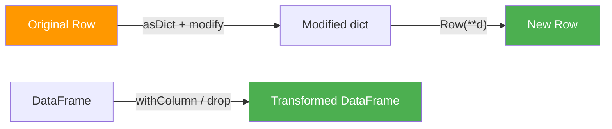

# Row Mutation

`Row` objects are immutable — every "mutation" produces a brand-new `Row`. This page
covers patterns for adding, removing, updating, renaming, and merging fields.



## API Quick Reference

| Pattern | Level | Stays in Catalyst? | Best For |
|---------|-------|:------------------:|----------|
| `df.withColumn("new", expr)` | DataFrame | ✅ | Add or update a column |
| `df.drop("col")` | DataFrame | ✅ | Remove a column |
| `df.withColumnRenamed("old", "new")` | DataFrame | ✅ | Rename a column |
| `Row(**{**row.asDict(), "new": val})` | Row (RDD) | ❌ | Add a field to a collected Row |
| `Row(**{k: v for k, v in row.asDict().items() if k != "drop_me"})` | Row (RDD) | ❌ | Remove a field |
| `{**r1.asDict(), **r2.asDict()}` | Row (RDD) | ❌ | Merge two Rows |

## Worked Examples — DataFrame API (Preferred)

### Add a Column

```python
from pyspark.sql import functions as F

df = spark.createDataFrame([
    (1, "Alice", 90000.0),
    (2, "Bob",   75000.0),
], ["id", "name", "salary"])

result = df.withColumn("bonus", F.col("salary") * 0.1)   # (1)!
result.show()
```

1. `withColumn` adds a new column or replaces an existing one with the same name.

### Remove a Column

```python
result = df.drop("salary")
```

### Update a Column

```python
result = df.withColumn("salary", F.col("salary") * 1.10)   # (1)!
```

1. Same column name → in-place replacement in the schema.

### Rename a Column

```python
result = df.withColumnRenamed("name", "employee_name")
```

## Worked Examples — Row-Level (RDD)

### Add a Field

```python
from pyspark.sql import Row

row = Row(id=1, name="Alice", salary=90000.0)
d = row.asDict()
d["bonus"] = d["salary"] * 0.1           # (1)!
new_row = Row(**d)
print(new_row)
```

1. Modify the dict, then rebuild a new `Row` from it.

### Remove a Field

```python
d = row.asDict()
del d["salary"]
trimmed = Row(**d)
```

### Update a Field

```python
d = row.asDict()
d["name"] = d["name"].upper()
updated = Row(**d)
```

### Rename a Field

```python
d = row.asDict()
d["employee_name"] = d.pop("name")       # (1)!
renamed = Row(**d)
```

1. `dict.pop` removes the old key and returns the value in one step.

### Merge Two Rows

```python
r1 = Row(id=1, name="Alice")
r2 = Row(department="Engineering", salary=90000.0)

merged = Row(**{**r1.asDict(), **r2.asDict()})   # (1)!
print(merged)
```

1. Dict unpacking combines both sets of fields. If keys overlap, `r2` wins.

### RDD Map Pipeline

```python
result_rdd = df.rdd.map(lambda r: Row(
    **{**r.asDict(), "bonus": r.salary * 0.1}
))
result = spark.createDataFrame(result_rdd)
result.show()
```

### Run

```bash
cd spark-python/pyspark-dataframe
python src/data_frame/rows/mutation/row_mutation.py
```

!!! success "Prefer DataFrame API"
    `withColumn`, `drop`, and `withColumnRenamed` stay inside the Catalyst optimizer
    and benefit from code generation. Use them for all production transformations.

!!! warning "Row-level mutation is slow at scale"
    RDD-based Row mutations (`rdd.map` + `Row(**d)`) execute in the Python
    interpreter and bypass Catalyst. Reserve them for collected rows or edge cases
    that cannot be expressed with built-in functions.

!!! note "Row is immutable"
    You cannot do `row.name = "Bob"` — `Row` fields are read-only. Every mutation
    pattern creates a new `Row` from a modified dict.

## Full Source

```python title="src/data_frame/rows/mutation/row_mutation.py"
--8<-- "data_frame/rows/mutation/row_mutation.py"
```
