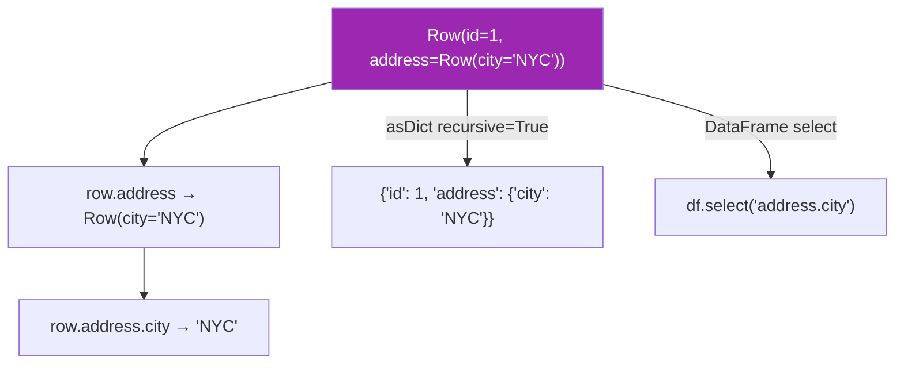

# Nested Rows

Work with `Row` objects that contain other `Row` objects as fields — the Python
representation of `StructType` columns with nested `StructField` definitions.

## Nested Row Patterns



## API Quick Reference

| Pattern | Syntax | Returns |
|---------|--------|---------|
| Nested field access | `row.address.city` | Scalar value |
| Dict-style access | `row["address"]["city"]` | Scalar value |
| `asDict(recursive=True)` | `row.asDict(recursive=True)` | Nested `dict` |
| DataFrame dot notation | `df.select("address.city")` | Column of scalars |
| `F.col` nested path | `F.col("address.city")` | Column reference |
| Explode array of structs | `F.explode("items")` | One row per struct element |

## Worked Examples

### Row Containing a Nested Row

```python
from pyspark.sql import Row

address = Row(city="New York", zip_code="10001")
person  = Row(id=1, name="Alice", address=address)  # (1)!

print(person.address.city)       # "New York"
print(person["address"]["zip_code"])  # "10001"
```

1. A `Row` can hold another `Row` as a field value — Spark maps this to a `StructType` column.

### StructType with Nested StructField

```python
from pyspark.sql.types import StructType, StructField, IntegerType, StringType

schema = StructType([
    StructField("id",   IntegerType(), nullable=False),
    StructField("name", StringType(),  nullable=True),
    StructField("address", StructType([                    # (1)!
        StructField("city",     StringType(), nullable=True),
        StructField("zip_code", StringType(), nullable=True),
    ])),
])

data = [(1, "Alice", ("New York", "10001")),
        (2, "Bob",   ("Boston",   "02101"))]

df = spark.createDataFrame(data, schema)                   # (2)!
df.printSchema()
```

1. The nested `StructType` defines the sub-fields of the struct column.
2. Tuples in the data are mapped to nested `Row` objects by Spark.

### Accessing Nested Fields in a DataFrame

```python
from pyspark.sql import functions as F

df.select("name", "address.city").show()                   # (1)!
df.select(F.col("address.city").alias("city")).show()
df.filter(F.col("address.city") == "New York").show()
```

1. Dot notation `"address.city"` navigates into the struct.

### Deep Conversion with `asDict(recursive=True)`

```python
row = df.first()
shallow = row.asDict()                     # address stays as Row
deep    = row.asDict(recursive=True)       # address becomes dict (1)!
print(deep["address"]["city"])             # "New York"
```

1. Without `recursive=True`, nested `Row` objects remain as `Row` in the dict.

### Array of Structs (Explode)

```python
from pyspark.sql.types import ArrayType, DoubleType

order_schema = StructType([
    StructField("order_id", IntegerType()),
    StructField("items", ArrayType(StructType([            # (1)!
        StructField("product", StringType()),
        StructField("price",   DoubleType()),
    ]))),
])

data = [(1, [("Widget", 9.99), ("Gadget", 19.99)]),
        (2, [("Bolt", 0.50)])]

df = spark.createDataFrame(data, order_schema)
df.select("order_id", F.explode("items").alias("item")) \
  .select("order_id", "item.product", "item.price") \
  .show()
```

1. `ArrayType(StructType(...))` — each element is a struct with named sub-fields.

### Run

```bash
cd spark-python/pyspark-dataframe
python src/data_frame/rows/nested/row_nested.py
```

!!! tip "Use dot notation in `select` and `filter`"
    `df.select("address.city")` and `F.col("address.city")` both work for
    navigating into struct columns — no need to use UDFs.

!!! warning "`asDict()` is shallow by default"
    Call `asDict(recursive=True)` to fully convert nested structs to dicts.
    The default `asDict()` leaves inner `Row` objects as-is.

## Full Source

```python title="src/data_frame/rows/nested/row_nested.py"
--8<-- "data_frame/rows/nested/row_nested.py"
```
