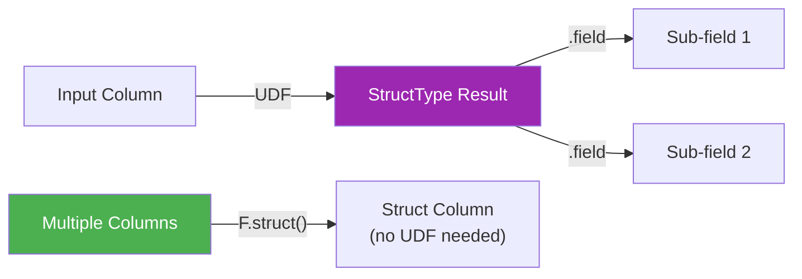

# Row UDFs

UDFs that return `StructType` — creating or repackaging `Row` objects inside
user-defined functions.



## API Quick Reference

| Pattern | UDF Needed? | Returns | Best For |
|---------|:-----------:|---------|----------|
| `F.struct(col1, col2, …)` | ❌ | `StructType` column | Grouping existing columns into a struct |
| `@F.udf(returnType=schema)` | ✅ | `StructType` column | Custom logic producing multiple fields |
| `@F.pandas_udf(schema)` | ✅ | `StructType` column | Vectorised struct creation (Arrow) |

## Worked Examples

### F.struct — No UDF Needed (Preferred)

```python
from pyspark.sql import functions as F

df = spark.createDataFrame([
    (1, "Alice", 90000.0),
    (2, "Bob",   75000.0),
], ["id", "name", "salary"])

result = df.withColumn(
    "info",
    F.struct(                                 # (1)!
        F.col("name"),
        F.col("salary"),
        (F.col("salary") * 0.1).alias("bonus"),
    ),
)
result.select("id", "info.name", "info.bonus").show()
```

1. `F.struct()` packs columns into a struct without leaving the Catalyst optimizer.
   Prefer this over a UDF when the logic is expressible with built-in functions.

### UDF Returning StructType

```python
from pyspark.sql import functions as F
from pyspark.sql.types import StructType, StructField, StringType, DoubleType

price_tier_schema = StructType([
    StructField("tier",  StringType()),
    StructField("bonus", DoubleType()),
])

@F.udf(returnType=price_tier_schema)          # (1)!
def classify_salary(salary):
    if salary is None:
        return ("Unknown", 0.0)
    if salary >= 80000:
        return ("Senior", salary * 0.15)
    return ("Junior", salary * 0.05)

result = df.withColumn("classification", classify_salary(F.col("salary")))
result.select("name", "classification.tier", "classification.bonus").show()
```

1. The UDF returns a tuple matching the `StructType` field order. Spark wraps it
   into a struct column automatically.

### UDF Parsing a String into a Struct

```python
address_schema = StructType([
    StructField("city",  StringType()),
    StructField("state", StringType()),
])

@F.udf(returnType=address_schema)
def parse_address(raw):
    if raw is None:
        return (None, None)
    parts = raw.split(",")
    city  = parts[0].strip() if len(parts) > 0 else None
    state = parts[1].strip() if len(parts) > 1 else None
    return (city, state)

addresses = spark.createDataFrame([
    (1, "New York, NY"),
    (2, "Boston, MA"),
    (3, None),
], ["id", "raw_address"])

result = addresses.withColumn("parsed", parse_address(F.col("raw_address")))
result.select("id", "parsed.city", "parsed.state").show()
```

### Selecting Sub-Fields from a Struct Column

```python
result.select("id", "parsed.*").show()             # (1)!
result.select("id", F.col("parsed.city")).show()   # (2)!
```

1. `"parsed.*"` expands all sub-fields of the struct into top-level columns.
2. Dot notation selects a single sub-field.

### Run

```bash
cd spark-python/pyspark-dataframe
python src/data_frame/rows/udf/row_udf.py
```

!!! success "Prefer `F.struct()` over UDFs"
    If the struct can be built from existing columns and built-in functions, use
    `F.struct()` — it stays inside the Catalyst optimizer and benefits from
    code generation.

!!! warning "UDF performance"
    Python UDFs serialize data between JVM and Python for every row. For large
    DataFrames, consider `pandas_udf` (vectorised) or rewrite the logic with
    built-in functions.

!!! note "Return type must match"
    The tuple returned by a `StructType` UDF must match the declared schema in
    field order and types. Mismatches cause runtime errors or silent `null` values.

## Full Source

```python title="src/data_frame/rows/udf/row_udf.py"
--8<-- "data_frame/rows/udf/row_udf.py"
```
