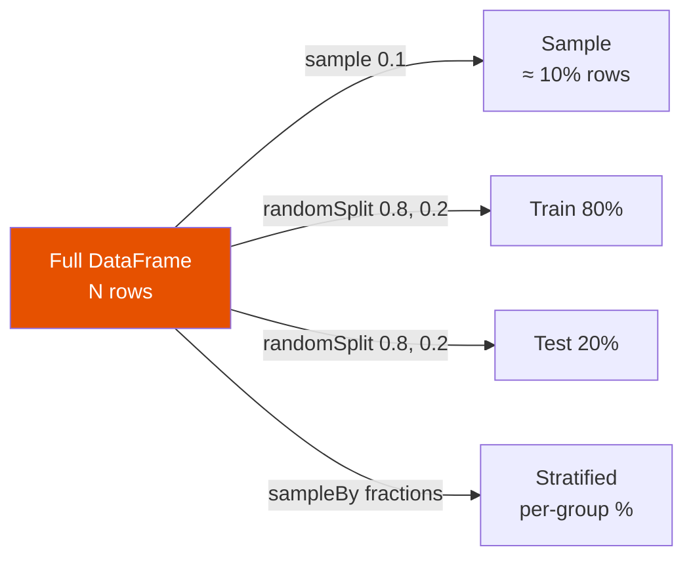

# Sampling

Draw a random subset of rows from a DataFrame for exploration, testing, or
stratified analysis.



## API Reference

| Method | What It Does | Deterministic? |
|--------|-------------|:--------------:|
| `df.sample(fraction, seed)` | Random sample without replacement | With seed ✅ |
| `df.sample(withReplacement=True, fraction, seed)` | Random sample with replacement (rows may repeat) | With seed ✅ |
| `df.randomSplit([w1, w2, …], seed)` | Split into multiple DataFrames by weight | With seed ✅ |
| `df.stat.sampleBy(col, fractions, seed)` | Stratified sample — different fraction per group | With seed ✅ |

## Random Sample

```python
import os
from pyspark.sql import SparkSession

spark = (SparkSession.builder
         .appName("sampling")
         .master(os.environ.get("SPARK_MASTER", "local[*]"))
         .config("spark.sql.shuffle.partitions", "4")
         .config("spark.ui.enabled", "false")
         .getOrCreate())
spark.sparkContext.setLogLevel("WARN")

data = [(i, f"name_{i}") for i in range(100)]
df = spark.createDataFrame(data, ["id", "name"])

# ~10 % sample — actual count varies slightly
sample = df.sample(fraction=0.1, seed=42)   # (1)!
print(f"Sample size: {sample.count()}")     # approximately 10
```
1. `seed` makes the sample reproducible across runs. Without a seed the result
   differs each time.

### Run

```bash
python src/data_frame/transformation/transformations.py
```

## Train / Test Split

```python
train, test = df.randomSplit([0.8, 0.2], seed=42)   # (1)!
print(f"Train: {train.count()}, Test: {test.count()}")
```
1. Weights do not need to sum to 1.0 — Spark normalises them automatically.

## Stratified Sample

```python
from pyspark.sql import functions as F

regions = spark.createDataFrame(
    [(i, "North" if i % 3 == 0 else "South" if i % 3 == 1 else "East")
     for i in range(100)],
    ["id", "region"],
)

fractions = {"North": 0.1, "South": 0.2, "East": 0.5}
stratified = regions.stat.sampleBy("region", fractions, seed=42)   # (1)!
stratified.groupBy("region").count().show()
```
1. Only rows whose key appears in `fractions` are included in the result.
   Keys not listed are excluded entirely.

## Common Patterns

### Sample With Replacement (Bootstrap)

```python
bootstrap = df.sample(withReplacement=True, fraction=1.0, seed=42)
```

### Three-Way Split (Train / Validation / Test)

```python
train, val, test = df.randomSplit([0.7, 0.15, 0.15], seed=42)
```

!!! note "fraction is approximate"
    `sample()` uses Bernoulli sampling — each row is independently included with
    probability `fraction`. The actual row count is close to but not exactly
    `fraction * df.count()`.

!!! tip "Use seed for reproducibility"
    Always set `seed` when writing tests or sharing sample data — without a seed
    the sample differs on every call.

!!! warning "randomSplit reads data multiple times"
    `randomSplit` evaluates the DataFrame once per split. Cache the DataFrame
    first if it is expensive to compute: `df.cache()` then `df.randomSplit(...)`.
