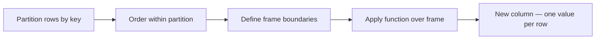

# Window Functions — Overview

A window function computes a value for each row based on a **window** (subset) of
rows related to the current row — without collapsing the DataFrame the way `groupBy`
does. Each row retains its identity in the output.



## Window Function Categories

| Category | Functions | Page |
|----------|-----------|------|
| **Ranking** | `rank`, `dense_rank`, `row_number`, `percent_rank`, `ntile` | [Ranking](ranking.md) |
| **Analytical** | `lead`, `lag`, `first`, `last` | [Analytical](analytical.md) |
| **Aggregate** | `sum`, `avg`, `min`, `max`, `count` over a frame | [Aggregation](aggregation.md) |
| **Null Options** | `IGNORE NULLS` / `RESPECT NULLS` for `first`, `last`, `lead`, `lag` | [Null Options](null_options.md) |

## WindowSpec Construction

```python
from pyspark.sql.window import Window
from pyspark.sql import functions as F

# Partition + order (no explicit frame — defaults to unboundedPreceding→currentRow for aggregates)
w = Window.partitionBy("region").orderBy(F.asc("date"))

# With an explicit rows frame
w_running = (Window
             .partitionBy("region")
             .orderBy("date")
             .rowsBetween(Window.unboundedPreceding, Window.currentRow))

# With a range frame (value-based, not row-count-based)
w_range = (Window
           .partitionBy("region")
           .orderBy("amount")
           .rangeBetween(-100, 100))
```

## Frame Boundaries

| Constant | Meaning |
|----------|---------|
| `Window.unboundedPreceding` | Start of the partition |
| `Window.currentRow` | The current row |
| `Window.unboundedFollowing` | End of the partition |
| Integer `n` | `n` rows / range units before (`-n`) or after (`+n`) current row |

Use `.rowsBetween()` for count-based frames; `.rangeBetween()` for value-based frames.

## Quick Pattern Reference

```python
# Ranking
df = df.withColumn("rank",       F.rank().over(w))
df = df.withColumn("row_number", F.row_number().over(w))

# Running total
df = df.withColumn("running_total", F.sum("revenue").over(w_running))

# Previous / next row
df = df.withColumn("prev_revenue", F.lag("revenue",  1).over(w))
df = df.withColumn("next_revenue", F.lead("revenue", 1).over(w))

# Top-N per group
df = (df
      .withColumn("rn", F.row_number().over(w))
      .filter(F.col("rn") <= 3)
      .drop("rn"))
```

!!! tip "Always specify partitionBy"
    Omitting `.partitionBy()` creates a single global window over the entire
    DataFrame — every executor must have all data, causing a full shuffle.

!!! warning "No partitionBy + orderBy = implicit frame"
    With `.orderBy()` but no explicit frame, aggregate window functions default to
    `rowsBetween(unboundedPreceding, currentRow)`, not the whole partition.
    Always specify the frame for aggregates to avoid surprises.
