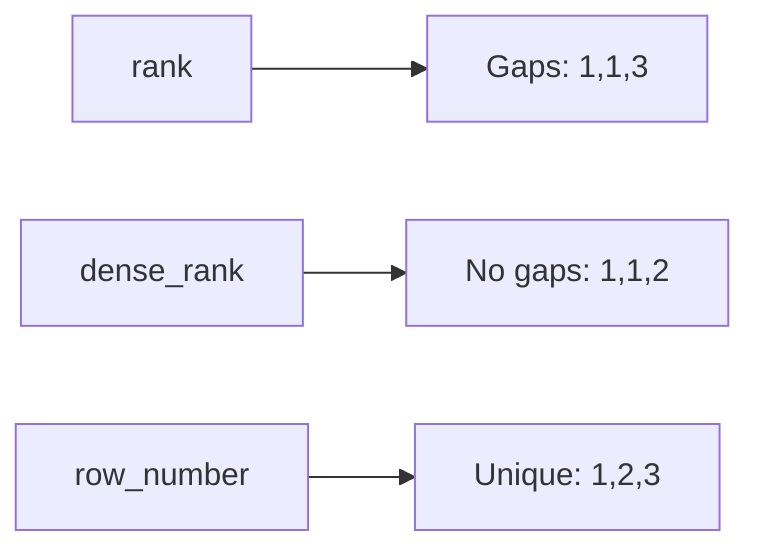

# Ranking Window Functions

Assign a position number to each row within its partition based on the ORDER BY
expression. Unlike aggregation, the DataFrame is not collapsed — every input row
gets a rank value.

## Function Comparison

| Function | Gaps on ties? | Resets per partition? | Unique per partition? |
|----------|:-------------:|:---------------------:|:---------------------:|
| `rank()` | Yes | Yes | No — tied rows share rank |
| `dense_rank()` | No | Yes | No — tied rows share rank |
| `row_number()` | N/A | Yes | Yes — always unique |
| `percent_rank()` | Yes | Yes | Range 0.0–1.0 |
| `ntile(n)` | N/A | Yes | Splits partition into `n` buckets |



## Example

```python
import os
from pyspark.sql import SparkSession
from pyspark.sql.window import Window
from pyspark.sql import functions as F

spark = (SparkSession.builder
         .appName("ranking-functions")
         .master(os.environ.get("SPARK_MASTER", "local[*]"))
         .config("spark.sql.shuffle.partitions", "4")
         .config("spark.ui.enabled", "false")
         .getOrCreate())
spark.sparkContext.setLogLevel("WARN")

data = [
    ("North", "Alice", 800.0),
    ("North", "Bob",   500.0),
    ("North", "Carol", 800.0),   # tie with Alice
    ("South", "Dave",  300.0),
    ("South", "Eve",   700.0),
]
df = spark.createDataFrame(data, ["region", "name", "revenue"])

w = Window.partitionBy("region").orderBy(F.desc("revenue"))  # (1)!

result = (df
          .withColumn("rank",         F.rank().over(w))
          .withColumn("dense_rank",   F.dense_rank().over(w))
          .withColumn("row_number",   F.row_number().over(w))
          .withColumn("percent_rank", F.round(F.percent_rank().over(w), 2))
          .withColumn("ntile_2",      F.ntile(2).over(w)))
result.orderBy("region", "rank").show()
```
1. Descending revenue — highest earner gets rank 1.

### Run

```bash
python src/data_frame/analytical/window_function/ranking/ranking_function_rank.py
```

## Top-N per Group

```python
top3 = (df
        .withColumn("rn", F.row_number().over(w))  # (1)!
        .filter(F.col("rn") <= 3)
        .drop("rn"))
```
1. `row_number` is preferred over `rank` for Top-N because it guarantees exactly
   N rows per partition even when there are ties.

!!! tip "row_number for pagination / deduplication"
    `row_number` is also the standard way to deduplicate: keep only `rn == 1`
    to retain the first row per group according to your ordering.

!!! success "Good fit for ranking"
    - Leaderboards and percentile buckets
    - Selecting the latest record per entity
    - Top-N products per category

!!! failure "Not suitable when"
    - You need the actual aggregated value over a window — use aggregate functions
    - You want to compare with the previous/next row — use `lag`/`lead`
