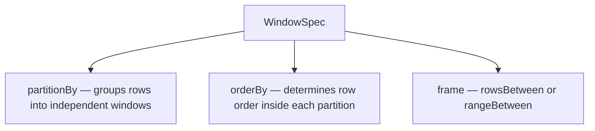

# Window Specification

A `WindowSpec` object defines the three components of a window: how to **partition**
rows, how to **order** them within each partition, and which **frame** of rows the
function should see.



## Partition

```python
from pyspark.sql.window import Window
from pyspark.sql import functions as F

# One window per region
w = Window.partitionBy("region")

# Multi-column partition key
w = Window.partitionBy("region", "year")
```

## Order

```python
w = Window.partitionBy("region").orderBy(F.asc("date"))

# Multiple sort keys
w = Window.partitionBy("region").orderBy(F.asc("year"), F.desc("revenue"))
```

## Frame — Rows-Based

Count-based frame — boundaries measured in number of rows:

```python
# From start of partition to current row (running total)
w = (Window
     .partitionBy("region")
     .orderBy("date")
     .rowsBetween(Window.unboundedPreceding, Window.currentRow))

# Rolling 3-row window: 1 row before + current + 1 row after
w = (Window
     .partitionBy("region")
     .orderBy("date")
     .rowsBetween(-1, 1))

# Entire partition (no running effect)
w = (Window
     .partitionBy("region")
     .orderBy("date")
     .rowsBetween(Window.unboundedPreceding, Window.unboundedFollowing))
```

## Frame — Range-Based

Value-based frame — boundaries measured in the unit of the ORDER BY column:

```python
# All rows whose amount is within ±100 of the current row's amount
w = (Window
     .partitionBy("region")
     .orderBy("amount")
     .rangeBetween(-100, 100))
```

!!! note "rangeBetween requires a numeric ORDER BY"
    `rangeBetween` only works when the ORDER BY column is numeric or a date/timestamp.
    Use `rowsBetween` for string or non-numeric sort keys.

## Frame Boundary Reference

| Boundary constant | Value | Meaning |
|-------------------|-------|---------|
| `Window.unboundedPreceding` | `-sys.maxsize` | Start of partition |
| `Window.currentRow` | `0` | The current row |
| `Window.unboundedFollowing` | `sys.maxsize` | End of partition |
| Integer `n` | `n` | `n` rows/units before (`-n`) or after (`+n`) |


## Full Example

```python
import os
from pyspark.sql import SparkSession
from pyspark.sql.window import Window
from pyspark.sql import functions as F

spark = (SparkSession.builder
         .appName("window-specification")
         .master(os.environ.get("SPARK_MASTER", "local[*]"))
         .config("spark.sql.shuffle.partitions", "4")
         .config("spark.ui.enabled", "false")
         .getOrCreate())
spark.sparkContext.setLogLevel("WARN")

data = [
    ("North", "2024-01", 100.0),
    ("North", "2024-02", 200.0),
    ("North", "2024-03", 150.0),
    ("South", "2024-01",  80.0),
    ("South", "2024-02", 120.0),
]
df = spark.createDataFrame(data, ["region", "month", "revenue"])

w_running = (Window
             .partitionBy("region")
             .orderBy("month")
             .rowsBetween(Window.unboundedPreceding, Window.currentRow))

df.withColumn("running_total", F.sum("revenue").over(w_running)).show()
```

### Run

```bash
python src/data_frame/analytical/window_function/specification/window_specification.py
```
