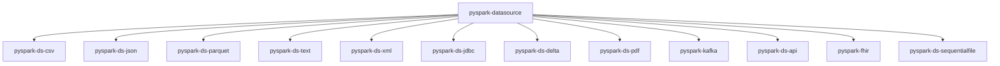

# MkDocs Documentation Conventions

## Stack

- MkDocs ≥ 1.6 with **mkdocs-material** ≥ 9.5.
- Markdown extensions: admonitions, tabbed content, code annotations, Mermaid diagrams.

## Theme Configuration

```yaml
theme:
  name: material
  palette:
    - scheme: default
      primary: deep orange
      accent: orange
      toggle:
        icon: material/brightness-7
        name: Switch to dark mode
    - scheme: slate
      primary: deep orange
      accent: orange
      toggle:
        icon: material/brightness-4
        name: Switch to light mode
  features:
    - navigation.tabs
    - navigation.sections
    - navigation.expand
    - navigation.top
    - navigation.indexes
    - search.highlight
    - search.suggest
    - content.code.copy
    - content.code.annotate
```

## Required Plugins and Extensions

```yaml
plugins:
  - search
  - include-markdown

markdown_extensions:
  - admonition
  - attr_list
  - md_in_html
  - tables
  - pymdownx.details
  - pymdownx.inlinehilite
  - pymdownx.highlight:
      anchor_linenums: true
      line_spans: __span
      pygments_lang_class: true
  - pymdownx.superfences:
      custom_fences:
        - name: mermaid
          class: mermaid
          format: !!python/name:pymdownx.superfences.fence_code_format
  - pymdownx.tabbed:
      alternate_style: true
  - pymdownx.snippets:
      base_path: ["."]
  - toc:
      permalink: true
```

## Code Blocks

### Include source files (preferred — keeps docs in sync)

````markdown
```python title="src/example/read_data.py"
--8<-- "src/example/read_data.py"
```
````

### Code annotations

```python
spark = (
    SparkSession.builder
    .master(os.environ.get("SPARK_MASTER", "local[*]"))  # (1)!
    .config("spark.ui.enabled", "false")                  # (2)!
    .getOrCreate()
)
```

1. Falls back to local mode when `SPARK_MASTER` is not set.
2. Skip the Spark Web UI for faster startup.

### Tabbed install options

````markdown
=== "uv"
    ```bash
    uv add pyspark
    ```

=== "pip"
    ```bash
    pip install pyspark
    ```

=== "Poetry"
    ```bash
    poetry add pyspark
    ```
````

## Admonitions

```markdown
!!! tip "No cluster required"
    Every example runs locally with `local[*]` — no Spark cluster needed.

!!! warning "Environment variables"
    All connection strings and paths should come from environment variables.
    Never hardcode credentials in source files.

!!! note
    Parquet is the preferred output format across all datasource projects.

!!! success "When to use this datasource"
    Use the CSV datasource when working with legacy flat-file exports
    from databases, spreadsheets, or ETL tools.

!!! failure "When NOT to use this datasource"
    Avoid CSV for large-scale production pipelines — use Parquet or
    Delta Lake for better performance and schema enforcement.
```

## Architecture Diagrams

Use Mermaid for data flow:

````markdown

````

## Datasource Comparison Diagram

````markdown

````

## Page Structure

Each documentation page should follow this order:

1. **Description** — what this pattern does and when to use it.
2. **Data flow diagram** (Mermaid) — for complex transformations.
3. **Prerequisites** — `uv sync` and any config needed.
4. **Read/write options table** — for reader/writer-focused pages.
5. **Source code** — `--8<--` snippet include with annotations.
6. **Run the example** — bash command block.
7. **Expected output** — truncated `show()` output.
8. **When to use / not use** — `!!! success` and `!!! failure` admonitions.

## Build and Serve

```bash
uv run mkdocs serve          # local preview at http://127.0.0.1:8000
uv run mkdocs build --strict # production build — fails on warnings
```
