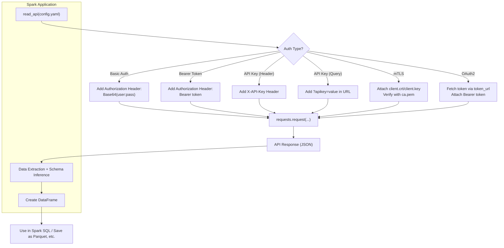

# Spark Api integration

1. `Ingesting data into Apache Spark from APIs` – You want to use Spark to pull data from external APIs (like REST APIs) and process it.
2. `Building an API with Spark` – You’re building a web API using a framework (like Flask or FastAPI), and you want to ingest data into Spark from that API.
3. `Using Spark's own APIs for ingestion` – You’re asking about Spark’s DataFrame or RDD API to ingest data from different sources (like Kafka, JSON, CSV, JDBC, etc.).
4. `Streaming API ingestion` – You want to use Spark Structured Streaming or Spark Streaming to ingest data in real time from APIs or message brokers like Kafka.

## Flow



## Project Layout

- **`src/rest_ds/`** — library package: `APIClient`/`Paginator` (`rest_api.py`),
  auth dispatch (`authentication/auth_util.py`), shared utilities (`util/`),
  schema helpers (`schema/`), and the incremental ingestion engine
  (`incremental/`). Nothing here is a mock server or standalone demo script.
  Installed as an editable package (`hatchling` build backend), so
  `import rest_ds...` works with or without `PYTHONPATH=src`.
- **`examples/`** — usage/demo code: one runnable scenario per auth strategy,
  pagination strategy, and ingestion pattern, each with its own mock FastAPI
  server, ETL/runner script, and YAML/JSON config. Run any example with
  `PYTHONPATH=src uv run python examples/<path>/<script>.py`.

## Development

```bash
uv sync                                    # install runtime + dev dependencies
uv run pytest                              # run tests
uv run black src tests examples            # format
uv run isort src tests examples            # sort imports
uv run flake8 src examples                 # style lint
uv run mypy src/rest_ds                    # static type check (library only)
uv run bandit -r src -c pyproject.toml     # security lint
uv run pip-audit                           # dependency vulnerability scan
uv run pre-commit install                  # enable git hooks (runs the above on commit)
uv run mkdocs serve                        # preview docs at http://127.0.0.1:8000
```

See `docs/` (built with MkDocs Material) for the full project documentation,
including architecture, authentication/pagination guides, incremental
ingestion design, and the `rest_ds` API reference.

## Requirement

1. Partition by date to store the results.
2. Storage the rest api result into s3.
3. It will handle all kinds of response: json, xml, csv.
4. List all secrets needed for rest api.
5. v1 in yaml.
6. Timeout - Done
7. format of files -csv, json etc
8. Storage: temporary files and based on the success, we move the all files from temp to storage.

9. Workspace for certificates
   data Path in raw bucket.
10. Scan task.
11. Reconciliation
12. Duplicate check
13. **Incremental ingestion — Done.** See `examples/incremental/README.md`: YAML-driven
    watermark parameters injected into each API call, with run state (last
    watermark + full run history) tracked in a database control table
    (`ingestion_watermark` / `ingestion_run_history`), not a file. This is the
    foundation for #11 (Reconciliation) and #12 (Duplicate check) above — the
    run-history table records every run's parameters and row counts for audit.

## Standard

Chart flow for end to end flow.

## Limitation

1. Secrets in yaml file.
2. Paginated response will return error if any single page is failing.
3. Incremental mode currently only supports injecting the watermark as a
   query parameter, and only reuses the simple (non-`result_key`-aware)
   pagination path — see `examples/incremental/README.md` for details.
