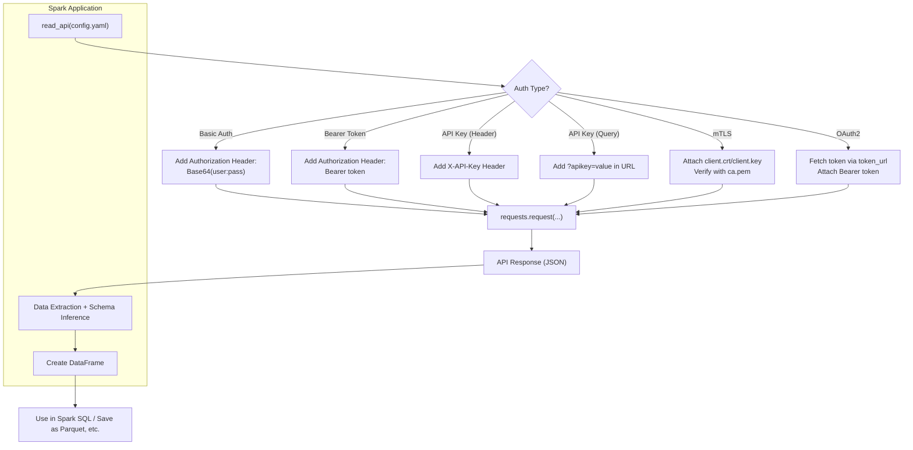

# Spark Api integration

1. Ingesting data into Apache Spark from APIs – You want to use Spark to pull data from external APIs (like REST APIs) and process it.
2. Building an API with Spark – You’re building a web API using a framework (like Flask or FastAPI), and you want to ingest data into Spark from that API.
3. Using Spark's own APIs for ingestion – You’re asking about Spark’s DataFrame or RDD API to ingest data from different sources (like Kafka, JSON, CSV, JDBC, etc.).
4. Streaming API ingestion – You want to use Spark Structured Streaming or Spark Streaming to ingest data in real time from APIs or message brokers like Kafka.

## Flow

