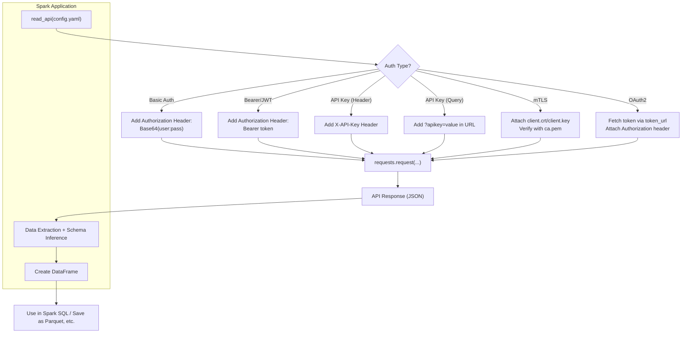

# pyspark-ds-api

A REST API ingestion framework for Apache Spark. It fetches data from REST
APIs — handling authentication, pagination, and response parsing — and loads
the results into PySpark DataFrames. Every example is self-contained and
runnable locally; no cluster required.

Typical use cases this framework targets:

1. **Ingesting data into Apache Spark from APIs** — pull data from external
   REST APIs and process it with Spark.
2. **Building an API with Spark** — ingest data into Spark from a web API you
   control (Flask/FastAPI).
3. **Using Spark's own APIs for ingestion** — DataFrame/RDD ingestion from
   other sources (Kafka, JSON, CSV, JDBC, etc.).
4. **Streaming API ingestion** — Structured Streaming from APIs or message
   brokers like Kafka.

## Request flow

## Project layout

- **`src/rest_ds/`** — the library package. `APIClient`/`Paginator`
  (`rest_api.py`), auth dispatch (`authentication/auth_util.py`), shared
  utilities (`util/`), schema helpers (`schema/`), and the incremental
  ingestion engine (`incremental/`). No mock servers or demo scripts live
  here. Installed as an editable package via the `hatchling` build backend.
- **`examples/`** — usage/demo code. One runnable scenario per auth
  strategy, pagination strategy, and ingestion pattern — each with its own
  mock FastAPI server, ETL/runner script, and YAML/JSON config.
- **`tests/`** — pytest suite covering the `rest_ds` library only.
- **`docs/`** — this site.

See the navigation for a deep dive into each area, or jump straight to the
[API reference](reference.md).
