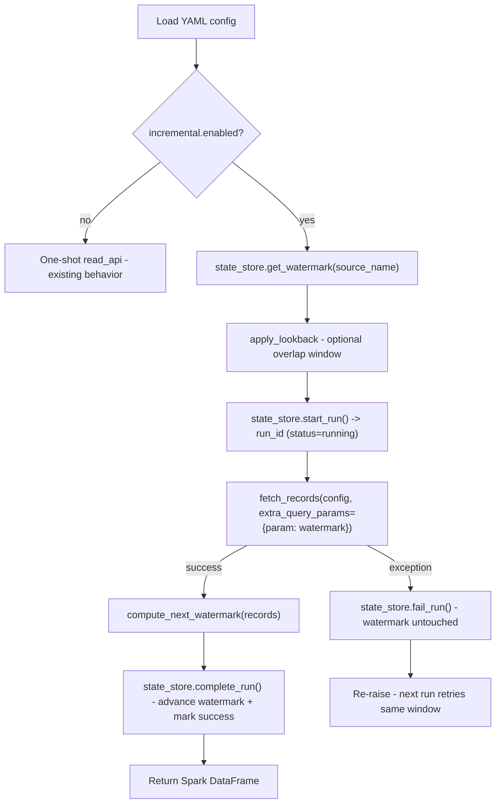

# Incremental REST API Ingestion

Adds **incremental (delta) fetching** and **database-backed run-state
tracking** on top of the existing YAML-driven REST API framework, so a
source only pulls records that are new or changed since the last
successful run — instead of re-fetching the full dataset every time.

## Why a database, not a file?

The framework's existing outputs (JSON/schema files, `FileWriter`) are
fine for *data*, but run **state** (the last watermark, run history, pass/fail)
needs to support:

- **Concurrent-safe reads/writes** — a file can be half-written if a job is
  killed mid-run; a DB transaction either commits or rolls back.
- **Point queries** — "what's the watermark for source X?" is a single
  indexed lookup, not a file scan/parse.
- **Auditability** — every run (success or failure) is a row you can query,
  join, and report on for reconciliation — the README's existing
  "Reconciliation" and "Duplicate check" requirements build directly on
  this table.
- **Multiple concurrent sources/environments** sharing one control-table
  database without file-locking concerns.

This is the same "control table" pattern used by Airbyte, Fivetran, dbt
sources, and Meltano: a small, fast, transactional store *separate* from
the distributed data-processing engine (Spark). Reads/writes here are
single-row operations — routing them through Spark would add distributed
overhead for zero benefit.

## Architecture



## Control tables

| Table | Purpose | Key columns |
|---|---|---|
| `ingestion_watermark` | Current pointer per source — read at the start of every run, advanced only on success. | `source_name` (PK), `watermark_value`, `updated_at` |
| `ingestion_run_history` | Append-only audit log of every run attempt. | `run_id` (PK), `source_name`, `status`, `watermark_start`, `watermark_end`, `params_used`, `records_fetched`, `error_message`, `started_at`, `completed_at` |

Both tables are defined as `SQLModel` classes in `models.py` and are
created automatically (`SQLModel.metadata.create_all`) the first time an
`IncrementalStateStore` connects — no manual migration step needed for
SQLite. For Postgres/MySQL in production, point `stateStore.url` at your
shared control-table database (see below); the same `CREATE TABLE IF NOT
EXISTS`-style bootstrap runs there too.

## YAML configuration

Add an `incremental` block under `options` in the same nested
`extracts.extract.source.params.options` structure used everywhere else
in this project:

```yaml
options:
  incremental:
    enabled: true
    mode: "query_param"          # only mode implemented so far
    paramName: "updated_since"   # request parameter carrying the watermark
    watermarkColumn: "updated_at" # field read from each response record
    type: "datetime"              # datetime | integer | string
    format: null                   # strptime/strftime pattern, or null for ISO-8601
    initialValue: "1970-01-01T00:00:00+00:00"
    lookback: "PT5M"               # ISO-8601 duration; optional overlap window
    stateStore:
      url: "sqlite:///${DATA_HOME}/rest_api_ds/incremental_state.db"
```

See `incremental_api_source.yaml` for the full runnable example.

## Usage

```python
from rest_ds.incremental.incremental_runner import run_incremental_ingestion
from rest_ds.incremental.state_store import IncrementalStateStore
from rest_ds.util.config_loader import load_config

config = load_config("examples/incremental/incremental_api_source.yaml")
store = IncrementalStateStore(os.path.expandvars("sqlite:///${DATA_HOME}/rest_api_ds/incremental_state.db"))

df = run_incremental_ingestion(spark, config, source_name="events_api", state_store=store)
```

Run the full local example (spins up a mock API and runs two incremental
cycles against it):

```bash
PYTHONPATH=src uv run python examples/incremental/mock_incremental_server.py &
PYTHONPATH=src uv run python examples/incremental/run_incremental_example.py
```

## Design notes / limitations

- **Watermark only advances on success.** A failed run leaves
  `ingestion_watermark` untouched, so the next scheduled run retries the
  exact same window — no gaps, no manual intervention needed.
- **Empty batches are not errors.** "Nothing new since the last watermark"
  is expected steady-state behavior; `create_dataframe_json` now returns a
  valid zero-row DataFrame instead of crashing on `spark.createDataFrame([])`.
- **Lookback window** rewinds a *datetime* watermark by a small overlap
  (e.g. `PT5M`) before each run to tolerate clock skew or APIs that expose
  records slightly out of order — at the cost of re-fetching (and your
  downstream layer de-duplicating) a few overlapping records each run.
- **`mode: query_param`** is the only injection mode implemented today;
  `body` and `header` injection are natural follow-ups if/when a source
  needs the watermark somewhere other than the query string.
- **Pagination compatibility**: incremental fetching reuses the same
  simple pagination path as `read_api()` (`rest_ds.util.api_client.fetch_data_with_pagination`),
  not the more advanced `result_key`-aware `Paginator` hierarchy in
  `rest_ds.rest_api`. Sources needing cursor/offset/page-number pagination
  *and* incremental watermarks will need that gap closed as a follow-up.
