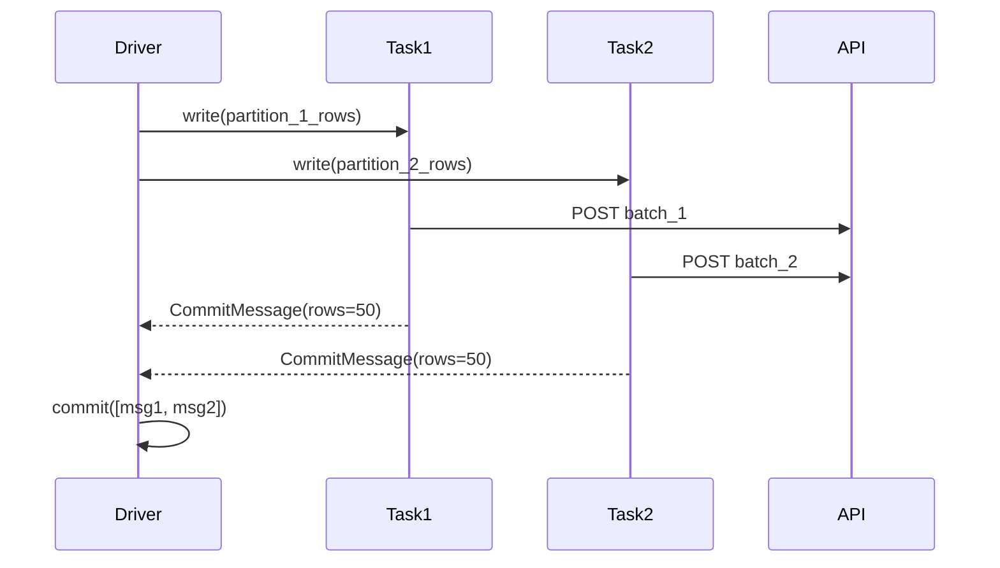
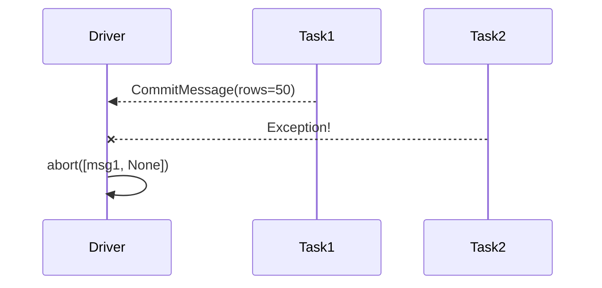

# Batch Writer — `RestApiSinkDataSource`

Write DataFrame rows to a REST API endpoint via HTTP POST.

## Format Name

```python
df.write.format("restapi_sink")
```

## Options

| Option | Type | Default | Description |
|--------|------|---------|-------------|
| `url` | str | Required | Target HTTP endpoint |
| `batchSize` | int | `100` | Number of rows per HTTP request |
| `headers.<name>` | str | — | Custom HTTP headers |
| `apiKey` | str | — | API key (sent via header) |
| `apiKeyHeader` | str | `X-API-Key` | Header name for API key |

## Behavior

Each Spark task:

1. Collects rows from its partition into batches of `batchSize`
2. POSTs each batch as a JSON array to the endpoint
3. Returns a `WriterCommitMessage` with row/request counts

After all tasks complete, the driver calls `commit()` to log totals.
If any task fails, `abort()` is called instead.

## Usage

```python
from pyspark.sql import functions as F
from custom_ds import create_spark_session, RestApiSinkDataSource

spark = create_spark_session("write-demo")
spark.dataSource.register(RestApiSinkDataSource)

df = spark.range(100).select(
    F.col("id"),
    F.concat(F.lit("item-"), F.col("id").cast("string")).alias("value"),
)

df.write.format("restapi_sink") \
    .option("url", "http://localhost:9090/api/records") \
    .option("batchSize", "25") \
    .mode("append") \
    .save()

spark.stop()
```

!!! note "Supported modes"
    Only `append` mode is meaningful for REST API writes. The `overwrite` flag
    is passed to the writer but has no effect on the HTTP behavior.

## Payload Format

Each batch is sent as a JSON array:

```json
[
  {"id": 0, "value": "item-0"},
  {"id": 1, "value": "item-1"},
  ...
]
```

## Commit / Abort Lifecycle



If a task fails:


