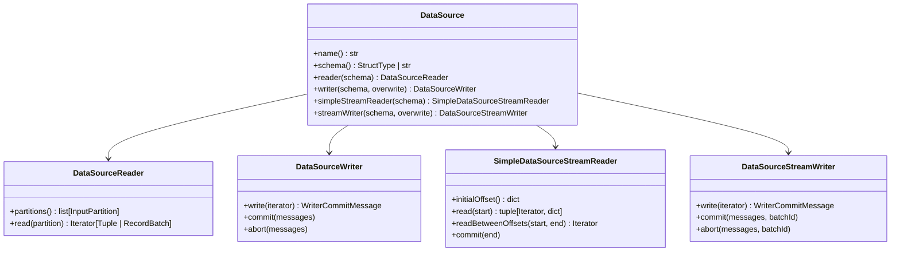

# API Reference

Complete reference for all custom data source implementations in the `custom_ds` library.

!!! info "Based on the PySpark 4 Python Data Source API"
    All classes extend base types from [`pyspark.sql.datasource`](https://spark.apache.org/docs/4.0.0/api/python/reference/pyspark.sql/api/pyspark.sql.datasource.DataSource.html).
    See the [official tutorial](https://spark.apache.org/docs/4.0.0/api/python/tutorial/sql/python_data_source.html)
    for the underlying API design.

## Data Sources Overview

| Format Name | Class | Mode | Description |
|---|---|---|---|
| `restapi` | `RestApiDataSource` | Batch read | HTTP GET → DataFrame with partitioning |
| `restapi_arrow` | `RestApiArrowDataSource` | Batch read | Arrow-optimized HTTP GET → DataFrame |
| `restapi_sink` | `RestApiSinkDataSource` | Batch write | DataFrame → HTTP POST |
| `restapi_stream` | `RestApiStreamDataSource` | Stream read | Polls endpoint with offset tracking |
| `restapi_stream_sink` | `RestApiStreamSinkDataSource` | Stream write | Micro-batch → HTTP POST |
| `weather_api` | `WeatherApiSource` | Batch read | UC HTTP auth + external API |
| `simple` | `SimpleDataSource` | Batch read | In-memory generated rows |
| `simple_sink` | `SimpleSinkDataSource` | Batch write | JSON-lines file sink |
| `simple_stream` | `SimpleStreamDataSource` | Stream read | Incrementing counter |

## Registration

Register individual sources or all at once:

```python
from custom_ds import register_all, RestApiDataSource

# Register everything (9 sources)
register_all(spark)

# Or register individually
spark.dataSource.register(RestApiDataSource)
```

## Python Data Source API Classes

The PySpark 4 API provides these base classes in `pyspark.sql.datasource`:



!!! warning "Serialization requirement"
    All DataSource reader/writer classes must be **pickle-serializable**.
    Import libraries **inside** `read()`/`write()` methods — not at module level — to
    ensure they are available in Spark worker processes.

    ```python
    # ✅ Correct — import inside worker method
    def read(self, partition):
        import requests
        resp = requests.get(self.url)
        ...

    # ❌ Wrong — top-level import breaks serialization
    import requests  # fails on workers in cluster mode
    class MyReader(DataSourceReader):
        def read(self, partition):
            resp = requests.get(self.url)
    ```

    See [References → Serialization Rules](../references.md#serialization-rules) for full details.

## Source Code

All implementations are in `src/custom_ds/`:

```
src/custom_ds/
├── batch/simple_source.py          → SimpleDataSource
├── writer/simple_writer.py         → SimpleSinkDataSource
├── streaming/simple_stream_source.py → SimpleStreamDataSource
├── restapi/
│   ├── rest_source.py              → RestApiDataSource (3 partition strategies)
│   ├── rest_arrow_source.py        → RestApiArrowDataSource
│   ├── rest_writer.py              → RestApiSinkDataSource
│   ├── rest_stream_source.py       → RestApiStreamDataSource
│   └── rest_stream_writer.py       → RestApiStreamSinkDataSource
├── uc_auth/
│   └── weather_source.py           → WeatherApiSource (UC HTTP auth)
├── session.py                      → create_spark_session()
└── util/registration.py            → register_all()
```
