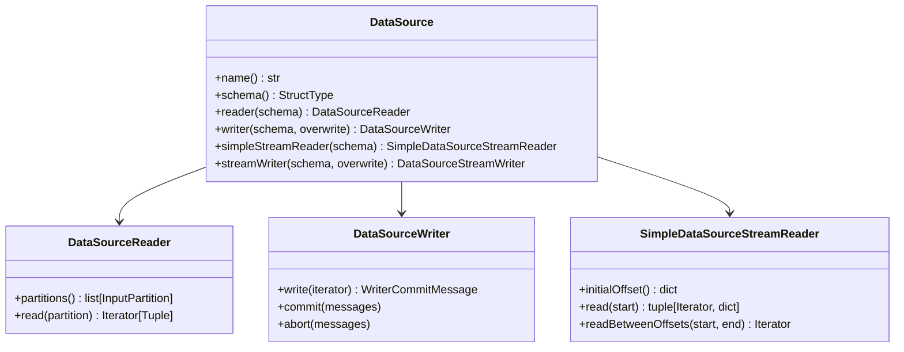

# API Reference

Complete reference for all custom data source implementations.

## Data Sources Overview

| Format Name | Class | Mode | Description |
|---|---|---|---|
| `restapi` | `RestApiDataSource` | Batch read | HTTP GET → DataFrame with partitioning |
| `restapi_arrow` | `RestApiArrowDataSource` | Batch read | Arrow-optimized HTTP GET → DataFrame |
| `restapi_sink` | `RestApiSinkDataSource` | Batch write | DataFrame → HTTP POST |
| `restapi_stream` | `RestApiStreamDataSource` | Stream read | Polls endpoint with offset tracking |
| `restapi_stream_sink` | `RestApiStreamSinkDataSource` | Stream write | Micro-batch → HTTP POST |
| `simple` | `SimpleDataSource` | Batch read | In-memory generated rows |
| `simple_sink` | `SimpleSinkDataSource` | Batch write | JSON-lines file sink |
| `simple_stream` | `SimpleStreamDataSource` | Stream read | Incrementing counter |

## Registration

Register individual sources or all at once:

```python
from custom_ds import register_all, RestApiDataSource

# Register everything
register_all(spark)

# Or register individually
spark.dataSource.register(RestApiDataSource)
```

## Python Data Source API Classes

The PySpark 4 API provides these base classes in `pyspark.sql.datasource`:



!!! note "Serialization requirement"
    All DataSource classes and their methods must be pickle-serializable.
    Import libraries **inside** `read()`/`write()` methods — not at module level — to
    ensure they are available in Spark worker processes.
