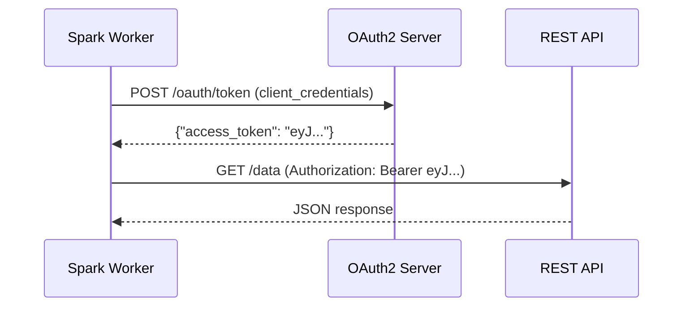
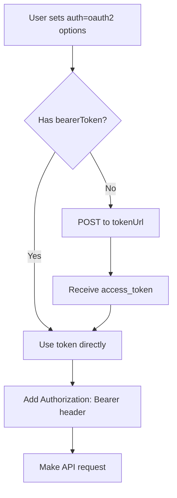

# OAuth2 Authentication

All REST API data sources (`restapi`, `restapi_arrow`, `restapi_sink`,
`restapi_stream`, `restapi_stream_sink`) support **OAuth2 authentication**
via configuration options — no custom code needed.

## Supported Flows

| Flow | Grant Type | Use Case |
|------|-----------|----------|
| **Client Credentials** | `client_credentials` | Machine-to-machine (most common for APIs) |
| **Resource Owner Password** | `password` | Username/password → token |
| **Bearer Token** | — | Pre-obtained token, no refresh |

## Configuration Options

| Option | Required | Default | Description |
|--------|----------|---------|-------------|
| `auth` | Yes | — | Set to `"oauth2"` to enable |
| `oauth.tokenUrl` | Yes* | — | Token endpoint URL |
| `oauth.clientId` | Yes* | — | OAuth2 client ID |
| `oauth.clientSecret` | Yes* | — | OAuth2 client secret |
| `oauth.grantType` | No | `client_credentials` | Grant type |
| `oauth.scope` | No | — | Space-separated scopes |
| `oauth.username` | No | — | Username (for `password` grant) |
| `oauth.password` | No | — | Password (for `password` grant) |
| `oauth.bearerToken` | No | — | Pre-obtained token (skips token fetch) |
| `oauth.param.<name>` | No | — | Extra token request parameters |

*Not required when using `oauth.bearerToken`.

## Client Credentials Flow

The most common flow for API-to-API authentication:

```python
df = (
    spark.read.format("restapi")
    .option("url", "https://api.example.com/data")
    .option("auth", "oauth2")
    .option("oauth.tokenUrl", "https://auth.example.com/oauth/token")
    .option("oauth.clientId", "my-client-id")
    .option("oauth.clientSecret", "my-client-secret")
    .option("oauth.scope", "read data:access")
    .load()
)
```



## Bearer Token (Pre-obtained)

Skip the token endpoint when you already have a valid token:

```python
df = (
    spark.read.format("restapi")
    .option("url", "https://api.example.com/data")
    .option("auth", "oauth2")
    .option("oauth.bearerToken", os.environ["API_TOKEN"])
    .load()
)
```

!!! tip "Use environment variables"
    Never hardcode tokens in source code. Use `os.environ` or
    Databricks secrets (`dbutils.secrets.get()`).

## Password Grant

For APIs that require username/password authentication:

```python
df = (
    spark.read.format("restapi")
    .option("url", "https://api.example.com/data")
    .option("auth", "oauth2")
    .option("oauth.tokenUrl", "https://auth.example.com/token")
    .option("oauth.clientId", "my-client")
    .option("oauth.clientSecret", "my-secret")
    .option("oauth.grantType", "password")
    .option("oauth.username", "user@example.com")
    .option("oauth.password", os.environ["API_PASSWORD"])
    .load()
)
```

## Writing with OAuth2

OAuth2 works with both batch and streaming writers:

```python
# Batch write
df.write.format("restapi_sink") \
    .option("url", "https://api.example.com/records") \
    .option("auth", "oauth2") \
    .option("oauth.tokenUrl", "https://auth.example.com/token") \
    .option("oauth.clientId", "my-client") \
    .option("oauth.clientSecret", "my-secret") \
    .mode("append") \
    .save()

# Streaming write
query = df.writeStream.format("restapi_stream_sink") \
    .option("url", "https://api.example.com/records") \
    .option("auth", "oauth2") \
    .option("oauth.bearerToken", os.environ["API_TOKEN"]) \
    .start()
```

## How It Works



Key design points:

1. **Pickle-safe** — `OAuth2Config` is a `@dataclass` with simple types only
2. **Lazy token fetch** — tokens are fetched inside `read()`/`write()`, not at construction
3. **Per-request** — each worker task fetches its own token (safe for parallel execution)
4. **All sources** — works with `restapi`, `restapi_arrow`, `restapi_sink`, `restapi_stream`, `restapi_stream_sink`

!!! warning "Token caching"
    The current implementation fetches a new token for each Spark task.
    For high-partition workloads, consider using `oauth.bearerToken` with a
    pre-fetched long-lived token to reduce token endpoint load.

## Combining with Other Auth

OAuth2 (`auth=oauth2`) takes precedence over API key auth (`apiKey`). If both
are set, OAuth2 is used and the API key is ignored.

| Priority | Auth Method | Options |
|----------|------------|---------|
| 1 | OAuth2 | `auth=oauth2` + `oauth.*` |
| 2 | API Key | `apiKey` + `apiKeyHeader` |
| 3 | Custom Headers | `headers.Authorization` |

## Running the Example

```bash
# Start mock server
uv run python examples/mock_server/server.py

# Run OAuth2 example
uv run python examples/12_oauth2/oauth2_client_credentials.py
```
