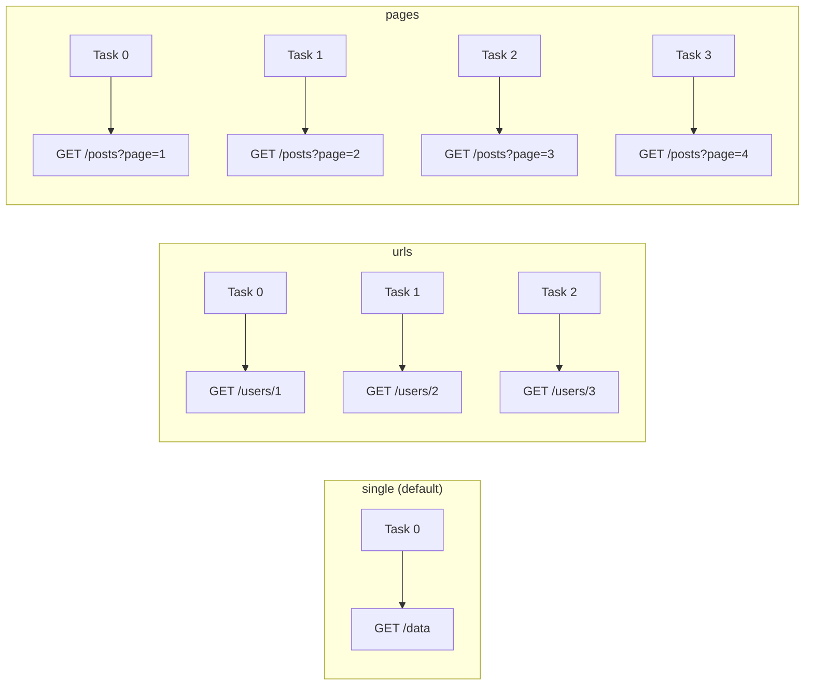

# Partitioning Strategies

The `restapi` data source supports three partitioning strategies for parallel data loading.

## Overview

| Strategy | Option | Partitions | Best For |
|---|---|---|---|
| `single` | `url` | 1 | Small APIs, simple endpoints |
| `urls` | `urls` (comma-separated) | N (one per URL) | Multi-endpoint aggregation |
| `pages` | `url` + `totalPages` | N (one per page) | Paginated APIs |



## Single Partition (default)

One HTTP call, one Spark task. Use for small APIs or when the endpoint returns all data at once.

```python
df = spark.read.format("restapi") \
    .option("url", "http://api.example.com/users") \
    .option("resultKey", "data") \
    .load()
```

## URL-based Partitioning

Process multiple URLs in parallel — one Spark task per URL:

```python
urls = ",".join([
    "http://api.example.com/users/1",
    "http://api.example.com/users/2",
    "http://api.example.com/users/3",
])

df = spark.read.format("restapi") \
    .option("partitionStrategy", "urls") \
    .option("urls", urls) \
    .option("schema", "id LONG, name STRING, email STRING") \
    .load()

# Verify partition distribution
from pyspark.sql.functions import spark_partition_id
df.select(spark_partition_id().alias("partition")).groupBy("partition").count().show()
```

!!! tip "Use cases for URL-based partitioning"
    - Fetching individual resources by ID
    - Aggregating data from multiple microservices
    - Parallel calls to different API versions

## Page-based Partitioning

Fetch multiple pages in parallel — one Spark task per page:

```python
df = spark.read.format("restapi") \
    .option("partitionStrategy", "pages") \
    .option("url", "http://api.example.com/posts") \
    .option("totalPages", "10") \
    .option("pageSize", "50") \
    .option("pageParam", "page") \
    .option("pageSizeParam", "limit") \
    .option("resultKey", "data") \
    .option("schema", "id LONG, title STRING") \
    .load()
```

### Page Options

| Option | Default | Description |
|--------|---------|-------------|
| `totalPages` | `1` | Number of pages to fetch |
| `pageSize` | `100` | Items requested per page |
| `pageParam` | `page` | Query parameter name for page number |
| `pageSizeParam` | `limit` | Query parameter name for page size |

The reader generates requests like:

```
GET /posts?page=1&limit=50
GET /posts?page=2&limit=50
...
GET /posts?page=10&limit=50
```

## Performance Comparison

For a 1000-record API with 4 pages of 250 records:

| Strategy | Partitions | Parallelism | Expected Speedup |
|---|---|---|---|
| `single` | 1 | Sequential | 1x (baseline) |
| `pages` (4) | 4 | 4 concurrent calls | ~4x |

!!! note "Spark parallelism"
    Actual parallelism depends on available executor cores. With `local[*]`, all
    partitions run concurrently up to the number of CPU cores.
