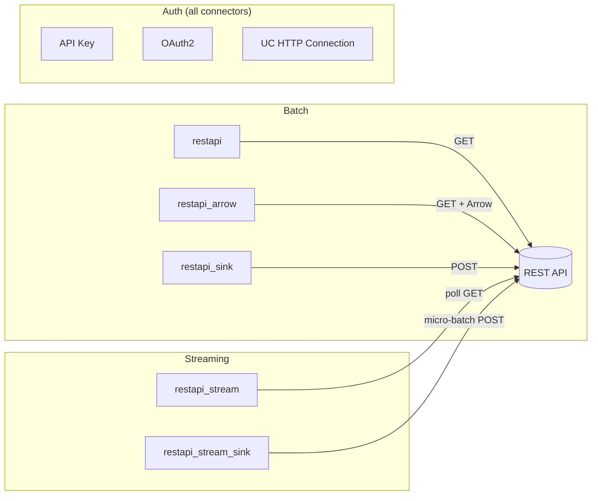
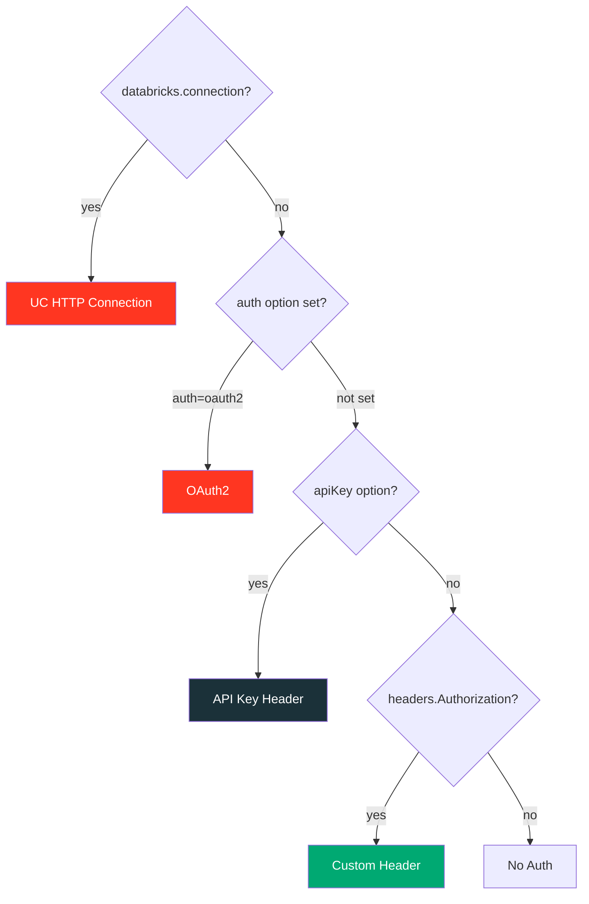
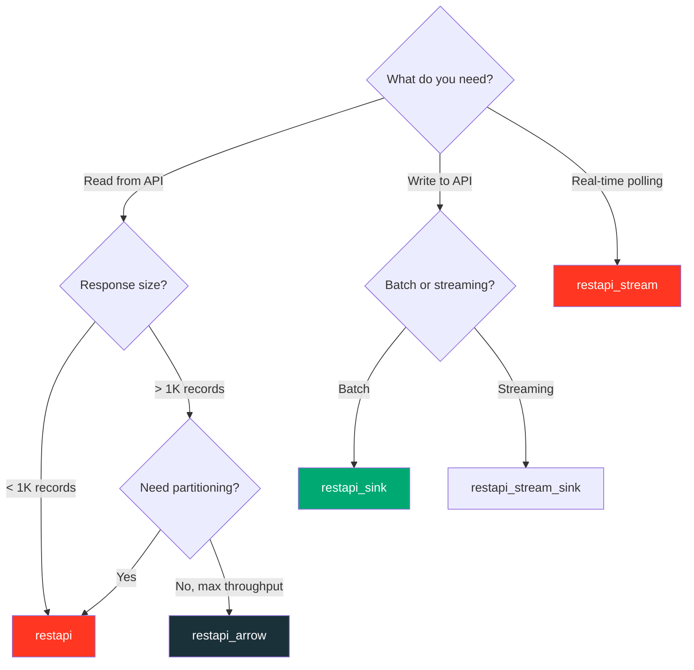

# REST API Data Source — Complete Guide

A comprehensive overview of all REST API data source connectors in the `custom_ds`
library: what they support, how they differ, and what their limitations are.

---

## Connector Overview



| Format Name | Class | Direction | Mode | Protocol |
|---|---|---|---|---|
| `restapi` | `RestApiDataSource` | Read | Batch | HTTP GET |
| `restapi_arrow` | `RestApiArrowDataSource` | Read | Batch | HTTP GET + Arrow |
| `restapi_sink` | `RestApiSinkDataSource` | Write | Batch | HTTP POST |
| `restapi_stream` | `RestApiStreamDataSource` | Read | Streaming | HTTP GET (poll) |
| `restapi_stream_sink` | `RestApiStreamSinkDataSource` | Write | Streaming | HTTP POST |
| `weather_api` | `WeatherApiSource` | Read | Batch | HTTP GET (UC auth) |

---

## Supported Features

### :material-check-all: Feature Matrix

| Feature | `restapi` | `restapi_arrow` | `restapi_sink` | `restapi_stream` | `restapi_stream_sink` |
|---|:---:|:---:|:---:|:---:|:---:|
| **JSON response parsing** | :material-check: | :material-check: | — | :material-check: | — |
| **Schema inference** | :material-check: | :material-check: | — | :material-close: | — |
| **Explicit DDL schema** | :material-check: | :material-check: | :material-check: | :material-check: | :material-check: |
| **Result key navigation** | :material-check: | :material-check: | — | :material-check: | — |
| **Custom headers** | :material-check: | :material-check: | :material-check: | :material-check: | :material-check: |
| **Query parameters** | :material-check: | :material-check: | — | — | — |
| **API key auth** | :material-check: | :material-check: | :material-check: | :material-check: | :material-check: |
| **OAuth2 auth** | :material-check: | :material-check: | :material-check: | :material-check: | :material-check: |
| **Configurable timeout** | :material-check: | :material-check: | :material-check: | :material-check: | :material-check: |
| **Partitioning: single** | :material-check: | :material-check: | — | — | — |
| **Partitioning: URL-based** | :material-check: | :material-close: | — | — | — |
| **Partitioning: page-based** | :material-check: | :material-close: | — | — | — |
| **Arrow RecordBatch** | :material-close: | :material-check: | — | — | — |
| **Batch size control** | — | — | :material-check: | — | :material-check: |
| **Commit/abort lifecycle** | — | — | :material-check: | — | :material-check: |
| **Offset tracking** | — | — | — | :material-check: | — |
| **SQL access** | :material-check: | :material-check: | — | :material-check: | — |
| **UC HTTP Connection** | :material-check: | :material-check: | :material-check: | :material-check: | :material-check: |

### Authentication

Four authentication methods, applied in priority order:



| Method | Options | Supported Flows |
|--------|---------|-----------------|
| **UC HTTP Connection** | `databricks.connection` or `uc.*` | Auto-injected (DBR 18.1+), local via `uc.*` options |
| **OAuth2** | `auth=oauth2` + `oauth.*` | Client credentials, password, bearer token |
| **API Key** | `apiKey` + `apiKeyHeader` | Header-based (default: `X-API-Key`) |
| **Custom Header** | `headers.Authorization` | Any scheme (Basic, Bearer, custom) |

### Schema Handling

| Behavior | When | Source |
|----------|------|--------|
| **Auto-inference** | No `schema` option provided (batch only) | First record from API response |
| **Explicit DDL** | `schema` option set | User-provided DDL string |
| **Required** | Streaming sources | Always required (no inference call) |

Type mapping for auto-inference:

| Python Type | Spark Type | Arrow Type |
|-------------|-----------|------------|
| `int` | `LongType` | `pa.int64()` |
| `float` | `DoubleType` | `pa.float64()` |
| `bool` | `BooleanType` | `pa.bool_()` |
| `str`, other | `StringType` | `pa.string()` |
| `dict`, `list` | `StringType` (JSON-serialized) | `pa.string()` |

### Partitioning Strategies

| Strategy | Partitions | Parallelism | Use Case |
|----------|-----------|-------------|----------|
| `single` | 1 | None | Small APIs, simple endpoints |
| `urls` | N (one per URL) | Full parallel | Multi-endpoint aggregation |
| `pages` | N (one per page) | Full parallel | Paginated APIs |

### Response Navigation

The `resultKey` option supports dot-notation for nested JSON:

```json
{"meta": {"status": "ok"}, "response": {"items": [{"id": 1}]}}
```

```python
.option("resultKey", "response.items")  # extracts the array
```

| Response Shape | resultKey | Behavior |
|---------------|-----------|----------|
| Top-level array `[{...}]` | Not set | Array used directly |
| Wrapped `{"data": [{...}]}` | `"data"` | Navigates to nested array |
| Deep `{"a": {"b": [{...}]}}` | `"a.b"` | Dot-path navigation |
| Single object `{...}` | Not set | Wrapped as single-element list |

---

## All Configuration Options

### Batch Reader (`restapi`)

| Option | Type | Default | Description |
|--------|------|---------|-------------|
| `url` | str | Required* | HTTP endpoint URL |
| `urls` | str | — | Comma-separated URLs (for `urls` strategy) |
| `method` | str | `GET` | HTTP method |
| `resultKey` | str | — | Dot-path to JSON array in response |
| `schema` | str | auto-inferred | DDL schema string |
| `partitionStrategy` | str | `single` | `single`, `urls`, or `pages` |
| `totalPages` | int | `1` | Pages to fetch (for `pages` strategy) |
| `pageSize` | int | `100` | Items per page |
| `pageParam` | str | `page` | Query param for page number |
| `pageSizeParam` | str | `limit` | Query param for page size |
| `headers.<name>` | str | — | Custom HTTP headers |
| `params.<name>` | str | — | Query parameters |
| `apiKey` | str | — | API key value |
| `apiKeyHeader` | str | `X-API-Key` | Header name for API key |
| `auth` | str | — | Set to `oauth2` for OAuth2 |
| `oauth.tokenUrl` | str | — | OAuth2 token endpoint |
| `oauth.clientId` | str | — | OAuth2 client ID |
| `oauth.clientSecret` | str | — | OAuth2 client secret |
| `oauth.grantType` | str | `client_credentials` | OAuth2 grant type |
| `oauth.scope` | str | — | OAuth2 scope |
| `oauth.bearerToken` | str | — | Pre-obtained bearer token |
| `timeout` | int | `30` | Request timeout (seconds) |
| `databricks.connection` | str | — | UC HTTP connection name (DBR 18.1+) |
| `uc.host` | str | — | UC host for local testing |
| `uc.basePath` | str | — | UC base path for local testing |
| `uc.bearerToken` | str | — | UC bearer token for local testing |
| `uc.port` | str | — | UC port for local testing |
| `uc.path` | str | — | Additional path appended to base URL |

### Batch Writer (`restapi_sink`)

| Option | Type | Default | Description |
|--------|------|---------|-------------|
| `url` | str | Required* | Target HTTP endpoint |
| `batchSize` | int | `100` | Rows per HTTP POST request |
| `headers.<name>` | str | — | Custom HTTP headers |
| `apiKey` | str | — | API key value |
| `auth` | str | — | Set to `oauth2` for OAuth2 |
| `oauth.*` | — | — | Same OAuth2 options as reader |
| `databricks.connection` | str | — | UC HTTP connection (DBR 18.1+) |
| `uc.*` | — | — | Same UC options as reader |

### Stream Reader (`restapi_stream`)

| Option | Type | Default | Description |
|--------|------|---------|-------------|
| `url` | str | Required* | HTTP endpoint to poll |
| `offsetParam` | str | `since_id` | Query param for offset |
| `offsetKey` | str | `id` | JSON field for monotonic offset |
| `limit` | int | `100` | Max records per poll |
| `resultKey` | str | — | Dot-path to array in response |
| `schema` | str | Required | DDL schema string |
| `headers.<name>` | str | — | Custom headers |
| `apiKey` | str | — | API key |
| `auth` | str | — | Set to `oauth2` for OAuth2 |
| `oauth.*` | — | — | Same OAuth2 options as reader |
| `databricks.connection` | str | — | UC HTTP connection (DBR 18.1+) |
| `uc.*` | — | — | Same UC options as reader |

### Stream Writer (`restapi_stream_sink`)

| Option | Type | Default | Description |
|--------|------|---------|-------------|
| `url` | str | Required* | Target HTTP endpoint |
| `batchSize` | int | `100` | Rows per HTTP POST |
| `headers.<name>` | str | — | Custom headers |
| `apiKey` | str | — | API key |
| `auth` | str | — | Set to `oauth2` for OAuth2 |
| `oauth.*` | — | — | Same OAuth2 options as reader |
| `databricks.connection` | str | — | UC HTTP connection (DBR 18.1+) |
| `uc.*` | — | — | Same UC options as reader |

!!! info "* URL is required unless `databricks.connection` or `uc.host` is provided"

---

## Limitations

!!! warning "Known Limitations"

### Data Format

| Limitation | Detail | Workaround |
|-----------|--------|------------|
| **JSON only** | Only `application/json` responses supported | Pre-process XML/CSV/Protobuf externally |
| **Flat schema only** | Nested objects/arrays → JSON string columns | Parse with `from_json()` after loading |
| **No schema evolution** | Schema fixed at read time | Provide explicit schema or reload |

### Authentication

| Limitation | Detail | Workaround |
|-----------|--------|------------|
| **No token caching** | OAuth2 fetches a new token per Spark task | Use `oauth.bearerToken` with pre-fetched token |
| **No token refresh** | Expired tokens cause task failures | Use short-lived jobs or client_credentials flow |
| **No mTLS** | Mutual TLS not supported | Use a proxy or API gateway |
| **No OAuth2 PKCE** | Authorization Code + PKCE not supported | Use client_credentials or password grant |

### Networking

| Limitation | Detail | Workaround |
|-----------|--------|------------|
| **No retry logic** | HTTP failures immediately raise exceptions | Implement retries in a custom subclass |
| **No rate limiting** | No built-in throttling for API rate limits | Use page-based partitioning to control concurrency |
| **No connection pooling** | Each `read()`/`write()` creates a new connection | Acceptable for most API workloads |
| **No proxy support** | `HTTP_PROXY`/`HTTPS_PROXY` not explicitly handled | Set env vars on worker nodes |

### Partitioning & Parallelism

| Limitation | Detail | Workaround |
|-----------|--------|------------|
| **No cursor-based pagination** | Only offset/page-number pagination | Implement custom `DataSourceReader` |
| **No auto-discovery of total pages** | Must provide `totalPages` explicitly | Query API metadata first, then pass count |
| **Arrow reader: single partition** | `restapi_arrow` doesn't support URL/page partitioning | Use `restapi` with partitioning instead |
| **No dynamic partitioning** | Partition count fixed at planning time | Pre-compute partition list |

### Streaming

| Limitation | Detail | Workaround |
|-----------|--------|------------|
| **Driver-only stream reader** | Uses `SimpleDataSourceStreamReader` (not partitioned) | Sufficient for most polling use cases |
| **Integer offsets only** | Offset must be a monotonically increasing integer | Map timestamps/cursors to integers |
| **No exactly-once for writes** | POST is not idempotent by default | Use idempotency keys in the API |
| **No backpressure** | Polls at fixed intervals regardless of downstream | Tune `trigger(processingTime=...)` |

### Write Operations

| Limitation | Detail | Workaround |
|-----------|--------|------------|
| **POST only** | Writer always uses HTTP POST | Subclass `DataSourceWriter` for PUT/PATCH |
| **JSON array payload** | Sends rows as `[{...}, {...}]` JSON array | Acceptable for most REST APIs |
| **No partial rollback** | `abort()` logs a warning but can't undo sent data | Design APIs to be idempotent |
| **Append mode only** | `overwrite` flag has no effect on HTTP behavior | Not applicable to REST APIs |

### General

| Limitation | Detail | Workaround |
|-----------|--------|------------|
| **No column pruning** | All columns fetched regardless of query | Future PySpark API enhancement |
| **No filter pushdown** | Filters applied after fetching all data | Add `params.<name>` for server-side filters |
| **No predicate pushdown** | `WHERE` clauses not pushed to API | Use query parameters manually |
| **PySpark 4.0+ only** | Python Data Source API doesn't exist in 3.x | Use PySpark 4.0 or DBR 15.4+ |
| **Java 17 required** | PySpark 4.x requires Java 17 | Install JDK 17 |

---

## Choosing the Right Connector



| Scenario | Recommended Connector |
|----------|----------------------|
| Simple API read | `restapi` (single partition) |
| Multi-endpoint aggregation | `restapi` (URL-based partitioning) |
| Large paginated API | `restapi` (page-based partitioning) |
| High-throughput single endpoint | `restapi_arrow` |
| POST data to API | `restapi_sink` |
| Continuous polling | `restapi_stream` |
| Stream writes to API | `restapi_stream_sink` |
| Databricks + UC auth | Any connector with `databricks.connection` or `uc.*` |

---

## Quick Reference

### Batch Read

```python
df = (
    spark.read.format("restapi")
    .option("url", "https://api.example.com/users")
    .option("resultKey", "data")
    .option("auth", "oauth2")
    .option("oauth.tokenUrl", "https://auth.example.com/token")
    .option("oauth.clientId", "my-client")
    .option("oauth.clientSecret", "my-secret")
    .load()
)
```

### Batch Read with UC HTTP Connection

=== "On Databricks (DBR 18.1+)"

    ```python
    df = (
        spark.read.format("restapi")
        .option("databricks.connection", "my_http_connection")  # (1)!
        .option("uc.path", "users")                             # (2)!
        .option("resultKey", "data")
        .schema("id INT, name STRING, email STRING")
        .load()
    )
    ```

    1. Unity Catalog auto-injects `host`, `base_path`, and `bearer_token`.
    2. Additional path appended to the base URL.

=== "Local Testing"

    ```python
    df = (
        spark.read.format("restapi")
        .option("uc.host", "https://api.example.com")
        .option("uc.basePath", "/v2")
        .option("uc.bearerToken", "my-token")
        .option("uc.path", "users")
        .schema("id INT, name STRING, email STRING")
        .load()
    )
    ```

### Batch Write

```python
df.write.format("restapi_sink") \
    .option("url", "https://api.example.com/records") \
    .option("batchSize", "50") \
    .mode("append") \
    .save()
```

### Stream Read

```python
stream_df = (
    spark.readStream.format("restapi_stream")
    .option("url", "https://api.example.com/events")
    .option("schema", "id LONG, event STRING, ts STRING")
    .option("offsetParam", "since_id")
    .load()
)
```

### Stream Write

```python
query = (
    stream_df.writeStream.format("restapi_stream_sink")
    .option("url", "https://api.example.com/records")
    .option("batchSize", "100")
    .start()
)
```

---

## Related Pages

- [Batch Reader API](batch-reader.md) — detailed options and partitioning
- [Batch Writer API](batch-writer.md) — commit/abort lifecycle
- [Streaming API](streaming.md) — offset tracking and micro-batch writes
- [Arrow Reader API](arrow-reader.md) — zero-copy columnar transfer
- [OAuth2 Authentication](oauth2.md) — OAuth2 flows and configuration
- [Partitioning Strategies](partitioning.md) — parallel read patterns
- [UC HTTP Auth Example](../examples/uc-http-auth.md) — Unity Catalog credential injection
- [UC HTTP Connection](uc-connection.md) — Unity Catalog HTTP connection setup and auth types
- [:material-file-document: Databricks HTTP Connections](https://docs.databricks.com/aws/en/query-federation/http) — official documentation
