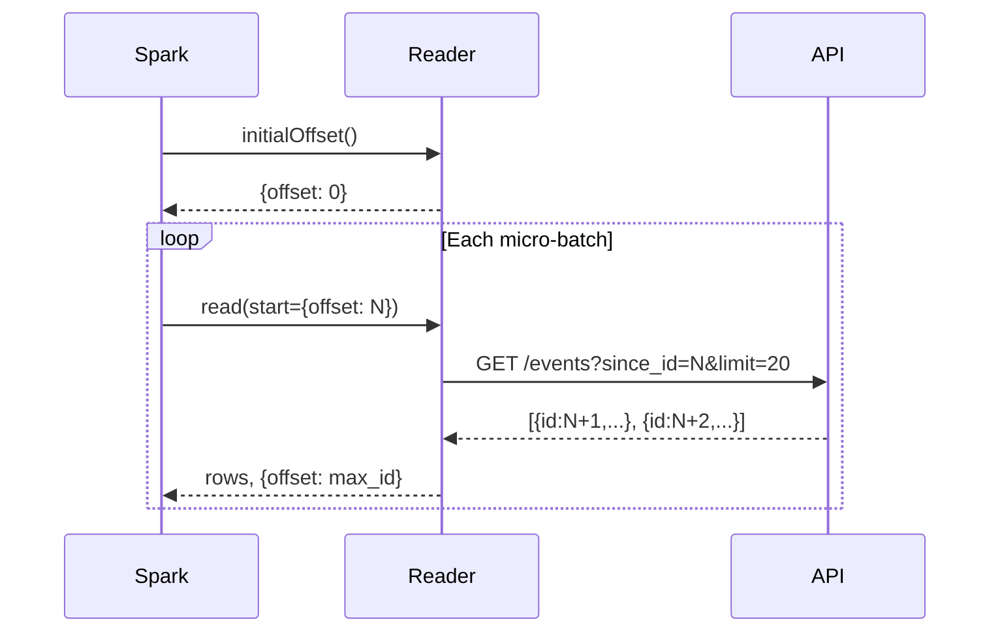

# Streaming — `RestApiStreamDataSource` & `RestApiStreamSinkDataSource`

Poll a REST API for new records or push micro-batches to an endpoint.

## Stream Reader — `restapi_stream`

### Options

| Option | Type | Default | Description |
|--------|------|---------|-------------|
| `url` | str | Required | HTTP endpoint to poll |
| `offsetParam` | str | `since_id` | Query param carrying the current offset |
| `offsetKey` | str | `id` | JSON field representing the monotonic offset |
| `limit` | int | `100` | Max records per poll |
| `resultKey` | str | — | Dot-path to array in response |
| `schema` | str | Required | DDL schema string (no auto-inference for streaming) |
| `headers.<name>` | str | — | Custom headers |
| `apiKey` | str | — | API key |

### Usage

```python
from custom_ds import create_spark_session, RestApiStreamDataSource

spark = create_spark_session("stream-demo")
spark.dataSource.register(RestApiStreamDataSource)

stream_df = spark.readStream.format("restapi_stream") \
    .option("url", "http://localhost:9090/api/events") \
    .option("offsetParam", "since_id") \
    .option("offsetKey", "id") \
    .option("limit", "20") \
    .option("schema", "id LONG, event STRING, timestamp STRING") \
    .load()

query = stream_df.writeStream \
    .format("console") \
    .outputMode("append") \
    .trigger(processingTime="5 seconds") \
    .start()

query.awaitTermination(timeout=30)
query.stop()
spark.stop()
```

### How It Works



!!! tip "Schema is required"
    Streaming sources cannot infer schema (no initial HTTP call on the driver).
    Always provide a `schema` option.

---

## Stream Writer — `restapi_stream_sink`

### Options

| Option | Type | Default | Description |
|--------|------|---------|-------------|
| `url` | str | Required | Target HTTP endpoint |
| `batchSize` | int | `100` | Rows per HTTP request |
| `headers.<name>` | str | — | Custom headers |
| `apiKey` | str | — | API key |

### Usage

```python
from custom_ds import create_spark_session, RestApiStreamSinkDataSource

spark = create_spark_session("stream-write-demo")
spark.dataSource.register(RestApiStreamSinkDataSource)

# Assume stream_df is a streaming DataFrame
query = stream_df.writeStream \
    .format("restapi_stream_sink") \
    .option("url", "http://localhost:9090/api/records") \
    .option("batchSize", "50") \
    .start()

query.awaitTermination(timeout=30)
query.stop()
spark.stop()
```

### Commit/Abort per Batch

The stream writer receives a `batchId` with each commit/abort call, allowing
per-micro-batch tracking:

```python
def commit(self, messages, batch_id: int) -> None:
    total = sum(m.rows_sent for m in messages if m is not None)
    print(f"batch {batch_id}: committed {total} rows")

def abort(self, messages, batch_id: int) -> None:
    print(f"batch {batch_id}: aborted")
```
