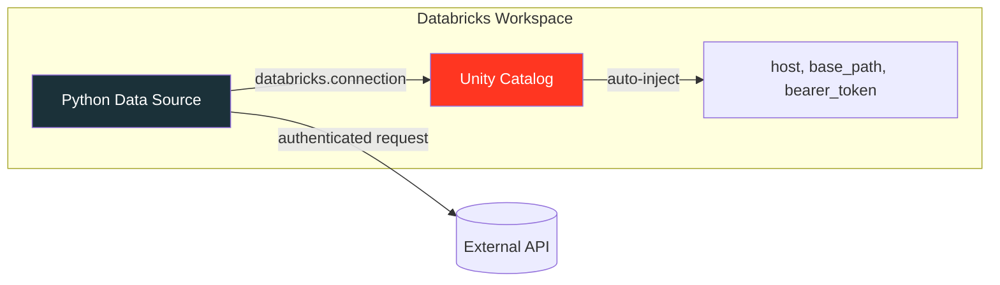
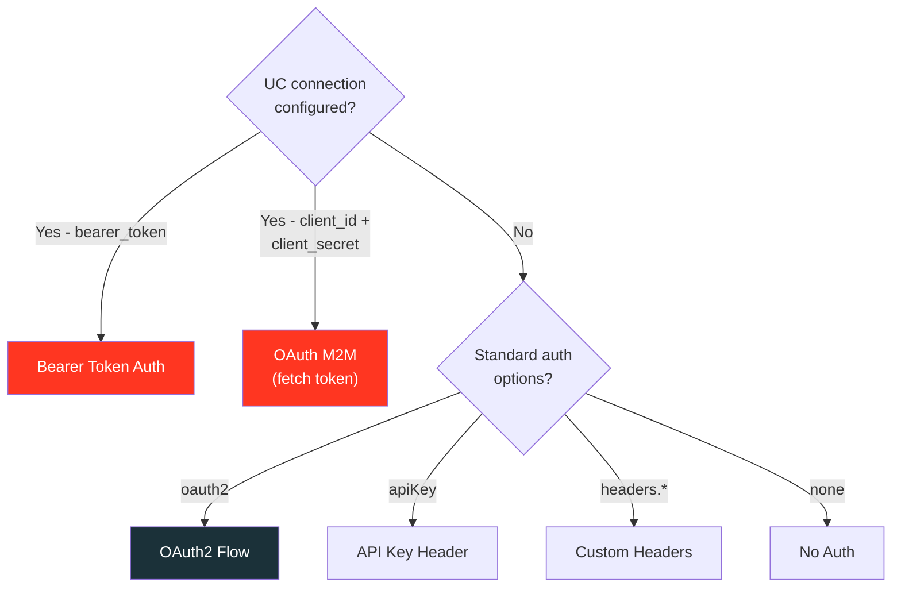

# Unity Catalog HTTP Connection

:material-shield-lock: **Secure credential management for REST API data sources**

---

## Overview

Unity Catalog HTTP connections are securable objects that store endpoint and credential
information for external HTTP services. Instead of embedding tokens or secrets in your
code, you create a connection in Unity Catalog and reference it from your data source.

All five REST API connectors support UC HTTP connections:

| Connector | Format Name | Direction |
|-----------|-------------|-----------|
| Batch Reader | `restapi` | Read |
| Arrow Reader | `restapi_arrow` | Read |
| Batch Writer | `restapi_sink` | Write |
| Stream Reader | `restapi_stream` | Read |
| Stream Writer | `restapi_stream_sink` | Write |



---

## Authentication Methods

UC HTTP connections support multiple authentication types:

| Auth Type | UC Option Keys | Use Case |
|-----------|---------------|----------|
| **Bearer Token** | `bearer_token` | Simple token-based auth |
| **OAuth M2M** | `client_id`, `client_secret`, `token_endpoint`, `oauth_scope` | Server-to-server communication |
| **OAuth U2M Shared** | *(managed by Databricks)* | Shared user identity |
| **OAuth U2M Per User** | *(managed by Databricks)* | Individual user identity |
| **Dynamic Client Registration** | *(managed by Databricks)* | RFC 7591 auto-discovery |

!!! info "Python Data Source Support"
    The `custom_ds` library directly handles **Bearer Token** and **OAuth M2M**
    connection types. The other OAuth flows (U2M Shared, U2M Per User, DCR) are
    managed entirely by the Databricks driver and work transparently.

---

## Setup on Databricks

### Step 1: Create the Connection

=== "Bearer Token"

    ```sql
    CREATE CONNECTION my_rest_api TYPE HTTP
    OPTIONS (
        host 'https://api.example.com',
        port '443',
        base_path '/v2',
        bearer_token secret('my_scope', 'api_token')  -- (1)!
    );
    ```

    1. Use `secret()` to reference a Databricks secret — never hardcode tokens in SQL.

=== "OAuth Machine-to-Machine"

    ```sql
    CREATE CONNECTION my_oauth_api TYPE HTTP
    OPTIONS (
        host 'https://api.example.com',
        base_path '/v2',
        client_id 'my-client-id',
        client_secret secret('my_scope', 'client_secret'),
        token_endpoint 'https://auth.example.com/oauth/token',
        oauth_scope 'read write'
    );
    ```

### Step 2: Grant Access

```sql
-- Grant USE CONNECTION to users who need to read/write via the connection
GRANT USE CONNECTION ON CONNECTION my_rest_api TO `data-team@example.com`;

-- Grant MANAGE to users who need to modify the connection
GRANT MANAGE ON CONNECTION my_rest_api TO `admin@example.com`;
```

### Step 3: Use in Data Source

```python
from custom_ds import RestApiDataSource

spark.dataSource.register(RestApiDataSource)

df = (
    spark.read.format("restapi")
    .option("databricks.connection", "my_rest_api")  # (1)!
    .option("uc.path", "users")                      # (2)!
    .option("resultKey", "data")
    .schema("id INT, name STRING, email STRING")
    .load()
)
```

1. The Spark driver resolves the connection and injects `host`, `base_path`, and
   credentials into the options dict automatically.
2. Additional path appended after `base_path` to form the full endpoint URL.

---

## Local Testing

For development and testing outside Databricks, pass the same connection
parameters explicitly using `uc.*` options:

=== "Bearer Token"

    ```python
    df = (
        spark.read.format("restapi")
        .option("uc.host", "https://api.example.com")
        .option("uc.basePath", "/v2")
        .option("uc.bearerToken", os.environ["API_TOKEN"])
        .option("uc.path", "users")
        .schema("id INT, name STRING, email STRING")
        .load()
    )
    ```

=== "OAuth M2M"

    ```python
    df = (
        spark.read.format("restapi")
        .option("uc.host", "https://api.example.com")
        .option("uc.basePath", "/v2")
        .option("uc.clientId", os.environ["CLIENT_ID"])
        .option("uc.clientSecret", os.environ["CLIENT_SECRET"])
        .option("uc.tokenEndpoint", "https://auth.example.com/oauth/token")
        .option("uc.oauthScope", "read write")
        .option("uc.path", "users")
        .schema("id INT, name STRING, email STRING")
        .load()
    )
    ```

---

## Configuration Options

### Connection Options (Databricks)

| Option | Description |
|--------|-------------|
| `databricks.connection` | UC HTTP connection name |

!!! warning "UC-injected keys cannot be overridden"
    When `databricks.connection` is set, the Spark driver injects `host`, `base_path`,
    `bearer_token`, `port`, `client_id`, `client_secret`, `token_endpoint`, and
    `oauth_scope` automatically. These injected keys **cannot** be overridden by user options.

### Local Testing Options (`uc.*`)

| Option | Type | Description |
|--------|------|-------------|
| `uc.host` | str | API host URL (e.g., `https://api.example.com`) |
| `uc.basePath` | str | Base path prepended to all requests |
| `uc.port` | str | Custom port (overrides host port) |
| `uc.path` | str | Additional path appended to base URL |
| `uc.bearerToken` | str | Bearer token for auth |
| `uc.clientId` | str | OAuth M2M client ID |
| `uc.clientSecret` | str | OAuth M2M client secret |
| `uc.tokenEndpoint` | str | OAuth M2M token endpoint URL |
| `uc.oauthScope` | str | OAuth M2M scopes (space-separated) |

### Auth Priority



---

## URL Construction

The UC connection URL is built following the same pattern as the Databricks
HTTP connection proxy:

```
{host}:{port}{base_path}{uc.path}
```

| `uc.host` | `uc.port` | `uc.basePath` | `uc.path` | Result URL |
|-----------|-----------|---------------|-----------|------------|
| `https://api.example.com` | — | `/v2` | `users` | `https://api.example.com/v2/users` |
| `https://api.example.com` | `8443` | `/v2` | `users` | `https://api.example.com:8443/v2/users` |
| `https://api.example.com` | — | — | `data/users` | `https://api.example.com/data/users` |

---

## Writing with UC Connection

All write connectors support UC connections:

=== "Batch Write"

    ```python
    df.write.format("restapi_sink") \
        .option("databricks.connection", "my_rest_api") \
        .option("uc.path", "records") \
        .option("batchSize", "50") \
        .mode("append") \
        .save()
    ```

=== "Stream Write"

    ```python
    query = (
        stream_df.writeStream.format("restapi_stream_sink")
        .option("databricks.connection", "my_rest_api")
        .option("uc.path", "events")
        .option("batchSize", "100")
        .start()
    )
    ```

---

## SQL Access

Once data is loaded via UC connection, use it in SQL as usual:

```python
# Load from UC-connected API
spark.read.format("restapi") \
    .option("databricks.connection", "my_rest_api") \
    .option("uc.path", "users") \
    .schema("id INT, name STRING, email STRING") \
    .load() \
    .createOrReplaceTempView("api_users")

# Query with SQL
spark.sql("""
    SELECT name, email
    FROM api_users
    WHERE id > 10
    ORDER BY name
""").show()
```

You can also use the built-in `http_request` SQL function directly with
UC connections (no custom data source needed):

```sql
SELECT http_request(
    conn => 'my_rest_api',
    method => 'GET',
    path => '/users',
    headers => map('Accept', 'application/json')
);
```

!!! note "http_request Limitations"
    The `http_request` function is rate-limited and designed for interactive use,
    not high-volume batch queries. For batch workloads, use the Python Data Source
    API connectors described on this page.

---

## Compute Requirements

| Requirement | Version |
|-------------|---------|
| Databricks Runtime | 15.4 LTS+ (connections), 18.1+ (credential injection) |
| SQL Warehouse | Pro or Serverless, 2023.40+ |
| Compute Access Mode | Standard or Dedicated |
| PySpark | 4.0+ |
| Java | 17 |

---

## API Reference

::: custom_ds.restapi.uc_connection.UCConnectionConfig

| Method | Description |
|--------|-------------|
| `from_options(options)` | Extract config from data source options dict |
| `build_base_url()` | Construct `{host}:{port}{base_path}` URL |
| `resolve_url(user_url, path)` | Resolve final request URL |
| `fetch_oauth_token()` | Fetch OAuth M2M access token |
| `apply_auth_headers(headers)` | Add auth headers (bearer or M2M token) |

---

## References

- :material-file-document: [Databricks HTTP Connections](https://docs.databricks.com/aws/en/query-federation/http) — official documentation
- :material-file-document: [CREATE CONNECTION SQL](https://docs.databricks.com/sql/language-manual/sql-ref-syntax-ddl-create-connection.html) — SQL reference
- :material-file-document: [Python Data Source API](https://docs.databricks.com/en/pyspark/datasource-custom.html) — custom connector docs
- :material-file-document: [Databricks Secrets](https://docs.databricks.com/security/secrets/) — secure credential storage
- :material-github: [Example Connectors](https://github.com/allisonwang-db/pyspark-data-sources) — community reference
