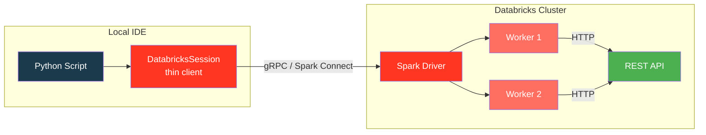

# Databricks Connect

Run PySpark custom data source examples **from your local IDE** against a remote
Databricks cluster using [Databricks Connect](https://docs.databricks.com/en/dev-tools/databricks-connect/).

## Architecture



Your code runs locally — Spark operations (reads, writes, SQL) execute on the
remote cluster. The custom data source `read()` / `write()` methods run on
**remote workers**, so HTTP calls go from the cluster to the target API.

## Installation

=== "uv"

    ```bash
    uv sync --extra databricks
    ```

=== "pip"

    ```bash
    pip install "pyspark-ds-custom[databricks]"
    ```

This installs `databricks-connect` and `databricks-sdk` as optional dependencies.

## Configuration

### Option 1 — Environment Variables

```bash
export DATABRICKS_HOST="https://<workspace>.cloud.databricks.com"
export DATABRICKS_TOKEN="<personal-access-token>"

# By cluster ID (direct)
export DATABRICKS_CLUSTER_ID="0123-456789-abcdef"

# Or by cluster name (auto-lookup via SDK)
export DATABRICKS_CLUSTER_NAME="Personal Cluster"
```

### Option 2 — Databricks Profile

```bash
# Configure profile once
databricks auth login --host https://<workspace>.cloud.databricks.com --profile dev

# Then use it
export DATABRICKS_PROFILE="dev"
export DATABRICKS_CLUSTER_NAME="Personal Cluster"
```

!!! tip "Cluster name lookup"
    When `DATABRICKS_CLUSTER_NAME` is set (and `DATABRICKS_CLUSTER_ID` is not),
    the session helper uses the Databricks SDK to find the cluster ID automatically.
    This makes scripts portable across workspaces.

### Configuration Priority

| Priority | Setting | Source |
|----------|---------|--------|
| 1 | `DATABRICKS_CLUSTER_ID` | Direct cluster ID — no lookup needed |
| 2 | `DATABRICKS_CLUSTER_NAME` | Resolved via `WorkspaceClient.clusters.list()` |
| 3 | _(neither set)_ | Falls back to local `SparkSession` |

## Prerequisites

!!! warning "Cluster requirements"
    - **DBR 16.4 LTS+** (PySpark 4 / Python Data Source API GA)
    - The target REST API must be accessible from the cluster network

!!! success "Automatic wheel upload"
    The session helper auto-uploads the `custom_ds` wheel to the remote cluster
    via `spark.addArtifact()` — no manual installation needed. It finds or
    builds the wheel from `dist/` automatically.

## Session Helper

The `create_dbconnect_session()` helper (in `custom_ds.session`) handles
connection setup, automatic wheel upload, and local fallback:

```python title="src/custom_ds/session.py"
--8<-- "src/custom_ds/session.py"
```

Usage in examples:

```python
from custom_ds import create_dbconnect_session

spark = create_dbconnect_session("my-app")
```

## Examples

### Batch Read

Read data from a REST API on a remote cluster — identical API to the local
[REST API Read](restapi-read.md) example:

```bash
export DATABRICKS_CLUSTER_NAME="Personal Cluster"
export DATABRICKS_PROFILE="dev"
export REST_API_URL="http://api-host:9090/api/users"

uv run python examples/13_databricks_connect/dbconnect_batch_read.py
```

```python title="examples/13_databricks_connect/dbconnect_batch_read.py"
--8<-- "examples/13_databricks_connect/dbconnect_batch_read.py"
```

### Batch Write

POST DataFrame rows to a REST API from a remote cluster:

```bash
uv run python examples/13_databricks_connect/dbconnect_batch_write.py
```

```python title="examples/13_databricks_connect/dbconnect_batch_write.py"
--8<-- "examples/13_databricks_connect/dbconnect_batch_write.py"
```

### SQL Queries

Register REST API data as temp views and run SQL analytics remotely:

```bash
uv run python examples/13_databricks_connect/dbconnect_sql.py
```

```python title="examples/13_databricks_connect/dbconnect_sql.py"
--8<-- "examples/13_databricks_connect/dbconnect_sql.py"
```

## How It Differs from Local Mode

| Aspect | Local Mode | Databricks Connect |
|--------|------------|-------------------|
| Spark engine | Local JVM (`local[*]`) | Remote cluster |
| `read()` / `write()` | Runs in local subprocess | Runs on remote workers |
| API access | From your machine | From cluster network |
| Session builder | `SparkSession.builder` | `DatabricksSession.builder` |
| Data source code | **Identical** | **Identical** |
| `.option()` calls | **Identical** | **Identical** |

!!! note "Code portability"
    The only difference between local and remote execution is **how the session
    is created**. All `.read.format(...)`, `.write.format(...)`, and SQL code
    is exactly the same. The `create_dbconnect_session()` helper handles the
    switch transparently.

## Combining with UC HTTP Connections

On Databricks, combine Databricks Connect with
[UC HTTP connections](uc-http-auth.md) for secure credential injection:

```python
df = (
    spark.read.format("restapi")
    .option("databricks.connection", "my_api")  # UC injects credentials
    .option("resultKey", "data")
    .load()
)
```

The driver resolves the UC connection and injects `host`, `base_path`, and
`bearer_token` — no tokens in code.

## Troubleshooting

??? question "Connection refused / timeout"
    - Verify the cluster is running: `databricks clusters get <cluster-id>`
    - Check that `DATABRICKS_HOST` includes `https://`
    - Ensure the cluster DBR version is 16.4 LTS+

??? question "ModuleNotFoundError: custom_ds"
    The wheel wasn't uploaded to the cluster. Ensure `upload_wheel=True`
    (default) in `create_dbconnect_session()` and that `dist/` contains a
    built wheel. Build one manually if needed:
    ```bash
    uv build --wheel
    ```

??? question "Cluster name not found"
    - Check the exact cluster name (case-sensitive)
    - Ensure your token/profile has permission to list clusters
    - Verify with: `databricks clusters list --profile dev`

??? question "Falls back to local unexpectedly"
    Set `DATABRICKS_CLUSTER_ID` or `DATABRICKS_CLUSTER_NAME` **and** ensure
    `databricks-connect` is installed (`uv sync --extra databricks`).

## References

- :material-link: [Databricks Connect documentation](https://docs.databricks.com/en/dev-tools/databricks-connect/)
- :material-link: [Databricks SDK for Python](https://docs.databricks.com/en/dev-tools/sdk-python.html)
- :material-link: [Python Data Source API (Spark 4.0)](https://spark.apache.org/docs/latest/api/python/user_guide/sql/python_data_source.html)
- :material-link: [PySpark Custom Data Source API blog](https://www.databricks.com/blog/python-data-source-api-pyspark)
