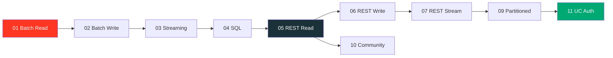

# Examples

Runnable demos of the PySpark 4 Python Data Source API. All examples run locally
with `local[*]` — no cluster required.

!!! success "Self-contained"
    Each script imports from `custom_ds`, registers its data source, creates a local
    SparkSession, and cleans up with `spark.stop()`. No external cluster needed.

## Prerequisites

```bash
uv sync
```

## Mock Server

REST API examples (05–09) require the mock FastAPI server:

```bash
uv run python examples/mock_server/server.py
```

This starts on `http://localhost:9090` with these endpoints:

| Endpoint | Method | Description |
|----------|--------|-------------|
| `/api/users` | GET | 50 users (paginated by offset) |
| `/api/users/{id}` | GET | Single user by ID |
| `/api/posts` | GET | 100 posts (paginated by page) |
| `/api/events` | GET | Events since a given ID (streaming) |
| `/api/records` | POST | Accepts JSON array (write sink) |
| `/api/records` | GET | Returns all written records |

## Example Index

### In-Memory Sources (no server needed)

| # | Script | Demonstrates |
|---|--------|---|
| 01 | `01_batch_read/` | In-memory partitioned batch read |
| 02 | `02_batch_write/` | JSON-lines file sink |
| 03 | `03_streaming/` | Counter streaming source |
| 04 | `04_sql/` | SQL over custom source |

### REST API (requires mock server)

| # | Script | Demonstrates |
|---|--------|---|
| 05 | `05_restapi_read/` | REST API batch read |
| 06 | `06_restapi_write/` | REST API batch write (POST) |
| 07 | `07_restapi_stream/` | REST API streaming read |
| 08 | `08_restapi_sql/` | SQL analytics over REST API data |
| 09 | `09_restapi_partitioned/` | 3 partitioning strategies |

### Community & Advanced

| # | Script | Demonstrates |
|---|--------|---|
| 10 | `10_community_sources/` | [`pyspark-data-sources`](https://github.com/allisonwang-db/pyspark-data-sources) — Fake, GitHub |
| 11 | `11_uc_http_auth/` | Unity Catalog HTTP credential injection |

## Learning Path



!!! tip "Recommended order"
    Start with examples 01–04 to learn the API basics, then move to 05–09 for
    real-world REST API patterns. Examples 10–11 show ecosystem integration and
    production security patterns.
