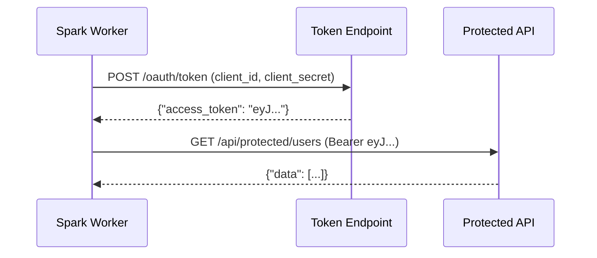

# OAuth2 Example

Read and write to OAuth2-protected REST APIs using the `client_credentials` flow.

## Prerequisites

```bash
# Start mock server (includes /oauth/token endpoint)
uv run python examples/mock_server/server.py
```

## Run

```bash
uv run python examples/12_oauth2/oauth2_client_credentials.py
```

## Code

```python title="examples/12_oauth2/oauth2_client_credentials.py"
--8<-- "examples/12_oauth2/oauth2_client_credentials.py"
```

## Key Concepts

1. **Set `auth=oauth2`** to enable OAuth2 authentication
2. **Provide `oauth.tokenUrl`, `oauth.clientId`, `oauth.clientSecret`** for client credentials flow
3. **Or use `oauth.bearerToken`** to skip the token endpoint with a pre-obtained token
4. **Works with all connectors** — `restapi`, `restapi_sink`, `restapi_stream`, `restapi_stream_sink`

## Authentication Flow



!!! tip "Production usage"
    For production workloads with many partitions, pre-fetch a token and use
    `oauth.bearerToken` to avoid repeated token endpoint calls:

    ```python
    import requests

    token = requests.post("https://auth/token", data={
        "grant_type": "client_credentials",
        "client_id": "...", "client_secret": "..."
    }).json()["access_token"]

    df = spark.read.format("restapi") \
        .option("auth", "oauth2") \
        .option("oauth.bearerToken", token) \
        .option("url", "https://api/data") \
        .load()
    ```

See [OAuth2 API Reference](../api/oauth2.md) for all configuration options.
