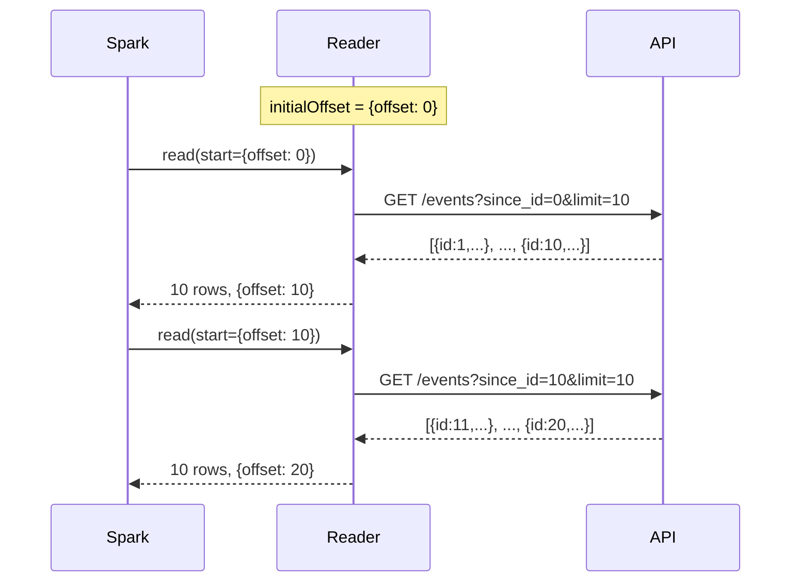

# REST API Streaming

Poll a REST API endpoint for new records using Spark Structured Streaming.

## Run

```bash
# Start mock server (separate terminal)
uv run python examples/mock_server/server.py

# Run example (runs for 10 seconds)
uv run python examples/07_restapi_stream/stream_restapi_source.py
```

## Code

```python title="examples/07_restapi_stream/stream_restapi_source.py"
--8<-- "examples/07_restapi_stream/stream_restapi_source.py"
```

## Key Concepts

1. **Offset tracking** — the reader maintains an integer offset (`id` field)
2. **Polling** — each micro-batch calls `GET /events?since_id=<offset>&limit=10`
3. **Schema required** — streaming sources cannot auto-infer schema

## How Offset Tracking Works



## Expected Output

```
=== Streaming events from REST API (10s window) ===
-------------------------------------------
Batch: 0
-------------------------------------------
+---+--------+-------------------------+
| id|   event|              timestamp  |
+---+--------+-------------------------+
|  1|   login|2025-08-28T12:30:00+00:00|
|  2|purchase|2025-08-28T13:15:00+00:00|
...
```
