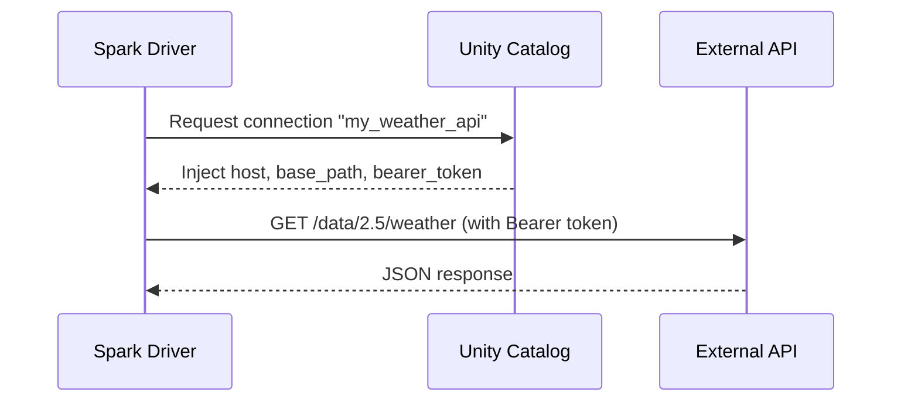

# Unity Catalog HTTP Authentication

Authenticate a PySpark custom data source with an external REST API using
**Unity Catalog HTTP connections** — no hardcoded tokens or credentials in code.

!!! note "Requirements"
    Unity Catalog HTTP connection credential injection requires
    **Databricks Runtime 18.1** or above.

## Architecture



## Step 1: Create an HTTP Connection

Create a Unity Catalog HTTP connection and grant access:

```sql
CREATE CONNECTION my_weather_api TYPE HTTP
OPTIONS (
    host 'https://api.openweathermap.org',
    base_path '/data/2.5',
    bearer_token secret('my_secret_scope', 'weather_api_token')
);

GRANT MANAGE ON CONNECTION my_weather_api TO `user@example.com`;
```

!!! tip "Use Databricks Secrets"
    Always store API tokens as Databricks secrets and reference them with
    `secret('scope', 'key')` — never put literal tokens in connection definitions.

## Step 2: Implement the Reader

The reader receives injected credentials through `options` — no secrets in code:

```python
--8<-- "src/custom_ds/uc_auth/weather_source.py"
```

Key design points:

- **One partition per city** — enables parallel reads across workers
- **stdlib only** (`urllib`) — no third-party HTTP libs to serialize
- **Timeout handling** — 30s timeout prevents hanging tasks
- **Response validation** — clear errors instead of `KeyError`

## Step 3: Register and Use

=== "Databricks (UC Connection)"

    ```python
    spark.dataSource.register(WeatherApiSource)

    df = (
        spark.read.format("weather_api")
        .option("databricks.connection", "my_weather_api")  # (1)!
        .option("cities", "Seattle,Portland,Denver")
        .load()
    )
    df.show()
    ```

    1. Unity Catalog injects `host`, `base_path`, and `bearer_token` automatically.
       These keys cannot be overridden by user options.

=== "Local (Explicit Credentials)"

    ```python
    import os

    spark.dataSource.register(WeatherApiSource)

    df = (
        spark.read.format("weather_api")
        .option("host", os.environ["WEATHER_API_HOST"])
        .option("base_path", "/data/2.5")
        .option("bearer_token", os.environ["WEATHER_API_TOKEN"])
        .option("cities", "Seattle,Portland,Denver")
        .load()
    )
    df.show()
    ```

## Step 4: SQL Access

```python
df.createOrReplaceTempView("weather")

spark.sql("""
    SELECT city, temperature, description
    FROM weather
    WHERE temperature > 15
    ORDER BY temperature DESC
""").show()
```

## How Credential Injection Works

| Behavior | Detail |
|----------|--------|
| Injected keys | `host`, `base_path`, `bearer_token` (from connection definition) |
| Cannot override | UC-injected keys take precedence over user-set options |
| Blocked options | `host` and `port` cannot be set by users when UC connection is active |
| Scope | Works with batch reads, streaming reads, and writes |
| Short-lived tokens | UC retrieves OAuth2 credentials with automatic rotation |

## Running the Examples

```bash
# Local variant (requires OpenWeatherMap API key)
export WEATHER_API_TOKEN=your_key
uv run python examples/11_uc_http_auth/weather_api_local.py

# On Databricks (with UC connection configured)
# Run examples/11_uc_http_auth/uc_weather_api.py in a notebook
```
