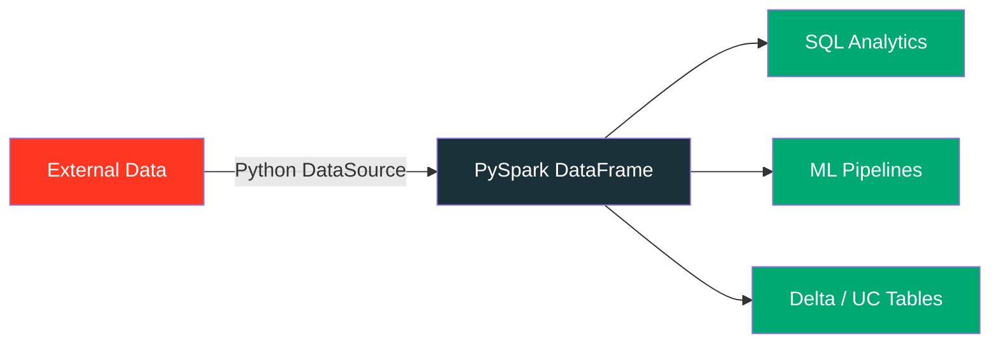

# Getting Started

Build custom Apache Spark connectors in pure Python — no JVM, no Scala, no Spark internals.

## What is the Python Data Source API?

The **Python Data Source API** (PySpark 4.0+ / DBR 15.4+) lets you create custom Spark
connectors using familiar Python. It replaces the complex JVM-based DSv1/DSv2 approach
with a clean, Pythonic interface built on Apache Arrow for high throughput.



## Why This Library?

| Challenge | Solution |
|-----------|----------|
| REST APIs aren't native Spark sources | `RestApiDataSource` — batch, streaming, Arrow |
| Auth is complex (OAuth2, mTLS, API keys) | UC HTTP connection injection + header options |
| Pagination varies across APIs | 3 strategies: single, URL-based, page-based |
| Writing back to APIs is manual | `RestApiSinkDataSource` — batch + streaming writers |
| Testing custom connectors is hard | Mock FastAPI server + 16 pytest tests |

## What You Can Do

<div class="grid cards" markdown>

-   :material-download:{ .lg .middle } **Batch Read**

    ---

    Pull data from any REST API into a DataFrame in one call.

    [:octicons-arrow-right-24: Batch Reader](../api/batch-reader.md)

-   :material-upload:{ .lg .middle } **Batch Write**

    ---

    POST DataFrame rows to REST endpoints with configurable batching.

    [:octicons-arrow-right-24: Batch Writer](../api/batch-writer.md)

-   :material-stream:{ .lg .middle } **Streaming**

    ---

    Continuously ingest from APIs with offset tracking and micro-batches.

    [:octicons-arrow-right-24: Streaming](../api/streaming.md)

-   :material-lightning-bolt:{ .lg .middle } **Arrow Performance**

    ---

    Zero-copy data transfer via `pyarrow.RecordBatch` for high-throughput reads.

    [:octicons-arrow-right-24: Arrow Reader](../api/arrow-reader.md)

-   :material-view-grid:{ .lg .middle } **Partitioning**

    ---

    Parallel reads across multiple URLs or paginated endpoints.

    [:octicons-arrow-right-24: Partitioning](../api/partitioning.md)

-   :material-shield-lock:{ .lg .middle } **UC HTTP Auth**

    ---

    Secure credential injection via Unity Catalog — no secrets in code.

    [:octicons-arrow-right-24: UC Auth Example](../examples/uc-http-auth.md)

</div>

## Supported Environments

| Environment | Version | Notes |
|-------------|---------|-------|
| Apache Spark (open-source) | 4.0+ | Python Data Source API is new in 4.0 |
| Databricks Runtime | 15.4 LTS+ | GA with UC integration |
| Python | 3.11+ | Required by project |
| Java | 17 | Required by PySpark 4.x |

## Quick Overview

```python
from pyspark.sql.datasource import DataSource, DataSourceReader

class MySource(DataSource):
    @classmethod
    def name(cls):
        return "my_source"

    def schema(self):
        return "id INT, value STRING"

    def reader(self, schema):
        return MyReader(self.options)

class MyReader(DataSourceReader):
    def read(self, partition):
        # Fetch data from anywhere — runs on Spark workers
        yield (1, "hello")
        yield (2, "world")

# Register and use like any built-in source
spark.dataSource.register(MySource)
df = spark.read.format("my_source").load()
```

## Next Steps

<div class="grid" markdown>

[Install the project :material-arrow-right:](installation.md){ .md-button .md-button--primary }

[Jump to Quick Start :material-arrow-right:](quickstart.md){ .md-button }

</div>
