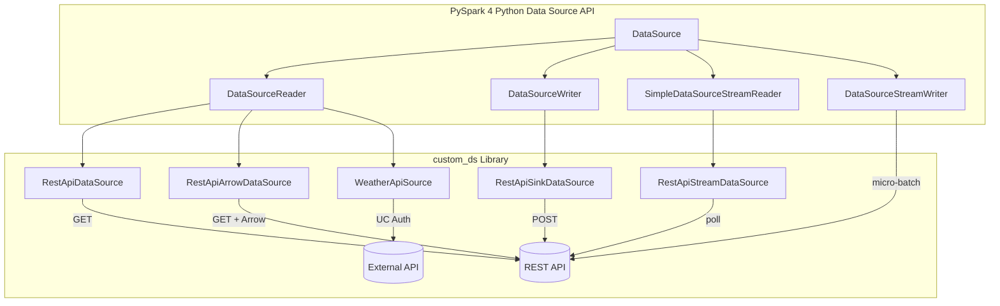

# PySpark Custom Data Source

Build custom Spark connectors in **pure Python** using the PySpark 4 Python Data Source API
(`pyspark.sql.datasource`). No JVM, no Scala — just Python.

---

## What is this?

A reference implementation library (`custom_ds`) demonstrating the full Python Data Source API:

| Capability | Source (Read) | Sink (Write) |
|---|---|---|
| **Batch** | `RestApiDataSource`, `RestApiArrowDataSource` | `RestApiSinkDataSource` |
| **Streaming** | `RestApiStreamDataSource` | `RestApiStreamSinkDataSource` |
| **UC Auth** | `WeatherApiSource` | — |

Plus simple in-memory sources (`SimpleDataSource`, `SimpleSinkDataSource`, `SimpleStreamDataSource`)
for learning the API without external dependencies.

---

## Architecture



---

## Key Features

- :fontawesome-brands-python: **Pure Python** — no JVM connector development needed
- :material-rocket-launch: **3 Partitioning Strategies** — single, URL-based, page-based
- :material-arrow-right-bold: **Arrow Batch Support** — zero-copy transfer for large payloads
- :material-stream: **Streaming** — poll endpoints with offset tracking
- :material-database: **SQL Access** — `createOrReplaceTempView` + Spark SQL
- :material-shield-lock: **Unity Catalog Auth** — credential injection via HTTP connections
- :material-package-variant: **Community Ecosystem** — works alongside [`pyspark-data-sources`](https://github.com/allisonwang-db/pyspark-data-sources)

---

## Quick Example

```python
from custom_ds import create_spark_session, RestApiDataSource

spark = create_spark_session("demo")
spark.dataSource.register(RestApiDataSource)

df = spark.read.format("restapi") \
    .option("url", "https://jsonplaceholder.typicode.com/users") \
    .load()

df.show()
spark.stop()
```

---

## Compatibility

| Platform | Version | Status |
|----------|---------|--------|
| Apache Spark (OSS) | 4.0+ | :material-check-circle:{ .green } GA |
| Databricks Runtime | 15.4 LTS+ | :material-check-circle:{ .green } GA |
| Databricks Serverless | Generic Compute | :material-check-circle:{ .green } Supported |

---

## Next Steps

- [Installation](getting-started/installation.md) — set up the project
- [Quick Start](getting-started/quickstart.md) — run your first example
- [API Reference](api/index.md) — detailed DataSource documentation
- [Examples](examples/index.md) — runnable demos with mock servers
- [References](references.md) — official docs, talks, and community resources
