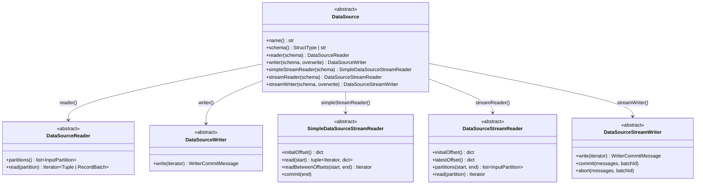

# References

Official documentation, conference talks, community resources, and related projects
for the PySpark Python Data Source API.

---

## Official Documentation

| Resource | Description |
|----------|-------------|
| :material-book-open-variant: [Python Data Source API Tutorial](https://spark.apache.org/docs/4.0.0/api/python/tutorial/sql/python_data_source.html) | Official Apache Spark 4.0 tutorial — batch, streaming, Arrow |
| :material-book-open-variant: [PySpark DataSource Reference](https://spark.apache.org/docs/4.0.0/api/python/reference/pyspark.sql/api/pyspark.sql.datasource.DataSource.html) | API class reference |
| :material-microsoft: [Databricks — Python Data Source](https://docs.databricks.com/en/pyspark/datasource.html) | Databricks-specific guide with UC integration |
| :material-microsoft: [Unity Catalog HTTP Connections](https://docs.databricks.com/en/integrations/http-connections.html) | Credential injection for custom data sources |
| :material-microsoft: [Declarative Pipeline Sinks](https://docs.databricks.com/en/delta-live-tables/sinks.html) | Using Python Data Sources as DLT/DP sinks |

---

## Blog Posts & Announcements

| Date | Title | Authors |
|------|-------|---------|
| 2025 | [Announcing GA of Python Data Source API](https://www.databricks.com/blog/announcing-general-availability-python-data-source-api) | Allison Wang, Jules Damji, Ryan Nienhuis, Huanli Wang |
| 2024 | [Introducing PySpark Data Source API](https://www.databricks.com/blog/introducing-pyspark-data-source-api) | Allison Wang |

---

## Conference Talks (Data + AI Summit 2025)

| Talk | Speakers |
|------|----------|
| [Breaking Barriers: Building Custom Apache Spark™ 4.0 Data Source Connectors with Python](https://www.databricks.com/dataaisummit/) | Allison Wang, Jules Damji |
| [Creating a Custom PySpark Stream Reader with PySpark 4.0](https://www.databricks.com/dataaisummit/) | Community |
| [Simplify Data Ingest and Egress with New Python Source API](https://www.databricks.com/dataaisummit/) | Community |

---

## Community Projects

| Project | Description | Link |
|---------|-------------|------|
| **pyspark-data-sources** | Community connectors: Fake, GitHub, OpenSky, Stock, Weather, HuggingFace | [:material-github: allisonwang-db/pyspark-data-sources](https://github.com/allisonwang-db/pyspark-data-sources) |
| **spark-misc (restapi)** | REST API data source with partitioning reference | [:material-github: dmatrix/spark-misc](https://github.com/dmatrix/spark-misc/tree/main/src/py/data_source/restapi) |
| **HuggingFace Connector** | Direct access to HuggingFace datasets via Python Data Source | [:material-github: hf-spark-datasource](https://github.com/allisonwang-db/pyspark-data-sources#huggingface) |
| **News Data Source** | News API connector for PySpark | [:material-github: News DataSource](https://github.com/julesdamji/news-datasource-pyspark) |

---

## Key Concepts Reference

### Python Data Source API Class Hierarchy



### Serialization Rules

!!! warning "Critical: Pickle Serialization"
    Spark serializes `DataSourceReader` and `DataSourceWriter` instances via pickle and
    sends them to worker processes. Follow these rules:

    1. **Import libraries inside `read()`/`write()` methods** — not at module top-level
    2. **Use only picklable types** in `InputPartition` — dataclasses with primitives
    3. **No generators, file handles, or lambdas** in partition objects
    4. **`DataSource.schema()` runs on the driver** — top-level imports are OK there

### Streaming: Two Reader APIs

| API | Class | Parallelism | Use When |
|-----|-------|-------------|----------|
| Simple | `SimpleDataSourceStreamReader` | Driver-only (single thread) | Simple polling, low throughput |
| Partitioned | `DataSourceStreamReader` | Multi-partition parallel | High-throughput, multi-shard sources |

!!! note "Mutually Exclusive"
    Implement **either** `simpleStreamReader()` **or** `streamReader()` on your
    `DataSource` — never both.

### Arrow Batch Support

PySpark 4 automatically detects when `read()` yields `pyarrow.RecordBatch` objects
instead of tuples, enabling zero-copy columnar transfer:

```python
def read(self, partition):
    import pyarrow as pa
    # Build columnar arrays
    ids = pa.array([1, 2, 3], type=pa.int64())
    names = pa.array(["a", "b", "c"], type=pa.string())
    yield pa.RecordBatch.from_arrays([ids, names], names=["id", "name"])
```

---

## Version History

| Version | Spark | DBR | Milestone |
|---------|-------|-----|-----------|
| Preview | 3.5+ | 15.2+ | Initial release (batch read only) |
| GA | 4.0 | 15.4 LTS | Full API: batch R/W, streaming R/W, Arrow |
| Enhanced | 4.0+ | 18.1+ | UC HTTP connection credential injection |

---

## Future Roadmap

Per the [GA announcement](https://www.databricks.com/blog/announcing-general-availability-python-data-source-api):

- **Column Pruning & Filter Pushdown** — optimize data transfer at source
- **Custom Statistics** — connector-provided stats for query planning
- **Better Observability** — enhanced logging and debugging tools
- **Performance Optimizations** — reduced serialization overhead

---

## Related Databricks Features

| Feature | Relation to Python Data Source |
|---------|-------------------------------|
| [Unity Catalog](https://docs.databricks.com/en/data-governance/unity-catalog/index.html) | Govern custom source data with lineage, access control |
| [Declarative Pipelines](https://docs.databricks.com/en/delta-live-tables/index.html) | Use custom sources/sinks in DLT/DP pipelines |
| [Lakeflow Connect](https://docs.databricks.com/en/ingestion/lakeflow-connect/index.html) | Managed ingestion (alternative to custom sources for supported SaaS) |
| [Serverless Compute](https://docs.databricks.com/en/compute/serverless.html) | Run custom data sources without cluster management |
