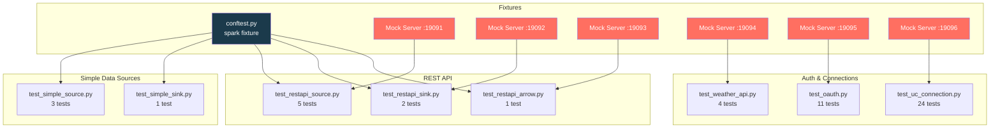

# Testing

Comprehensive test suite for the `custom_ds` library covering batch readers,
writers, streaming, REST API connectors, OAuth2, Unity Catalog HTTP connections,
and the Weather API source.

## Overview

| Metric | Value |
|--------|-------|
| **Total tests** | 51 |
| **Test files** | 8 |
| **Test classes** | 8 |
| **Marker** | `pyspark` |
| **Framework** | pytest ≥ 8.0 |
| **Mock servers** | 5 (FastAPI + uvicorn) |

## Running Tests

```bash
# Install PySpark extra (required — tests are skipped without it)
make install-spark

# Run all tests
make test MARK=pyspark

# Run verbose
make test-verbose MARK=pyspark

# Run with coverage
make test-cov MARK=pyspark

# Run a specific test file
uv run pytest tests/test_restapi_source.py -v

# Run a specific test class
uv run pytest tests/test_oauth.py::TestOAuth2Integration -v

# Run by keyword
uv run pytest -k "oauth" -v
```

!!! warning "PySpark required"
    All tests carry the `pyspark` marker and require PySpark 4.x. The `conftest.py`
    fixture gracefully skips when PySpark is not installed.

## Fixtures

### Session Fixture (`conftest.py`)

A session-scoped `spark` fixture shared across all tests:

```python
@pytest.fixture(scope="session")
def spark():
    # Skips if pyspark not installed
    session = SparkSession.builder \
        .master(os.environ.get("SPARK_MASTER", "local[*]")) \
        .appName("custom-ds-tests") \
        .config("spark.ui.enabled", "false") \
        .getOrCreate()
    session.sparkContext.setLogLevel("ERROR")
    yield session
    session.stop()
```

Some test files override this with a local fixture that also registers data sources.

### Mock Server Fixtures

Each REST API test file spins up a **FastAPI** server on a dedicated port using
a module-scoped fixture. Servers run in background threads and are available for
the entire module.

| Port | Test File | Endpoints |
|------|-----------|-----------|
| 19091 | `test_restapi_source.py` | `GET /users`, `GET /nested`, `GET /empty`, `GET /users/{id}`, `GET /posts` |
| 19092 | `test_restapi_sink.py` | `POST /write` |
| 19093 | `test_restapi_arrow.py` | `GET /data` |
| 19094 | `test_weather_api.py` | `GET /data/2.5/weather` |
| 19095 | `test_oauth.py` | `POST /oauth/token`, `GET /api/protected/users`, `POST /api/records` |
| 19096 | `test_uc_connection.py` | `GET /v2/users`, `POST /v2/records`, `POST /oauth/m2m/token` |

---

## Test Details

### `test_simple_source.py` — Simple Batch Reader

Tests for `SimpleDataSource` — the minimal batch reader that generates
`(id, value)` rows with configurable count and partitions.

| # | Test | Scenario | Options | Assertions |
|---|------|----------|---------|------------|
| 1 | `test_simple_source_default_row_count` | Default read with no options | — | count = 10, columns = `{id, value}` |
| 2 | `test_simple_source_respects_num_rows_option` | Custom row count and partitions | `numRows=25`, `numPartitions=3` | count = 25, partitions = 3, ids = `0..24` |
| 3 | `test_simple_source_value_format` | Verify value column format | `numRows=3` | values = `["row-0", "row-1", "row-2"]` |

!!! info "No mock server"
    This source generates data in-memory — no external dependencies.

---

### `test_simple_sink.py` — Simple Batch Writer

Tests for `SimpleSinkDataSource` — writes DataFrames to JSONL files.

| # | Test | Scenario | Options | Assertions |
|---|------|----------|---------|------------|
| 1 | `test_simple_sink_writes_all_rows` | Write 10 rows to JSONL | `path=<tmp_path>`, mode=`append` | At least one `part-*.jsonl` file exists; total lines = 10 |

**Fixtures:** `spark`, `tmp_path`

---

### `test_restapi_source.py` — REST API Batch Reader

Tests for `RestApiDataSource` — reads JSON from HTTP endpoints with multiple
partitioning strategies.

| # | Test | Scenario | Key Options | Assertions |
|---|------|----------|-------------|------------|
| 1 | `test_restapi_batch_read_top_level_array` | Flat JSON array response | `url=/users`, `method=GET` | count = 3, name = "Alice", age = 28 |
| 2 | `test_restapi_batch_read_nested_result_key` | Nested response with `resultKey` | `url=/nested`, `resultKey=data` | count = 3 |
| 3 | `test_restapi_batch_read_empty_response` | Empty array `[]` | `url=/empty` | count = 0 |
| 4 | `test_restapi_url_based_partitioning` | Partition by explicit URLs | `partitionStrategy=urls`, `urls=<3 URLs>` | count = 3, partitions = 3 |
| 5 | `test_restapi_page_based_partitioning` | Paginated reads | `partitionStrategy=pages`, `totalPages=4`, `pageSize=5`, `resultKey=data` | count = 20, partitions = 4 |

**Mock server:** port `19091`

---

### `test_restapi_sink.py` — REST API Batch Writer

Tests for `RestApiSinkDataSource` — POSTs DataFrame rows as JSON batches.

| # | Test | Scenario | Key Options | Assertions |
|---|------|----------|-------------|------------|
| 1 | `test_restapi_sink_posts_rows` | Single batch write | `url=/write`, `batchSize=100` | Total received rows = 5 |
| 2 | `test_restapi_sink_batches_requests` | Multi-batch write | `url=/write`, `batchSize=3` | 4 HTTP requests (3+3+3+1), total rows = 10 |

**Mock server:** port `19092`

---

### `test_restapi_arrow.py` — Arrow-based REST API Reader

Tests for `RestApiArrowDataSource` — reads JSON and returns Arrow-backed DataFrames.

| # | Test | Scenario | Key Options | Assertions |
|---|------|----------|-------------|------------|
| 1 | `test_arrow_reader_returns_correct_data` | Arrow batch read | `url=/data`, `resultKey=results` | count = 5, name = "Alice", score = 91 |

**Mock server:** port `19093`

---

### `test_oauth.py` — OAuth2 Authentication

Tests for `OAuth2Config` and OAuth2-protected REST API reads/writes.

#### `TestOAuth2Config` — Unit Tests (7 tests)

| # | Test | Scenario | Assertions |
|---|------|----------|------------|
| 1 | `test_from_options_returns_none_without_auth` | No `auth` option → `None` | `config is None` |
| 2 | `test_from_options_parses_client_credentials` | Parse `oauth.*` options | token_url, client_id, client_secret, scope, grant_type |
| 3 | `test_from_options_parses_bearer_token` | Pre-obtained bearer token | `fetch_token()` returns token |
| 4 | `test_from_options_parses_password_grant` | Password grant type | grant_type = "password", username = "user" |
| 5 | `test_fetch_token_from_mock_server` | Live token fetch | token = "mock-access-token-12345" |
| 6 | `test_fetch_token_invalid_credentials` | Bad credentials | `raises(Exception)` |
| 7 | `test_apply_to_headers` | Authorization header injection | Header present, Accept preserved |

#### `TestOAuth2Integration` — Spark Integration (4 tests)

| # | Test | Scenario | Key Options | Assertions |
|---|------|----------|-------------|------------|
| 1 | `test_batch_read_with_oauth2` | Client credentials read | `auth=oauth2`, `oauth.tokenUrl`, `oauth.clientId`, `oauth.clientSecret` | count = 5 |
| 2 | `test_batch_read_fails_without_auth` | No auth → 401 | no auth options | `raises(Exception)` |
| 3 | `test_batch_read_with_bearer_token` | Pre-obtained token | `auth=oauth2`, `oauth.bearerToken` | count = 5 |
| 4 | `test_batch_write_with_oauth2` | Write with OAuth2 | `auth=oauth2`, `oauth.tokenUrl`, `oauth.clientId`, `oauth.clientSecret` | write completes |

**Mock server:** port `19095`

---

### `test_uc_connection.py` — Unity Catalog HTTP Connections

Tests for `UCConnectionConfig` and UC-authenticated REST API reads/writes.

#### `TestUCConnectionConfig` — Unit Tests (15 tests)

| # | Test | Scenario | Assertions |
|---|------|----------|------------|
| 1 | `test_from_options_returns_none_when_not_configured` | No UC keys | `config is None` |
| 2 | `test_from_options_with_uc_prefix` | `uc.*` prefixed options | host, base_path, bearer_token, auth_type |
| 3 | `test_from_options_with_injected_keys` | Databricks-injected keys | host, bearer_token, connection_name |
| 4 | `test_injected_keys_take_precedence` | Both injected and `uc.*` | Injected values win |
| 5 | `test_oauth_m2m_from_options` | M2M OAuth via `uc.*` | auth_type = "oauth_m2m" |
| 6 | `test_oauth_m2m_injected_keys` | M2M OAuth injected | auth_type = "oauth_m2m" |
| 7 | `test_bearer_takes_precedence_over_oauth_m2m` | Both auth types present | auth_type = "bearer_token" |
| 8 | `test_build_base_url` | host + base_path → URL | URL correct |
| 9 | `test_build_base_url_with_port` | host + port + base_path | Port in URL |
| 10 | `test_resolve_url_with_user_url` | User URL overrides UC | Returns user URL |
| 11 | `test_resolve_url_with_path` | Builds URL from UC config | host + base_path + path |
| 12 | `test_apply_auth_headers_bearer` | Bearer token in headers | Authorization header set |
| 13 | `test_apply_auth_headers_no_auth` | No auth → no header | No Authorization header |
| 14 | `test_fetch_oauth_token_missing_endpoint` | Missing token_endpoint | `raises(ValueError)` |
| 15 | `test_fetch_oauth_token_missing_credentials` | Missing client_id/secret | `raises(ValueError)` |

#### `TestUCOAuthM2MToken` — M2M Token Tests (3 tests)

| # | Test | Scenario | Assertions |
|---|------|----------|------------|
| 1 | `test_fetch_oauth_token` | Fetch M2M token from mock | token matches expected |
| 2 | `test_fetch_oauth_token_bad_credentials` | Wrong credentials | `raises(RuntimeError)` |
| 3 | `test_apply_auth_headers_m2m` | M2M token applied to headers | Authorization header correct |

#### `TestUCConnectionBatchRead` — Spark Integration (2 tests)

| # | Test | Scenario | Key Options | Assertions |
|---|------|----------|-------------|------------|
| 1 | `test_batch_read_with_bearer_token` | Read via UC bearer | `uc.host`, `uc.basePath`, `uc.bearerToken`, `uc.path=users` | count = 3 |
| 2 | `test_batch_read_with_oauth_m2m` | Read via M2M OAuth | `uc.clientId`, `uc.clientSecret`, `uc.tokenEndpoint` | count = 3 |

#### `TestUCConnectionArrowRead` — Arrow Integration (1 test)

| # | Test | Scenario | Key Options | Assertions |
|---|------|----------|-------------|------------|
| 1 | `test_arrow_read_with_uc_options` | Arrow reader with UC bearer | `uc.host`, `uc.basePath`, `uc.bearerToken` | count = 3 |

#### `TestUCConnectionBatchWrite` — Write Integration (1 test)

| # | Test | Scenario | Key Options | Assertions |
|---|------|----------|-------------|------------|
| 1 | `test_batch_write_with_uc_options` | Write via UC bearer | `uc.host`, `uc.basePath`, `uc.bearerToken`, `uc.path=records` | received rows > 0 |

**Mock server:** port `19096`

---

### `test_weather_api.py` — Weather API Source

Tests for `WeatherApiSource` — partitioned reads from a weather API with
bearer-token authentication.

#### `TestWeatherApiSource` (4 tests)

| # | Test | Scenario | Key Options | Assertions |
|---|------|----------|-------------|------------|
| 1 | `test_read_all_cities` | Read 3 cities | `cities=Seattle,Portland,Denver`, `bearer_token=test-token-123` | count = 3, Seattle temp = 12.5, Portland humidity = 65 |
| 2 | `test_single_city` | Single city partition | `cities=Denver` | count = 1, city = "Denver", temp = 22.1 |
| 3 | `test_unauthorized_fails` | Wrong bearer token | `bearer_token=wrong-token` | `raises(Exception)` |
| 4 | `test_schema` | Verify schema fields | `cities=Seattle` | fields = `[city, temperature, humidity, description]` |

**Mock server:** port `19094`

---

## Test Architecture



## Coverage

Generate an HTML coverage report:

```bash
make test-cov MARK=pyspark
# Report at htmlcov/index.html
```

## Adding New Tests

1. Create `tests/test_<feature>.py`
2. Add `pytestmark = pytest.mark.pyspark` after imports
3. Use the `spark` fixture from `conftest.py` (or override locally)
4. For HTTP-based sources, spin up a FastAPI mock on a **unique port**
5. Follow the naming convention: `test_<source>_<scenario>`
