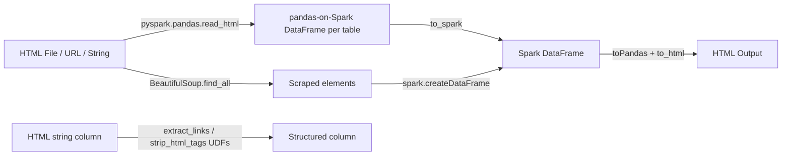

# PySpark HTML Datasource

Reference for reading, writing, and parsing HTML content with Apache Spark (PySpark 4.x).
Spark has no native HTML data source, so this project bridges **pyspark.pandas.read_html()**
(for `<table>` extraction) and **BeautifulSoup** (for general-purpose scraping) into Spark
DataFrames, backed by a reusable `pys_html` library.

## Architecture



## Topics

<div class="grid cards" markdown>

-   :material-table:{ .lg .middle } **[Data Source](data-source/index.md)**

    ---

    Reading `<table>` elements via `pyspark.pandas.read_html()` (or a generic argparse CLI reader) and scraping arbitrary tags via BeautifulSoup

-   :material-function:{ .lg .middle } **[Parsing](parsing/index.md)**

    ---

    Column-level UDFs: `extract_links`, `strip_html_tags`, `extract_meta_tags`, `extract_tag_text`

-   :material-file-table:{ .lg .middle } **[DataFrame Patterns](dataframe/index.md)**

    ---

    Create DataFrames from tables, transform/cast typed columns, write HTML reports, pandas round trips

</div>

## Quick Start

!!! tip "No cluster needed"
    All examples run locally with `local[*]` mode — just install PySpark, Java 17, and the
    HTML parsing dependencies (`beautifulsoup4`, `lxml`).

=== "Using the pys_html library"
    ```python
    from pys_html import HtmlReader, get_spark, print_dataframe

    spark = get_spark("quickstart")  # (1)!

    reader = HtmlReader(spark)
    df = reader.read_table("path/to/page.html")  # (2)!
    print_dataframe(df, title="Results")  # (3)!

    spark.stop()
    ```

    1. Handles `JAVA_HOME`, `SPARK_MASTER`, adaptive query settings automatically.
    2. Extracts the first `<table>` element via `pyspark.pandas.read_html()`.
    3. Rich bordered table instead of `df.show()`.

=== "Raw pyspark.pandas + PySpark"
    ```python
    import os
    import pyspark.pandas as ps
    from pyspark.sql import SparkSession

    spark = (SparkSession.builder
             .appName("html-quickstart")
             .master(os.environ.get("SPARK_MASTER", "local[*]"))
             .config("spark.sql.adaptive.enabled", "true")
             .getOrCreate())
    spark.sparkContext.setLogLevel("WARN")

    psdf = ps.read_html("path/to/page.html")[0]
    df = psdf.astype(str).to_spark()
    df.show()

    spark.stop()
    ```

## Installation

=== "uv (Recommended)"
    ```bash
    cd pyspark-ds-html
    uv sync --group dev
    ```

=== "pip"
    ```bash
    pip install -e ".[dev]"
    ```

!!! warning "Java 17 Required"
    PySpark 4.x requires **Java 17** (LTS). Set `JAVA_HOME` to point to a JDK 17 installation.

    === "macOS"
        ```bash
        brew install openjdk@17
        export JAVA_HOME=$(brew --prefix openjdk@17)
        ```

    === "Ubuntu/Debian"
        ```bash
        sudo apt install openjdk-17-jdk
        export JAVA_HOME=/usr/lib/jvm/java-17-openjdk-amd64
        ```

## Project Structure

```text
pyspark-ds-html/
├── src/pys_html/               # Reusable library
│   ├── __init__.py             # Public API (get_spark, Rich helpers, etc.)
│   ├── config.py               # SparkSession, DATA_HOME, write utilities
│   ├── _logging.py             # Rich-powered logging & print helpers
│   ├── reader/                 # HtmlReader — pyspark.pandas.read_html + BeautifulSoup bridge
│   ├── writer/                 # HtmlWriter — pandas.to_html bridge
│   ├── parsing/                # Column UDFs: links, tag text, meta tags
│   └── schema/                 # Schema builders for links/tables/meta
├── examples/
│   ├── 01_data_source/         # Reading tables and scraping tags
│   ├── 02_parsing/             # Column-level parsing UDFs
│   └── 03_dataframe/           # Create, transform, write, pandas round trips
├── tests/                      # pytest test suite
├── scripts/                    # batch example runner
├── docs/                       # This documentation (MkDocs Material)
├── Makefile                    # test, lint, docs, build targets
└── pyproject.toml              # hatchling build, ruff, mypy, bandit config
```

## Running Examples

```bash
# Single example
python examples/01_data_source/01_read_html_tables.py

# Run all examples with pass/fail report
./scripts/run-all-examples.sh

# Via Makefile
make run-example EX=examples/01_data_source/01_read_html_tables.py
make run-examples
```

## Development

```bash
make install          # Install with dev dependencies
make ci               # Full CI: format, lint, type-check, security, compile
make test             # Run pytest
make docs             # Build documentation
make check-all        # All quality checks
```

## Serving Docs Locally

```bash
uv run mkdocs serve
```

Then open [http://127.0.0.1:8000](http://127.0.0.1:8000).
