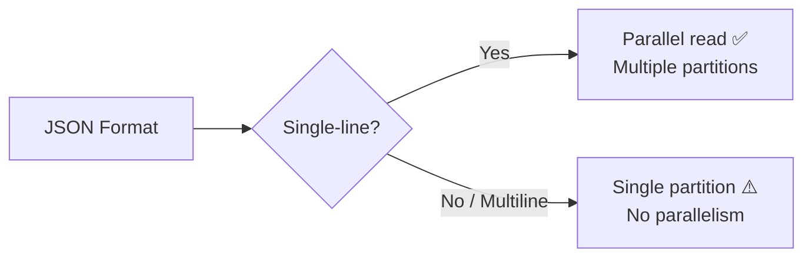
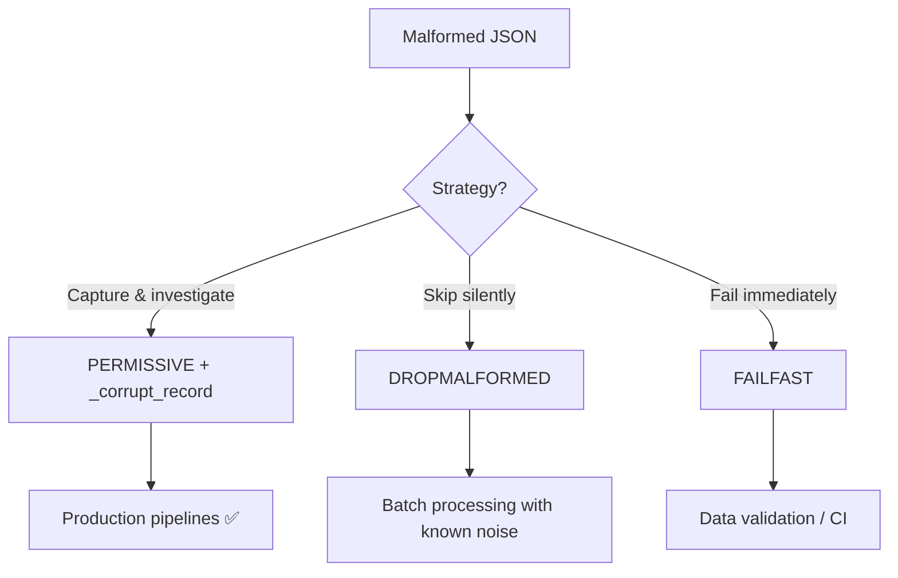

# Best Practices

Production-ready patterns for PySpark JSON pipelines — schema management, performance,
error handling, and operational excellence.

## Schema Management

### Always Use Explicit Schemas in Production

```python
from pyspark.sql.types import StructType, StructField, StringType, LongType, DoubleType

schema = StructType([
    StructField("id", LongType(), nullable=False),
    StructField("name", StringType(), nullable=True),
    StructField("amount", DoubleType(), nullable=True),
])

df = spark.read.schema(schema).json("s3://bucket/events/")
```

!!! failure "Avoid in Production"
    ```python
    # Schema inference scans ALL data — slow, unpredictable types
    df = spark.read.json("s3://bucket/events/")
    ```

| Approach | Speed | Type Safety | Use Case |
|----------|-------|-------------|----------|
| Explicit schema | ✅ Fast | ✅ Guaranteed | Production pipelines |
| DDL string | ✅ Fast | ✅ Guaranteed | Config-driven schemas |
| Schema inference | ❌ Slow | ⚠️ May vary | Development/exploration only |

### Version Your Schemas

```python
# Store schemas as JSON files alongside your code
schema_v1 = StructType.fromJson(json.load(open("schemas/events_v1.json")))
schema_v2 = StructType.fromJson(json.load(open("schemas/events_v2.json")))

# Validate before deploying schema changes
from pys_json.schema import validate_schema_file
result = validate_schema_file("schemas/events_v2.json", expected_schema=schema_v1)
if result.warnings:
    print(f"Schema drift detected: {result.warnings}")
```

### Export Schemas for Downstream

```python
import json

# Save schema for other teams / systems
schema_json = df.schema.json()
with open("schemas/events_current.json", "w") as f:
    f.write(schema_json)

# DDL for SQL-based tools
print(df.schema.toDDL())
```

---

## Performance

### Prefer Single-Line JSON



!!! tip "Convert Multiline to Single-Line"
    ```bash
    # Pre-process with jq for best Spark performance
    jq -c '.[]' array.json > records.jsonl
    ```

### Partition Large Datasets

```python
# Write with partitioning for efficient reads
df.write \
    .partitionBy("year", "month") \
    .mode("overwrite") \
    .json("s3://bucket/events/")

# Read only the partitions you need (partition pruning)
df = spark.read.json("s3://bucket/events/year=2024/month=01/")
```

### Use Compression

| Codec | Ratio | Speed | When to Use |
|-------|-------|-------|-------------|
| `snappy` | Medium | ✅ Fast | Default for intermediate data |
| `gzip` | ✅ Best | Slow | Archival, external sharing |
| `lz4` | Low | ✅ Fastest | Temporary / shuffle data |
| `zstd` | ✅ Best | Fast | Modern systems (Spark 3.2+) |
| `none` | — | — | Debugging, small files |

```python
df.write.option("compression", "snappy").json("/output/")
```

### Avoid Small Files

```python
# Bad: thousands of tiny files
df.write.json("/output/")  # One file per partition

# Better: control output file count
df.coalesce(10).write.json("/output/")  # 10 files

# Best: use maxRecordsPerFile for uniform sizes
df.write.option("maxRecordsPerFile", 1000000).json("/output/")
```

### Cache Before Multiple Operations

```python
# If you'll query the same JSON data multiple times:
df = spark.read.schema(schema).json("data.json").cache()

# Now multiple actions reuse the cached result
count = df.count()
summary = df.describe()
filtered = df.filter(df.amount > 100)
```

!!! warning "Required for `_corrupt_record`"
    When filtering on `_corrupt_record`, you **must** cache first:
    ```python
    df = spark.read.schema(schema).json("data.json").cache()
    corrupt = df.filter(F.col("_corrupt_record").isNotNull())
    ```

### Push Down Filters Early

```python
# Good: filter pushdown reduces data read
df = spark.read.json("events/").filter(F.col("event_type") == "purchase")

# Better: use partitioned paths
df = spark.read.json("events/type=purchase/")
```

---

## Error Handling

### Choose the Right Mode



| Mode | Malformed Rows | Use Case |
|------|----------------|----------|
| `PERMISSIVE` (default) | Kept with nulls + `_corrupt_record` | Production — investigate failures |
| `DROPMALFORMED` | Silently dropped | Batch jobs with acceptable data loss |
| `FAILFAST` | Job fails immediately | Validation pipelines, CI/CD |

### Always Include `_corrupt_record` in Schema

```python
from pys_json.schema import with_corrupt_record

schema = StructType([
    StructField("id", LongType()),
    StructField("name", StringType()),
])

# Add corrupt record column for error capture
safe_schema = with_corrupt_record(schema)

df = spark.read.schema(safe_schema).json("data.json").cache()

# Separate good and bad records
good = df.filter(F.col("_corrupt_record").isNull()).drop("_corrupt_record")
bad = df.filter(F.col("_corrupt_record").isNotNull())

# Log bad records for investigation
bad.write.mode("append").json("/quarantine/")
```

### Quarantine Pattern

```python
def read_with_quarantine(spark, path, schema):
    """Read JSON with automatic quarantine of bad records."""
    full_schema = with_corrupt_record(schema)

    df = spark.read.schema(full_schema).json(path).cache()

    good_df = df.filter(F.col("_corrupt_record").isNull()).drop("_corrupt_record")
    bad_df = df.filter(F.col("_corrupt_record").isNotNull())

    bad_count = bad_df.count()
    if bad_count > 0:
        bad_df.write.mode("append").json(f"{path}/_quarantine/")
        print(f"⚠️ Quarantined {bad_count} malformed records")

    return good_df
```

---

## Data Quality

### Validate After Read

```python
from pyspark.sql import functions as F

df = spark.read.schema(schema).json("data.json")

# Check for unexpected nulls in required fields
null_counts = df.select([
    F.sum(F.when(F.col(c).isNull(), 1).otherwise(0)).alias(c)
    for c in ["id", "name"]
])

# Check row count expectations
assert df.count() > 0, "Empty dataset!"

# Check for schema conformance
assert df.schema == schema, f"Schema mismatch: {df.schema}"
```

### Monitor Schema Drift

```python
from pys_json.schema import validate_schema_file

# In CI/CD: validate schema file hasn't drifted
result = validate_schema_file(
    "schemas/current.json",
    expected_schema=baseline_schema,
)

if not result.valid:
    raise ValueError(f"Schema invalid: {result.errors}")

if result.warnings:
    # Alert on drift but don't fail
    notify_team(f"Schema drift detected: {result.warnings}")
```

---

## JSON Functions

### Choose the Right Function

| Need | Function | Returns |
|------|----------|---------|
| Parse full JSON string → struct | `from_json(col, schema)` | Typed struct column |
| Extract 1–2 nested fields | `get_json_object(col, "$.path")` | String column |
| Extract multiple top-level keys | `json_tuple(col, "k1", "k2")` | Multiple string columns |
| Convert struct → JSON string | `to_json(col)` | String column |
| Infer schema from sample | `schema_of_json(lit(sample))` | DDL string column |

### from_json: Always Provide Schema

```python
# Good: explicit schema
schema = "id LONG, name STRING, email STRING"
df.withColumn("parsed", F.from_json("json_col", schema))

# Bad: schema_of_json in production (brittle, sample-dependent)
```

### get_json_object: Limit to 1–2 Fields

```python
# Good: quick extraction of deeply nested value
df.withColumn("city", F.get_json_object("payload", "$.user.address.city"))

# Bad: multiple get_json_object on same column (parses JSON repeatedly)
# Use from_json instead when accessing 3+ fields
```

---

## Operational Excellence

### Logging and Monitoring

```python
import logging

logger = logging.getLogger("json_pipeline")

df = spark.read.schema(schema).json(input_path).cache()

total = df.count()
corrupt = df.filter(F.col("_corrupt_record").isNotNull()).count()

logger.info("Read %d records, %d corrupt (%.1f%%)", total, corrupt, 100*corrupt/max(total,1))

if corrupt / max(total, 1) > 0.05:
    logger.warning("Corruption rate > 5%% — investigate source")
```

### Idempotent Writes

```python
# Use overwrite mode with explicit output paths
output_path = f"s3://bucket/output/date={today}/"
df.write.mode("overwrite").json(output_path)

# Or use a staging + swap pattern
staging = f"{output_path}_staging"
df.write.mode("overwrite").json(staging)
# Atomic rename (filesystem-dependent)
```

### Environment-Driven Configuration

```python
import os

input_path = os.environ.get("INPUT_PATH", "/tmp/input/")
output_path = os.environ.get("OUTPUT_PATH", "/tmp/output/")
error_mode = os.environ.get("JSON_ERROR_MODE", "PERMISSIVE")

df = spark.read \
    .option("mode", error_mode) \
    .schema(schema) \
    .json(input_path)
```

---

## Anti-Patterns to Avoid

| ❌ Anti-Pattern | ✅ Better Approach |
|----------------|-------------------|
| Schema inference in production | Explicit `StructType` or DDL schema |
| `df.collect()` for row count | `df.count()` |
| `import *` from pyspark.sql.functions | `from pyspark.sql import functions as F` |
| Hardcoded file paths | Environment variables with defaults |
| Missing `spark.stop()` | Always stop session in scripts |
| Multiple `get_json_object` on same column | Single `from_json` with full schema |
| Reading multiline JSON at scale | Convert to single-line JSONL |
| Querying only `_corrupt_record` without cache | `.cache()` before filtering |
| Ignoring malformed records | PERMISSIVE + quarantine pattern |
| `coalesce(1)` on large datasets | `maxRecordsPerFile` option |

---

## Checklist

Use this checklist for production JSON pipelines:

- [ ] Explicit schema defined (not inferred)
- [ ] Schema versioned and stored as JSON file
- [ ] Error mode set (PERMISSIVE + `_corrupt_record` for production)
- [ ] Corrupt records quarantined and monitored
- [ ] Compression enabled (snappy or gzip)
- [ ] Partition strategy defined for large datasets
- [ ] Output file count controlled
- [ ] Environment variables for paths and configuration
- [ ] Data quality checks after read
- [ ] `spark.stop()` at end of script
- [ ] Logging with record counts and corruption rates
