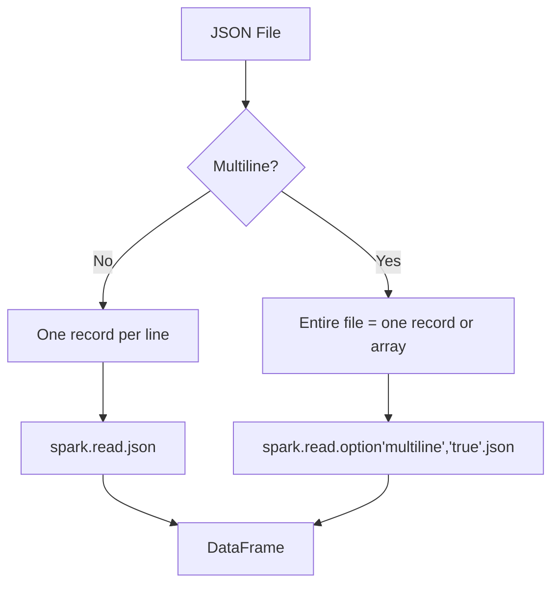

# JSON Data Source

Read and write JSON files using PySpark's built-in JSON datasource.

## Overview

PySpark reads JSON in two modes:

| Mode        | Description                        | Option           |
| ----------- | ---------------------------------- | ---------------- |
| Single-line | One JSON object per line (default) | —                |
| Multiline   | Pretty-printed or array JSON       | `multiline=true` |



## Reading JSON

```python title="examples/01_data_source/read_json_array.py"
--8<-- "examples/01_data_source/read_json_array.py"
```

## API Styles

PySpark provides two equivalent ways to read JSON:

=== "Direct Method (Preferred)"
`python
    df = spark.read.json("path/to/file.json")
    `

=== "Format-Based"
`python
    df = spark.read.format("json").load("path/to/file.json")
    `

!!! note
Both styles accept the same options. The direct method is more concise.

## Multiline JSON

By default, Spark expects one JSON object per line. For pretty-printed or array JSON:

```python
df = spark.read.option("multiline", "true").json("path/to/file.json")
```

!!! warning
Multiline mode reads the entire file into a single partition. For large files,
prefer single-line JSON (one record per line) for parallel processing.

## Writing JSON

```python
# Basic write
df.write.mode("overwrite").json("/tmp/output")

# With options
(df.write
 .mode("overwrite")
 .option("compression", "gzip")       # (1)!
 .option("ignoreNullFields", "true")   # (2)!
 .option("dateFormat", "yyyy-MM-dd")   # (3)!
 .json("/tmp/output"))
```

1. Supported codecs: `gzip`, `bzip2`, `deflate`, `lz4`, `snappy`, `none`.
2. Omit fields with null values from output (default: `true`).
3. Custom date format pattern for date columns.

## Reading Multiple Files

```python
# Read from a directory
df = spark.read.json("path/to/json_dir/")

# Read from multiple paths
df = spark.read.json(["file1.json", "file2.json", "dir/"])

# Read with glob pattern
df = spark.read.json("data/year=2024/month=*/events.json")
```

## Configuration Reference

| Config                                  | Default | Description                     |
| --------------------------------------- | ------- | ------------------------------- |
| `spark.sql.json.filterPushdown.enabled` | `true`  | Push filters into JSON reader   |
| `spark.sql.adaptive.enabled`            | `true`  | Enable Adaptive Query Execution |
| `spark.sql.shuffle.partitions`          | `200`   | Reduce for small datasets       |

## Run

```bash
python examples/01_data_source/read_json_array.py
```
