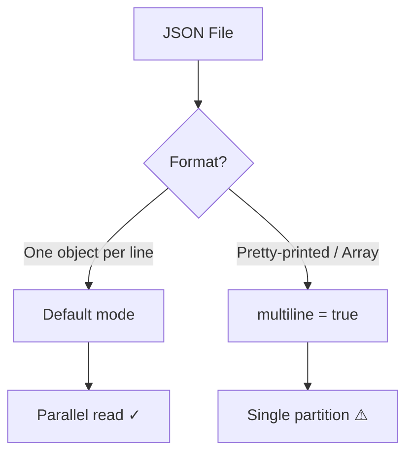

# Multiline JSON

Handle pretty-printed JSON, JSON arrays, and multi-record files.

## The Problem

By default, Spark treats each **line** as a separate JSON record. Pretty-printed
or array-formatted JSON spans multiple lines and fails to parse without `multiline=true`.



## JSON Array Files

```json title="users.json"
[
  {"id": 1, "name": "Alice", "age": 30},
  {"id": 2, "name": "Bob", "age": 25},
  {"id": 3, "name": "Charlie", "age": 35}
]
```

```python
df = spark.read.option("multiline", "true").json("users.json")
df.show()
# +---+-------+---+
# | id|   name|age|
# +---+-------+---+
# |  1|  Alice| 30|
# |  2|    Bob| 25|
# |  3|Charlie| 35|
# +---+-------+---+
```

## Pretty-Printed Objects

```json title="config.json"
{
  "database": {
    "host": "localhost",
    "port": 5432
  },
  "cache": {
    "ttl": 300
  }
}
```

```python
df = spark.read.option("multiline", "true").json("config.json")
```

## Single-Line vs Multiline Comparison

| Feature | Single-Line (default) | Multiline |
|---------|----------------------|-----------|
| Format | One JSON object per line | Pretty-printed or array |
| Parallelism | ✅ Multiple partitions | ⚠️ Single partition |
| Large files | ✅ Scalable | ❌ Memory issues |
| Human readable | ❌ Dense | ✅ Formatted |
| Use case | Logs, streaming, ETL | Config files, API exports |

## Performance Considerations

!!! warning "Single Partition Limitation"
    Multiline mode reads the **entire file** into one partition. This means:

    - No parallel processing within a single file
    - Risk of OOM on large files
    - Only one task processes the data

### Workaround for Large Multiline Files

```python
import json

# Step 1: Read as text and split manually
rdd = spark.sparkContext.textFile("large_array.json")

# Step 2: For JSON arrays, use wholeTextFiles + parse
rdd_whole = spark.sparkContext.wholeTextFiles("large_pretty.json")
parsed = rdd_whole.flatMap(lambda x: json.loads(x[1]) if isinstance(json.loads(x[1]), list) else [json.loads(x[1])])

# Step 3: Convert to DataFrame
df = spark.read.json(parsed)  # RDD[str] → DataFrame
```

### Best Practice: Convert to Single-Line

```bash
# Pre-process with jq (converts array to newline-delimited)
jq -c '.[]' users.json > users.jsonl
```

Then read without multiline:
```python
df = spark.read.json("users.jsonl")  # Fast, parallel
```

## Nested Multiline JSON

```json title="orders.json"
[
  {
    "order_id": "ORD-001",
    "customer": {
      "name": "Alice",
      "address": {
        "city": "NYC",
        "zip": "10001"
      }
    },
    "items": [
      {"sku": "A1", "qty": 2, "price": 29.99},
      {"sku": "B2", "qty": 1, "price": 49.99}
    ]
  }
]
```

```python
df = spark.read.option("multiline", "true").json("orders.json")
df.printSchema()
# root
#  |-- order_id: string
#  |-- customer: struct
#  |    |-- name: string
#  |    |-- address: struct
#  |    |    |-- city: string
#  |    |    |-- zip: string
#  |-- items: array
#  |    |-- element: struct
#  |    |    |-- sku: string
#  |    |    |-- qty: long
#  |    |    |-- price: double
```

## Run

```bash
python examples/01_data_source/read_json_array.py
```
