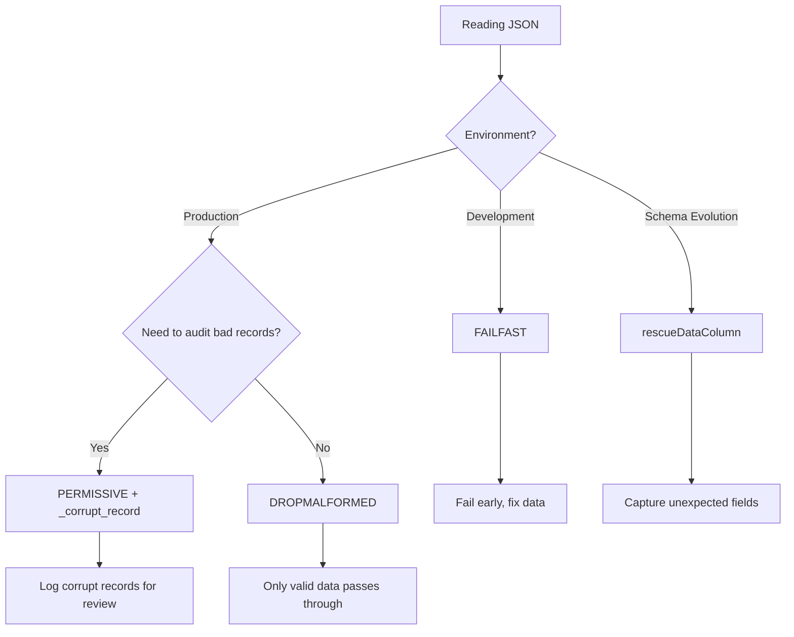

# Error Handling

PySpark provides three parse modes for handling malformed JSON records, plus a rescued data column feature.

## Parse Modes

| Mode | Behavior | Data Loss | Use Case |
|------|----------|-----------|----------|
| [PERMISSIVE](permissive.md) | Puts malformed string into `_corrupt_record` column | None | Production pipelines |
| [DROPMALFORMED](drop-malformed.md) | Silently drops unparseable rows | Yes | Quick prototyping |
| [FAILFAST](fail-fast.md) | Throws exception on first bad record | N/A | Development & CI |

## Rescued Data Column

The [rescued data column](rescued-data.md) captures fields that don't match the provided schema —
useful for schema evolution scenarios where new fields appear in source data.

## Decision Flowchart



## Setting the Mode

```python
# Option-based
df = spark.read.option("mode", "PERMISSIVE").json("data.json")

# With explicit schema (required for _corrupt_record)
from pyspark.sql.types import StructType, StructField, StringType, IntegerType

schema = StructType([
    StructField("name", StringType()),
    StructField("age", IntegerType()),
    StructField("_corrupt_record", StringType()),  # (1)!
])

df = (spark.read
      .option("mode", "PERMISSIVE")
      .option("columnNameOfCorruptRecord", "_corrupt_record")
      .schema(schema)
      .json("data.json"))
```

1. Must be `StringType`. The field name must match the `columnNameOfCorruptRecord` option.

!!! warning "Cache Required for `_corrupt_record` Queries"
    Spark raises `UNSUPPORTED_FEATURE.QUERY_ONLY_CORRUPT_RECORD_COLUMN` if you filter or
    select **only** the `_corrupt_record` column directly from a JSON read. You must
    `.cache()` the DataFrame first:

    ```python
    df = spark.read.schema(schema).json(path).cache()  # cache before filtering
    corrupt = df.filter(df._corrupt_record.isNotNull())
    ```

    This also applies to schema-inferred reads (which auto-add `_corrupt_record`) and
    to any DataFrame whose referenced columns resolve to only the corrupt record column.

!!! tip "Best Practice"
    - **Development**: Use `FAILFAST` to catch issues early.
    - **Production pipelines**: Use `PERMISSIVE` with `_corrupt_record` to capture and audit bad records.
    - **Quick prototyping**: Use `DROPMALFORMED` when you only care about valid data.
