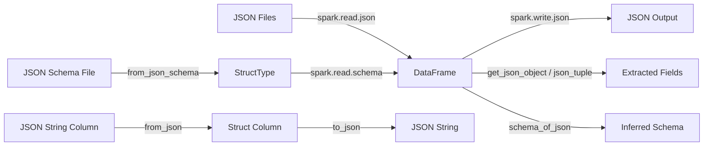

# PySpark JSON Datasource

Comprehensive reference for reading, writing, and processing JSON data with Apache Spark (PySpark 4.x).
This project contains **60+ standalone examples** organized into 7 categories, a reusable `pys_json`
library, and Rich-powered formatted output.

## Architecture



## Topics

<div class="grid cards" markdown>

-   :material-file-document:{ .lg .middle } **[Data Source](data-source/index.md)**

    ---

    Reading and writing JSON files with `spark.read.json()` and `.format("json").load()`

-   :material-function:{ .lg .middle } **[JSON Functions](json-functions/index.md)**

    ---

    Built-in functions: `from_json`, `to_json`, `json_tuple`, `get_json_object`, `schema_of_json`, `json_object_keys`, `json_array_length`

-   :material-table:{ .lg .middle } **[DataFrame Patterns](dataframe/index.md)**

    ---

    Create DataFrames, transformations, nested JSON, write modes, Pandas bridge, joins

-   :material-cog:{ .lg .middle } **[Properties](properties/index.md)**

    ---

    Every JSON read/write option — encoding, compression, formatting, parsing rules, type coercion

-   :material-alert-circle:{ .lg .middle } **[Error Handling](error-handling/index.md)**

    ---

    PERMISSIVE, DROPMALFORMED, FAILFAST modes and corrupt record recovery

-   :material-code-braces:{ .lg .middle } **[Schema](schema/index.md)**

    ---

    StructType, DDL, JSON Schema conversion, schema evolution, variable keys

-   :material-map-marker-path:{ .lg .middle } **[JSONPath](json-path/index.md)**

    ---

    JSONPath expressions for extracting values from JSON structures

</div>

## Quick Start

!!! tip "No cluster needed"
    All examples run locally with `local[*]` mode — just install PySpark and Java 17.

=== "Using the pys_json library"
    ```python
    from pys_json import get_spark, print_dataframe, print_schema

    spark = get_spark("quickstart")  # (1)!

    df = spark.read.json("path/to/data.json")
    print_schema(df, title="My Schema")  # (2)!
    print_dataframe(df, title="Results")  # (3)!

    spark.stop()
    ```

    1. Handles `JAVA_HOME`, `SPARK_MASTER`, adaptive query settings automatically.
    2. Rich tree-view schema output instead of `df.printSchema()`.
    3. Rich bordered table instead of `df.show()`.

=== "Raw PySpark"
    ```python
    import os
    from pyspark.sql import SparkSession

    spark = (SparkSession.builder
             .appName("json-quickstart")
             .master(os.environ.get("SPARK_MASTER", "local[*]"))
             .config("spark.sql.adaptive.enabled", "true")
             .getOrCreate())
    spark.sparkContext.setLogLevel("WARN")

    df = spark.read.json("path/to/data.json")
    df.printSchema()
    df.show()

    spark.stop()
    ```

## Installation

=== "uv (Recommended)"
    ```bash
    cd pyspark-ds-json
    uv sync --group dev
    ```

=== "pip"
    ```bash
    pip install -e ".[dev]"
    ```

!!! warning "Java 17 Required"
    PySpark 4.x requires **Java 17** (LTS). Set `JAVA_HOME` to point to a JDK 17 installation.

    === "macOS"
        ```bash
        brew install openjdk@17
        export JAVA_HOME=$(brew --prefix openjdk@17)
        ```

    === "Ubuntu/Debian"
        ```bash
        sudo apt install openjdk-17-jdk
        export JAVA_HOME=/usr/lib/jvm/java-17-openjdk-amd64
        ```

## Project Structure

```text
pyspark-ds-json/
├── src/pys_json/              # Reusable library
│   ├── __init__.py            # Public API (get_spark, Rich helpers, etc.)
│   ├── config.py              # SparkSession, DATA_HOME, write utilities
│   ├── _logging.py            # Rich-powered logging & print helpers
│   ├── reader/                # JsonReader fluent API
│   ├── writer/                # JsonWriter with compression presets
│   ├── parsing/               # from_json, json_tuple wrappers
│   ├── schema/                # Schema builders, from_json_schema()
│   └── validation/            # Data quality checks
├── examples/
│   ├── 01_data_source/        # spark.read.json / .format("json").load()
│   ├── 02_json_functions/     # from_json, to_json, json_tuple, etc.
│   ├── 03_dataframe/          # Create, transform, nest, write, joins
│   ├── 04_properties/         # Compression, encoding, formatting, etc.
│   ├── 05_error_handling/     # PERMISSIVE, DROPMALFORMED, FAILFAST
│   ├── 06_schema/             # 11 schema examples (evolution, convert)
│   └── 07_json_path/          # JSONPath expressions
├── tests/                     # pytest test suite
├── scripts/                   # spark-submit, docker, batch runners
├── docs/                      # This documentation (MkDocs Material)
├── Makefile                   # 28 targets: test, lint, docs, build, etc.
└── pyproject.toml             # hatchling build, ruff, mypy, bandit config
```

## Running Examples

```bash
# Single example
python examples/02_json_functions/01_from_json.py

# All examples in a category
python examples/06_schema/11_schema_evolution.py

# Run all examples with pass/fail report
./scripts/run-all-examples.sh

# Via Makefile
make run-example EXAMPLE=examples/04_properties/01_compression.py
```

## Development

```bash
make install          # Install with dev dependencies
make ci               # Full CI: format, lint, type-check, security, compile
make test             # Run pytest
make docs             # Build documentation
make check-all        # All quality checks
```

## Serving Docs Locally

```bash
uv run mkdocs serve
```

Then open [http://127.0.0.1:8000](http://127.0.0.1:8000).
