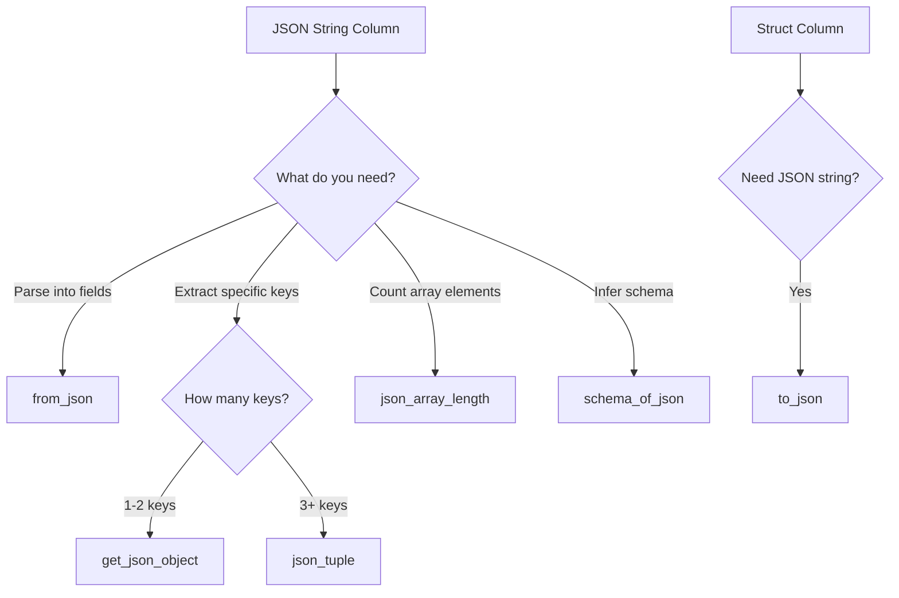

# JSON Functions

PySpark provides built-in functions for parsing, creating, and manipulating JSON data within DataFrames.

## Available Functions

| Function | Input | Output | Use Case |
|----------|-------|--------|----------|
| [`from_json`](from-json.md) | JSON string | Struct / Map / Array | Parse embedded JSON columns |
| [`to_json`](to-json.md) | Struct / Map | JSON string | Serialize for downstream systems |
| [`json_tuple`](json-tuple.md) | JSON string + keys | Multiple columns | Extract several keys efficiently |
| [`json_object`](json-object.md) | Key-value pairs | JSON string | Construct JSON from columns |
| [`json_array_length`](json-array-length.md) | JSON array string | Integer | Count array elements |
| [`schema_of_json`](schema-of-json.md) | JSON sample string | DDL schema string | Dynamic schema inference |

## Decision Guide



## Import Convention

```python
from pyspark.sql import functions as F
from pyspark.sql.functions import from_json, to_json, json_tuple
from pyspark.sql.types import StructType, StructField, StringType, IntegerType, MapType
```

!!! tip "Performance"
    - Use `json_tuple` over multiple `get_json_object` calls — it parses JSON once.
    - Use `from_json` with an explicit schema — avoid repeated inference.
    - Prefer `schema_of_json` to auto-generate schemas during development, then hardcode for production.
