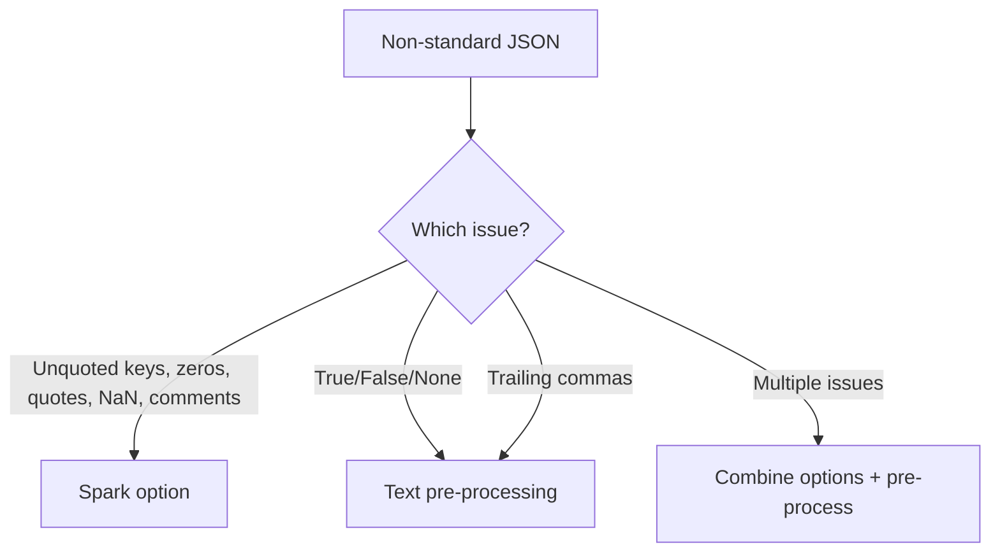

# Bad JSON That Looks Almost Valid

Handling non-standard JSON with Spark options and pre-processing.

## Common Non-Standard Patterns

| Pattern | Example | Valid JSON? |
|---------|---------|-------------|
| Unquoted keys | `{id: 1}` | ❌ |
| Leading zeros | `{"id": 001}` | ❌ |
| Single quotes | `{'name': 'Alice'}` | ❌ |
| NaN/Infinity | `{"val": NaN}` | ❌ |
| Comments | `// comment` | ❌ |
| Python True/False | `{"active": True}` | ❌ |
| Trailing commas | `{"k": "v",}` | ❌ |

## Spark Options (Built-in Fixes)

```python
df = (
    spark.read
    .option("allowUnquotedFieldNames", "true")
    .option("allowNumericLeadingZeros", "true")
    .option("allowSingleQuotes", "true")
    .option("allowNonNumericNumbers", "true")
    .option("allowComments", "true")
    .option("allowBackslashEscapingAnyCharacter", "true")
    .json(path)
)
```

### Option Details

| Option | Handles | Default |
|--------|---------|---------|
| `allowUnquotedFieldNames` | `{id: 1}` → `{"id": 1}` | false |
| `allowNumericLeadingZeros` | `001` → `1` | false |
| `allowSingleQuotes` | `'value'` → `"value"` | true |
| `allowNonNumericNumbers` | `NaN`, `Infinity`, `-Infinity` | false |
| `allowComments` | `//` and `/* */` lines | false |
| `allowBackslashEscapingAnyCharacter` | Non-standard `\x` escapes | false |

## Pre-Processing Required

### Python-style True/False/None

```python
from pyspark.sql import functions as F

raw = spark.read.text(path)
fixed = raw.select(
    F.regexp_replace(
        F.regexp_replace(
            F.regexp_replace(F.col("value"), r"\bTrue\b", "true"),
            r"\bFalse\b", "false",
        ),
        r"\bNone\b", "null",
    ).alias("value")
)
```

### Trailing Commas

```python
fixed = raw.select(
    F.regexp_replace(F.col("value"), r",\s*}", "}").alias("value")
)
```

## Handling NaN/Infinity After Parsing

```python
df_clean = df.withColumn(
    "value_clean",
    F.when(F.isnan(F.col("value")), None)
    .when(F.col("value") == float("inf"), None)
    .otherwise(F.col("value")),
)
```

## Full Demo

```python title="examples/06_schema/28_bad_json.py"
--8<-- "examples/06_schema/28_bad_json.py"
```

## Run

```bash
python examples/06_schema/28_bad_json.py
```

## Decision Guide



!!! warning "Production Advice"
    Relaxed parsing options hide data quality issues. Use them for ingestion,
    but log/monitor how many records needed non-standard parsing. Fix upstream
    if possible.
