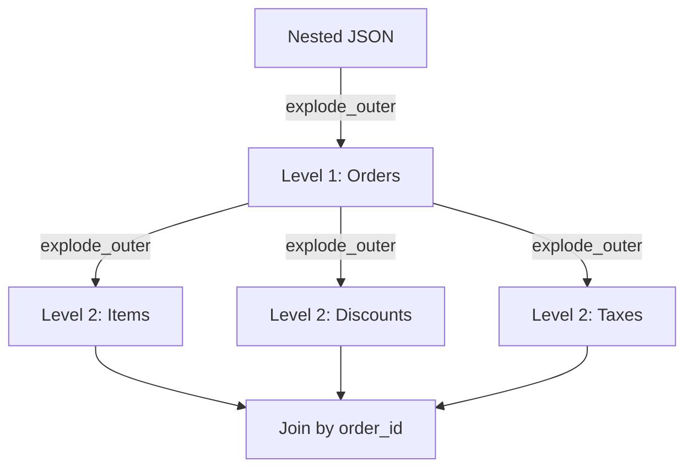

# Deeply Nested JSON

Flattening deeply nested arrays and structs safely, with row explosion control.

## Overview



!!! failure "The Problem"
    - Multiple nested arrays cause **cartesian row explosion**
    - A single input record can become thousands of rows
    - `explode()` silently drops records with null/empty arrays
    - Naive multi-explode multiplies array lengths together

## Row Explosion Example

```
customer (1 row)
  → orders (2 items)
    → items (3 per order)
    → discounts (2 per order)
    → taxes (2 per order)

Naive explode all: 1 × 2 × 3 × 2 × 2 = 24 rows from 1 input record!
```

## Safe Flattening Pattern

Flatten one level at a time and validate row counts:

```python
from pyspark.sql import functions as F

# Level 1: explode orders
orders_df = df.select(
    F.col("customer_id"),
    F.explode_outer("orders").alias("order"),
)

# Level 2: explode items (from orders)
items_df = orders_df.select(
    F.col("customer_id"),
    F.col("order.order_id").alias("order_id"),
    F.explode_outer("order.items").alias("item"),
).select(
    F.col("customer_id"),
    F.col("order_id"),
    F.col("item.sku").alias("sku"),
    F.col("item.qty").alias("qty"),
)
```

!!! tip "Validate After Every Explode"
    ```python
    logger.info("Input: %s rows", df.count())
    logger.info("After orders explode: %s rows", orders_df.count())
    logger.info("After items explode: %s rows", items_df.count())
    ```
    Unexpected growth signals a cartesian product.

## Avoiding Cartesian Products

When an order has **multiple sibling arrays** (items, discounts, taxes), flatten each independently:

```python
# Flatten items independently
df_items = df_orders.select("order_id", F.explode_outer("items").alias("item"))

# Flatten discounts independently
df_discounts = df_orders.select("order_id", F.explode_outer("discounts").alias("discount"))

# Flatten taxes independently
df_taxes = df_orders.select("order_id", F.explode_outer("taxes").alias("tax"))

# Join back by order_id when needed (no cartesian)
```

!!! warning "Never Explode Sibling Arrays in the Same Select"
    Exploding `items` and `discounts` in the same `select()` creates a cross-join
    between them — each item pairs with every discount.

## `explode_outer` vs `explode`

| Function | Null/Empty Array | Use When |
|----------|-----------------|----------|
| `explode()` | Drops the row entirely | You only want records with data |
| `explode_outer()` | Preserves as null row | You need all records (LEFT JOIN semantics) |

```python
# Record with items: null → dropped by explode(), preserved by explode_outer()
df.select("id", F.explode_outer("items").alias("item"))
```

## DDL Schema for Nested Structures

```python
schema = """
    customer_id BIGINT,
    orders ARRAY<STRUCT<
        order_id: STRING,
        items: ARRAY<STRUCT<
            sku: STRING,
            qty: INT
        >>
    >>
"""
df = spark.read.schema(schema).json(path)
```

## Full Demo

```python title="examples/06_schema/15_deeply_nested_json.py"
--8<-- "examples/06_schema/15_deeply_nested_json.py"
```

## Run

```bash
python examples/06_schema/15_deeply_nested_json.py
```

## Best Practices

| Practice | Why |
|----------|-----|
| Flatten one level at a time | Easier to debug and validate |
| Use `explode_outer` by default | Preserves records with empty/null arrays |
| Validate row counts after each explode | Detects unexpected cartesian products |
| Flatten sibling arrays independently | Avoids cross-join multiplication |
| Use explicit schema | Prevents inference from mistyping nested fields |
