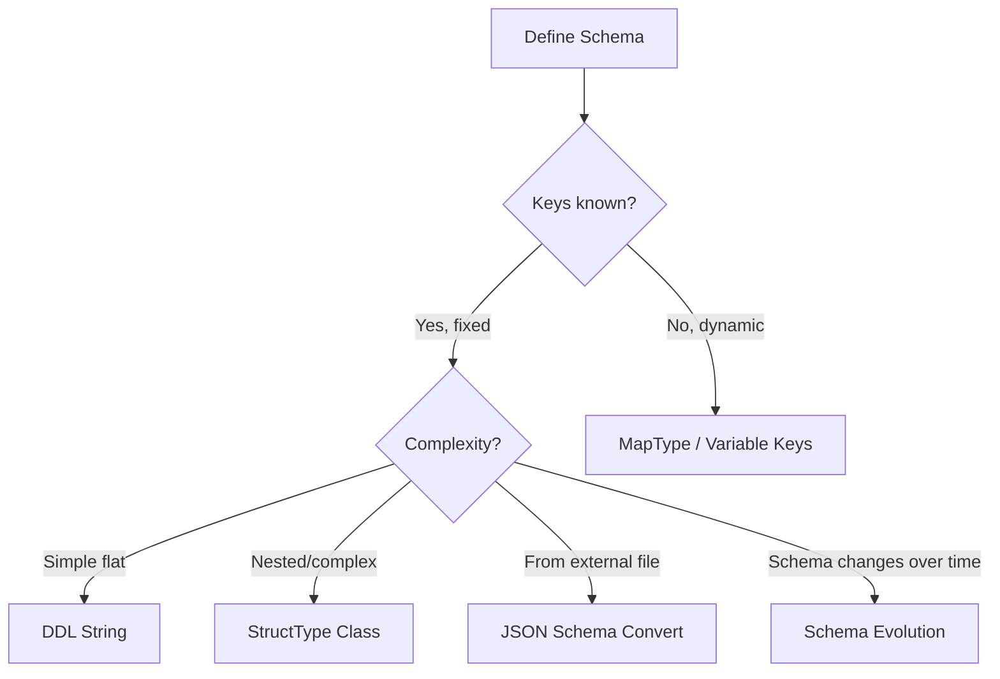

# Schema Approaches

PySpark offers multiple ways to define schemas for JSON data. Explicit schemas improve
performance (skip inference) and ensure data quality.

## Comparison

| Approach | Pros | Cons | Best For |
|----------|------|------|----------|
| [StructType Class](class-schema.md) | Full type safety, IDE support | Verbose | Production code |
| [DDL String](ddl-string.md) | Concise, readable | No IDE completion | Simple flat schemas |
| [JSON Schema](json-schema.md) | Portable, serializable | Verbose JSON | Schema registry integration |
| [JSON Schema Convert](json-schema-convert.md) | Standard format, reusable | Needs conversion | External schema files |
| [Variable Keys](variable-keys.md) | Handles dynamic data | Complex schema definition | API responses, logs |
| [Schema Evolution](schema-evolution.md) | Future-proof | Requires versioning strategy | Growing datasets |

## Decision Guide



## Why Use Explicit Schemas?

!!! success "Benefits"
    - **Performance**: Skips the expensive schema inference pass over all data
    - **Correctness**: Ensures columns have expected types (no surprise strings)
    - **Stability**: Schema doesn't change when data changes
    - **Corrupt record handling**: Required for `_corrupt_record` column in PERMISSIVE mode
    - **Documentation**: Schema serves as self-documenting data contract

!!! failure "Without Schema (Inference)"
    - Reads all data twice (once for inference, once for loading)
    - Types may change between runs if data changes
    - Cannot detect corrupt records
    - Slower for large datasets

## Schema Inference Helper

Use `schema_of_json()` to generate a starting schema from a sample, then refine it:

```python
from pyspark.sql.functions import schema_of_json

sample = '{"name": "Alice", "age": 30, "scores": [95, 87, 92]}'
schema_ddl = spark.range(1).select(schema_of_json(sample)).collect()[0][0]
print(schema_ddl)
# STRUCT<age: BIGINT, name: STRING, scores: ARRAY<BIGINT>>
```

## Library Utilities

The `pys_json.schema` module provides helper functions:

```python
from pys_json.schema import (
    from_json_schema,     # JSON Schema → StructType
    merge_schemas,        # Combine multiple schemas
    schema_from_dict,     # Dict → StructType
    schema_to_ddl,        # StructType → DDL string
    with_corrupt_record,  # Add _corrupt_record field
    select_fields,        # Subset a schema
    drop_fields,          # Remove fields from schema
)
```

!!! tip
    Generate the schema with `schema_of_json` during development, then hardcode the
    `StructType` definition in production code for stability and performance.
