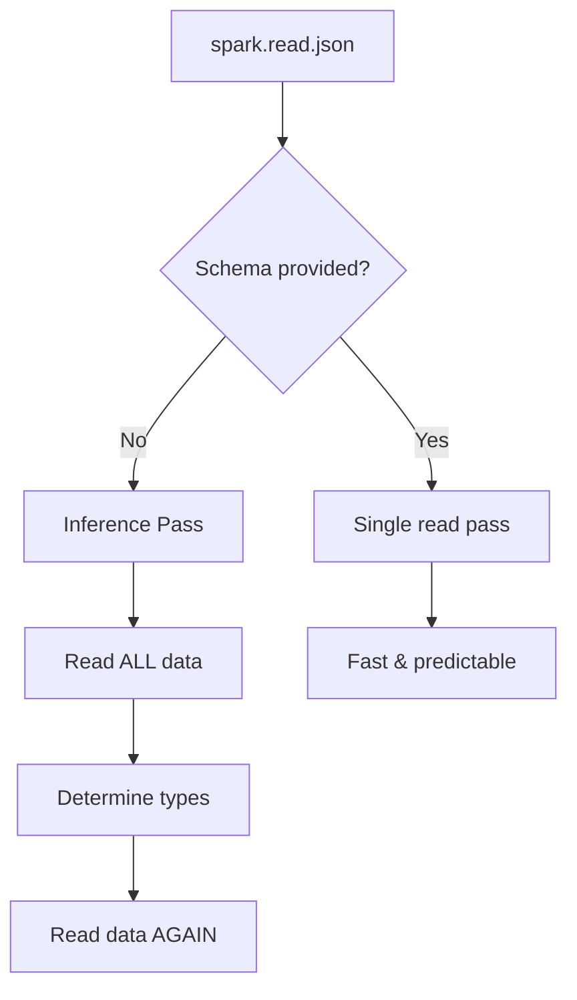

# Schema Inference Problems

Why automatic schema inference is expensive and dangerous for production JSON pipelines.

## Overview



!!! failure "The Problem"
    - Inference reads data **twice** (once for schema, once for loading)
    - Mixed types in a field cause fallback to `StringType`
    - Schema is **non-deterministic** — changes when data changes
    - Primitive-to-struct evolution breaks pipelines silently
    - `samplingRatio < 1.0` makes schemas unpredictable

## Key Scenarios

### 1. Mixed types → StringType fallback

When a single field contains different types, Spark widens to `StringType`:

```json
{"id": 1, "amount": 100}
{"id": 2, "amount": 100.25}
{"id": 3, "amount": "UNKNOWN"}
```

Spark infers `amount` as `StringType` — numeric operations will fail downstream.

### 2. Primitive-to-struct evolution (hardest scenario)

Your input changes from:

```json
{"amount": 100}
```

to:

```json
{"amount": {"value": 100, "currency": "USD"}}
```

Reading both files together forces `amount` to `StringType`, destroying type information
for **both** formats.

### 3. samplingRatio trap

With `samplingRatio < 1.0`, Spark samples a subset for inference. Fields that appear
only in rare records may be missed entirely — the schema becomes non-deterministic.

## Solution: Explicit Schema + PERMISSIVE Mode

```python
from pyspark.sql.types import DoubleType, LongType, StringType, StructField, StructType

schema = StructType(
    [
        StructField("id", LongType(), True),
        StructField("amount", DoubleType(), True),
        StructField("_corrupt_record", StringType(), True),
    ]
)

df = (
    spark.read
    .option("mode", "PERMISSIVE")
    .option("columnNameOfCorruptRecord", "_corrupt_record")
    .schema(schema)
    .json("/path/to/data.json")
)
```

!!! success "Benefits"
    - **Single read pass** — no inference overhead
    - **Type safety** — columns always have expected types
    - **Bad record detection** — corrupt records captured in `_corrupt_record`
    - **Stability** — schema doesn't change when data changes

## Handling Primitive-to-Struct Evolution

Read the evolving field as `StringType`, then parse conditionally:

```python
from pyspark.sql import functions as F

df_normalized = df.withColumn(
    "amount_value",
    F.when(
        F.col("amount").startswith("{"),
        F.get_json_object(F.col("amount"), "$.value").cast("double"),
    ).otherwise(F.col("amount").cast("double")),
).withColumn(
    "currency",
    F.when(
        F.col("amount").startswith("{"),
        F.get_json_object(F.col("amount"), "$.currency"),
    ).otherwise(F.lit("USD")),
)
```

!!! tip
    Use `get_json_object()` to extract fields from the string representation
    when a field evolves from primitive to struct.

## Full Demo

```python title="examples/06_schema/14_schema_inference_problems.py"
--8<-- "examples/06_schema/14_schema_inference_problems.py"
```

## Run

```bash
python examples/06_schema/14_schema_inference_problems.py
```

## Decision Table

| Scenario | Inference Behavior | Recommendation |
|----------|-------------------|----------------|
| All records same type | Works correctly | Still use explicit schema for performance |
| One field has mixed types | Widens to `StringType` | Explicit schema + PERMISSIVE |
| Field evolves primitive→struct | `StringType` fallback | Read as string, parse conditionally |
| Large dataset (>1GB) | Slow (reads all data twice) | Always use explicit schema |
| `samplingRatio < 1.0` | May miss rare fields | Avoid in production |

!!! warning "Cache Required"
    When using `_corrupt_record` to detect issues, always `.cache()` the DataFrame
    before filtering — otherwise Spark re-reads and recomputes.
