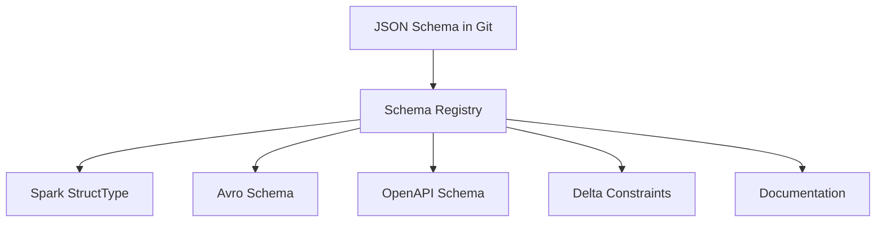

# JSON Schema ↔ Spark Schema

Bidirectional conversion between JSON Schema and Spark StructType for production pipelines.

## Architecture



!!! success "Single Source of Truth"
    Define schema once in JSON Schema Draft-07/2020-12. Generate all other
    representations automatically. Eliminates schema drift across systems.

## Type Mapping

| JSON Schema | Spark API | DDL | Notes |
|-------------|-----------|-----|-------|
| `string` | `StringType()` | `STRING` | |
| `integer` | `LongType()` | `BIGINT` | |
| `number` | `DoubleType()` | `DOUBLE` | Use DECIMAL for finance |
| `boolean` | `BooleanType()` | `BOOLEAN` | |
| `string` + `format: decimal` | `DecimalType(p,s)` | `DECIMAL(p,s)` | Exact precision |
| `object` | `StructType([...])` | `STRUCT<...>` | Nested struct |
| `object` + `additionalProperties` | `MapType(K,V)` | `MAP<K,V>` | Dynamic keys |
| `array` | `ArrayType(T)` | `ARRAY<T>` | |
| `oneOf` / `anyOf` | `StringType()` | `STRING` | No union in Spark |
| `required` field | `nullable=False` | `NOT NULL` | |
| optional field | `nullable=True` | _(default)_ | |

## JSON Schema → Spark Converter

```python
from pyspark.sql.types import *

def json_schema_to_spark(schema: dict) -> StructType:
    required = schema.get("required", [])
    fields = []
    for name, prop in schema.get("properties", {}).items():
        nullable = name not in required
        spark_type = resolve_type(prop)
        fields.append(StructField(name, spark_type, nullable))
    return StructType(fields)

def resolve_type(prop: dict):
    if "oneOf" in prop or "anyOf" in prop:
        return StringType()
    json_type = prop.get("type", "string")
    if json_type == "object":
        if "additionalProperties" in prop:
            return MapType(StringType(), resolve_type(prop["additionalProperties"]))
        return json_schema_to_spark(prop)
    if json_type == "array":
        return ArrayType(resolve_type(prop.get("items", {"type": "string"})))
    return {"string": StringType(), "integer": LongType(),
            "number": DoubleType(), "boolean": BooleanType()}.get(json_type, StringType())
```

## Spark → JSON Schema Converter

```python
def spark_to_json_schema(schema: StructType) -> dict:
    properties = {}
    required = []
    for field in schema.fields:
        properties[field.name] = spark_type_to_json(field.dataType)
        if not field.nullable:
            required.append(field.name)
    result = {"type": "object", "properties": properties}
    if required:
        result["required"] = required
    return result
```

## Production Pattern

```
schemas/
├── customer.schema.json
├── order.schema.json
└── event.schema.json
```

```python
import json

# Load from Git-managed file
with open("schemas/event.schema.json") as f:
    event_schema = json.load(f)

# Convert to Spark at runtime
spark_schema = json_schema_to_spark(event_schema)

# Read data
df = spark.read.schema(spark_schema).json(path)
```

## Special Cases

### Decimal (Financial)

```json
{"type": "string", "format": "decimal", "precision": 18, "scale": 2}
```
→ `DecimalType(18, 2)`

### Enum (Validation)

```json
{"type": "string", "enum": ["NEW", "ACTIVE", "CLOSED"]}
```
→ `StringType()` + downstream validation

### Union Types (oneOf)

```json
{"oneOf": [{"type": "string"}, {"type": "integer"}]}
```
→ `StringType()` (safest — parse later)

## Full Demo

```python title="examples/06_schema/30_json_schema_spark_convert.py"
--8<-- "examples/06_schema/30_json_schema_spark_convert.py"
```

## Run

```bash
python examples/06_schema/30_json_schema_spark_convert.py
```

!!! tip "Enterprise Best Practice"
    1. Define schema in JSON Schema Draft-2020-12
    2. Store versions in Git
    3. Generate Spark StructType automatically
    4. Validate payloads against JSON Schema before ingestion
    5. Use Spark schema only as the runtime execution schema
