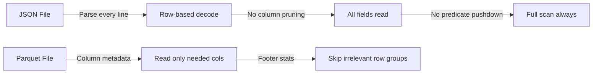

# Large JSON Files and Performance

Optimization strategies for processing JSON at scale in Spark.

## Why JSON Is Slow



!!! failure "JSON Limitations"
    - Row-based: must parse entire line even for one field
    - No predicate pushdown: filters applied after full read
    - No column pruning at storage level
    - Schema inference reads data twice
    - Text-based: larger on disk than binary formats

## Optimization Checklist

| Optimization | Impact | Description |
|--------------|--------|-------------|
| Explicit schema | HIGH | Avoids 2x read from inference |
| Column pruning | HIGH | Select needed fields immediately |
| Compact files | HIGH | Avoid many-small-files overhead |
| Convert to Parquet | HIGH | Bronze→Silver, enables all pushdowns |
| Single from_json | MEDIUM | Parse once, extract multiple fields |
| Cache parsed DF | MEDIUM | When reused in multiple actions |
| Filter before explode | MEDIUM | Reduce rows before array expansion |

## 1. Always Use Explicit Schema

```python
# Bad — inference reads all data twice
df = spark.read.json(path)

# Good — single pass
df = spark.read.schema(schema).json(path)
```

## 2. Select Only Needed Fields

```python
# Select immediately after read
df = spark.read.schema(schema).json(path).select("id", "event_time", "payload.type")
```

## 3. Parse from_json Once

```python
# Bad — parses payload 3 times
df.select(
    from_json("payload", schema).getField("type"),
    from_json("payload", schema).getField("x"),
    from_json("payload", schema).getField("y"),
)

# Good — parse once, extract fields
df.withColumn("parsed", from_json("payload", schema)).select(
    "parsed.type", "parsed.x", "parsed.y"
)
```

## 4. Compact Small Files

```python
# Read many small files → coalesce → write back
df = spark.read.schema(schema).json("input/many_files/")
df.coalesce(10).write.mode("overwrite").json("output/compacted/")
```

## 5. Convert to Parquet/Delta Early

```python
# One-time conversion (bronze → silver)
df = spark.read.schema(schema).json(bronze_path)
df.write.format("parquet").mode("overwrite").save(silver_path)

# All downstream reads use Parquet
df_fast = spark.read.parquet(silver_path)
```

## 6. Filter Before Explode

```python
# Bad — explodes all rows then filters
df.select("id", explode("items")).filter(col("status") == "active")

# Good — filter first, explode fewer rows
df.filter(col("status") == "active").select("id", explode("items"))
```

## 7. Cache When Reused

```python
df_parsed = spark.read.schema(schema).json(path).cache()
df_parsed.count()  # Materializes cache

# Subsequent actions use cache (no re-read)
df_parsed.filter(...).count()
df_parsed.groupBy(...).agg(...)
```

!!! tip "Unpersist When Done"
    Always call `df.unpersist()` when the cached DataFrame is no longer needed.

## Full Demo

```python title="examples/06_schema/23_performance.py"
--8<-- "examples/06_schema/23_performance.py"
```

## Run

```bash
python examples/06_schema/23_performance.py
```

!!! success "Key Takeaway"
    JSON is a **landing format**. Read with explicit schema, convert to
    Parquet/Delta at the bronze→silver boundary, and do all analytics
    on the columnar format.
