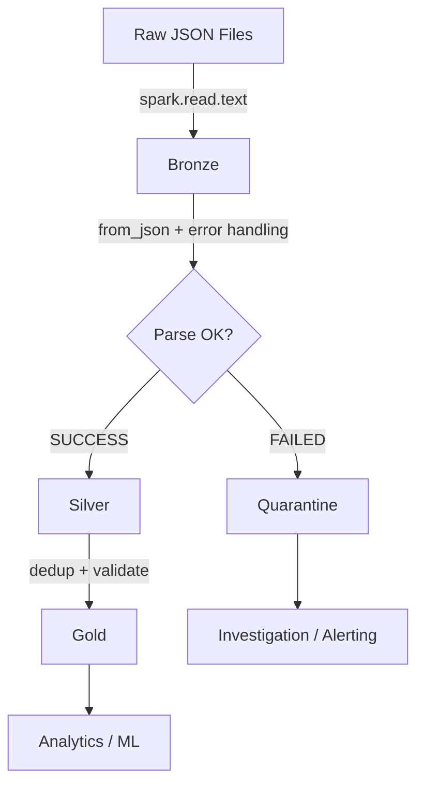

# Production-Grade JSON Parser

A complete enterprise pipeline pattern for JSON processing with error handling,
deduplication, and quality metrics.

## Architecture



## Bronze Layer

Store raw data exactly as received:

```python
def ingest_bronze(spark, path, source_system, batch_id):
    return (
        spark.read.text(path)
        .withColumnRenamed("value", "raw_json")
        .withColumn("source_system", F.lit(source_system))
        .withColumn("source_file", F.input_file_name())
        .withColumn("ingestion_time", F.current_timestamp())
        .withColumn("batch_id", F.lit(batch_id))
    )
```

| Column | Type | Purpose |
|--------|------|---------|
| raw_json | STRING | Original JSON line |
| source_system | STRING | Origin identifier |
| source_file | STRING | File path |
| ingestion_time | TIMESTAMP | When ingested |
| batch_id | STRING | Processing batch |

## Silver Layer

Parse with controlled schema and error routing:

```python
def parse_silver(bronze_df, schema, schema_version=1):
    return (
        bronze_df
        .withColumn("parsed", F.from_json(F.col("raw_json"), schema))
        .withColumn(
            "parse_status",
            F.when(F.col("parsed").isNull(), "FAILED").otherwise("SUCCESS"),
        )
        .withColumn(
            "error_reason",
            F.when(F.col("parsed").isNull(), "JSON parse failure"),
        )
        .withColumn("schema_version", F.lit(schema_version))
        .withColumn("processed_at", F.current_timestamp())
    )
```

## Gold Layer

Clean, deduplicated, validated business data:

```python
gold_df = (
    silver_df
    .filter(F.col("parse_status") == "SUCCESS")
    .select("parsed.*")
    .dropDuplicates(["id"])
    .filter(F.col("id").isNotNull())
    .filter(F.col("event_type").isNotNull())
)
```

## Quality Metrics

Track at every layer:

```python
total = bronze_df.count()
success = silver_df.filter(col("parse_status") == "SUCCESS").count()
failed = total - success
gold_count = gold_df.count()

logger.info("Parse rate: %.1f%%", success / total * 100)
logger.info("Duplicates removed: %d", success - gold_count)
```

!!! tip "Alerting"
    Alert when `failed / total > threshold` — signals upstream data corruption.

## Error Classification

Go beyond "FAILED" with detailed error classes:

```python
F.when(F.col("trimmed") == "", "empty_line")
.when(~F.col("trimmed").startsWith("{"), "not_json_object")
.when(F.col("parsed").isNull(), "malformed_json")
.when(F.col("parsed.id").isNull(), "missing_required_field")
.otherwise("valid")
```

## Full Demo

```python title="examples/06_schema/29_production_parser.py"
--8<-- "examples/06_schema/29_production_parser.py"
```

## Run

```bash
python examples/06_schema/29_production_parser.py
```

## Hardest JSON Scenarios Summary

| Scenario | Difficulty | Best Practice |
|----------|-----------|---------------|
| Schema inference | High | Always use explicit schema |
| Deeply nested JSON | High | Flatten one level at a time |
| Dynamic keys | High | Use MapType |
| Type conflicts | Very High | Read unstable fields as STRING |
| Schema evolution | Very High | Bronze raw → Silver parsed |
| Multiple arrays | Very High | Flatten independently, join back |
| Timestamps | High | Read as STRING, parse conditionally |
| Numeric precision | High | DECIMAL for money, STRING for IDs |
| Bad/non-standard JSON | Medium | Spark options + pre-processing |
| Streaming evolution | Very High | Stable bronze + versioned silver |

!!! success "Key Takeaway"
    The Bronze → Silver → Gold architecture handles **all** JSON scenarios.
    Bronze never breaks. Silver captures errors. Gold serves clean data.
    This is the production pattern for enterprise JSON pipelines.
