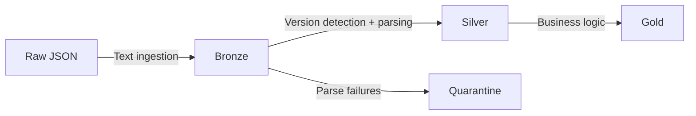

# Schema Evolution in Streaming JSON

Handling evolving JSON schemas in streaming pipelines with the medallion architecture.

## The Problem

Streaming JSON evolves over time:

| Day | Schema |
|-----|--------|
| Day 1 | `{"id": 1, "name": "Alice"}` |
| Day 2 | `{"id": 2, "name": "Bob", "email": "bob@co.com"}` |
| Day 3 | `{"id": 3, "name": {"first": "Eve", "last": "Smith"}}` |

!!! failure "Why This Breaks Pipelines"
    - Streaming queries require a **fixed schema** at start
    - New fields cause null columns (manageable)
    - Type changes (string→struct) cause **failures** (catastrophic)
    - Cannot restart a stream with a different schema without state loss

## Solution: Medallion Architecture



## Bronze Layer — Schema-Agnostic Ingestion

Never parse at bronze. Store raw JSON as string:

```python
from pyspark.sql.functions import input_file_name, current_timestamp

bronze = (
    spark.readStream
    .format("cloudFiles")
    .option("cloudFiles.format", "text")
    .load("/raw/events/")
    .withColumnRenamed("value", "raw_json")
    .withColumn("source_file", input_file_name())
    .withColumn("ingestion_time", current_timestamp())
)
```

Bronze schema is **always stable**:

```
raw_json       STRING
source_file    STRING
ingestion_time TIMESTAMP
```

!!! success "Key Insight"
    Bronze never breaks because it doesn't parse JSON — it just stores raw text.

## Silver Layer — Versioned Parsing

Detect schema version and parse accordingly:

```python
from pyspark.sql import functions as F

# Detect version from content
classified = bronze.withColumn(
    "schema_version",
    F.when(
        F.get_json_object(F.col("raw_json"), "$.name").startsWith("{"), 3
    ).when(
        F.get_json_object(F.col("raw_json"), "$.email").isNotNull(), 2
    ).otherwise(1),
)

# Parse V1: name is string
df_v1 = classified.filter(F.col("schema_version") == 1).select(
    F.get_json_object("raw_json", "$.id").cast("bigint").alias("id"),
    F.get_json_object("raw_json", "$.name").alias("name"),
    F.lit(None).alias("email"),
)

# Parse V3: name is struct → flatten to string
df_v3 = classified.filter(F.col("schema_version") == 3).select(
    F.get_json_object("raw_json", "$.id").cast("bigint").alias("id"),
    F.concat_ws(" ",
        F.get_json_object("raw_json", "$.name.first"),
        F.get_json_object("raw_json", "$.name.last"),
    ).alias("name"),
    F.get_json_object("raw_json", "$.email").alias("email"),
)

# Union all versions
silver = df_v1.unionByName(df_v2).unionByName(df_v3)
```

## Error Isolation — Quarantine

Route parse failures to a separate table:

```python
silver_attempt = bronze.withColumn(
    "parsed_id", F.get_json_object("raw_json", "$.id")
).withColumn(
    "parse_status",
    F.when(F.col("parsed_id").isNull(), "parse_failed")
    .when(F.col("parsed_id").rlike(r"^\d+$"), "success")
    .otherwise("invalid_type"),
)

# Good → silver
silver_attempt.filter(col("parse_status") == "success") \
    .writeStream.format("delta").start("/silver/events")

# Bad → quarantine
silver_attempt.filter(col("parse_status") != "success") \
    .writeStream.format("delta").start("/quarantine/events")
```

## Gold Layer — Analytics Model

Apply business logic on the stable silver schema:

```python
gold = silver.select(
    "id",
    F.upper("name").alias("name"),
    F.coalesce("email", F.lit("unknown")).alias("email"),
)
```

## Full Demo

```python title="examples/06_schema/24_streaming_schema_evolution.py"
--8<-- "examples/06_schema/24_streaming_schema_evolution.py"
```

## Run

```bash
python examples/06_schema/24_streaming_schema_evolution.py
```

## Architecture Summary

| Layer | Schema | Purpose |
|-------|--------|---------|
| Bronze | `raw_json STRING` + metadata | Never breaks, absorbs all changes |
| Silver | Typed, versioned parsing | Normalizes all versions to stable schema |
| Gold | Business model | Analytics-ready, clean types |
| Quarantine | Raw + error info | Isolates failures for investigation |

!!! tip "When to Add a New Version"
    When you detect a new field type or structure in quarantine records,
    add a new version handler to the silver layer parser. No bronze changes needed.
