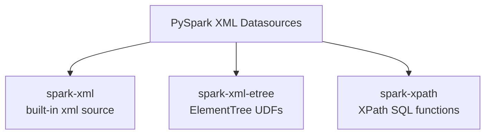

# PySpark XML Datasources

A monorepo of **three self-contained sub-projects**, each demonstrating a
different approach to XML processing with PySpark. Every example is runnable
locally — no cluster required.

## Sub-Projects

| Sub-Project | Approach | Key Dependency | When to Use |
|-------------|----------|----------------|-------------|
| [spark-xml](spark-xml/) | Built-in Spark 4 `xml` data source | PySpark ≥ 4.0 (native) | Reading/writing whole XML files as DataFrames; nested XML, attributes, namespaces. |
| [spark-xml-etree](spark-xml-etree/) | Python `xml.etree.ElementTree` via Spark UDFs | None (stdlib) | Fine-grained parsing control in Python; no external JARs. |
| [spark-xpath](spark-xpath/) | Spark built-in XPath SQL functions | None (built-in) | Extracting specific values from XML columns already in a DataFrame. |

## Architecture



## Building the Docs

This site aggregates all three sub-project docs using the
[mkdocs-monorepo-plugin](https://github.com/backstage/mkdocs-monorepo-plugin).
From the workspace root (`pyspark-ds-xml/`):

```bash
uv sync                        # install mkdocs, material theme, monorepo plugin
uv run mkdocs serve            # preview the aggregated site at http://127.0.0.1:8000
uv run mkdocs build --strict   # production build — fails on warnings
```

Each sub-project also builds standalone from its own directory:

```bash
cd spark-xml
uv run mkdocs serve
```
