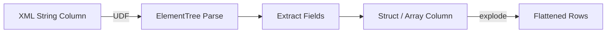

# MkDocs Documentation Conventions

## Stack

- MkDocs ≥ 1.6 with **mkdocs-material** ≥ 9.5.
- Markdown extensions: admonitions, tabbed content, code annotations, Mermaid diagrams.

## Theme Configuration

```yaml
theme:
  name: material
  palette:
    - scheme: default
      primary: deep orange
      accent: orange
      toggle:
        icon: material/brightness-7
        name: Switch to dark mode
    - scheme: slate
      primary: deep orange
      accent: orange
      toggle:
        icon: material/brightness-4
        name: Switch to light mode
  features:
    - navigation.tabs
    - navigation.sections
    - navigation.expand
    - navigation.top
    - navigation.indexes
    - search.highlight
    - search.suggest
    - content.code.copy
    - content.code.annotate
```

## Required Plugins and Extensions

```yaml
plugins:
  - search
  - include-markdown

markdown_extensions:
  - admonition
  - attr_list
  - md_in_html
  - tables
  - pymdownx.details
  - pymdownx.inlinehilite
  - pymdownx.highlight:
      anchor_linenums: true
      line_spans: __span
      pygments_lang_class: true
  - pymdownx.superfences:
      custom_fences:
        - name: mermaid
          class: mermaid
          format: !!python/name:pymdownx.superfences.fence_code_format
  - pymdownx.tabbed:
      alternate_style: true
  - pymdownx.snippets:
      base_path: ["."]
  - toc:
      permalink: true
```

## Code Blocks

### Include source files (preferred — keeps docs in sync)

````markdown
```python title="src/spark_etree/xmls_data_processing.py"
--8<-- "src/spark_etree/xmls_data_processing.py"
```
````

### Code annotations

```python
spark = (
    SparkSession.builder
    .master(os.environ.get("SPARK_MASTER", "local[*]"))  # (1)!
    .config("spark.sql.shuffle.partitions", "4")          # (2)!
    .getOrCreate()
)
```

1. Falls back to local mode when `SPARK_MASTER` is not set.
2. Default 200 is too high for small local datasets.

### Tabbed install options

````markdown
=== "pip"
    ```bash
    pip install pyspark
    ```

=== "uv"
    ```bash
    uv add pyspark
    ```
````

## Admonitions

```markdown
!!! tip "No JAR required"
    `xml.etree.ElementTree` is part of the Python standard library.

!!! warning "UDF Performance"
    Python UDFs serialize data between the JVM and Python. For large-scale
    XML processing, consider the Databricks spark-xml JAR instead.

!!! note
    Namespace prefixes must be registered before calling `ET.tostring()`.
```

## Architecture Diagrams

Use Mermaid for data flow and architecture:

````markdown

````

## Page Structure

Each example page should follow this order:

1. **Description** — what this pattern does and when to use it.
2. **Data flow diagram** (Mermaid) — for complex transformations.
3. **Prerequisites** — `uv sync` and any config needed.
4. **Source code** — `--8<--` snippet include with annotations.
5. **Run the example** — bash command block.
6. **Expected output** — truncated `show()` output.
7. **When to use / not use** — `!!! success` and `!!! failure` admonitions.

## Build and Serve

```bash
uv run mkdocs serve          # local preview at http://127.0.0.1:8000
uv run mkdocs build --strict # production build — fails on warnings
```
