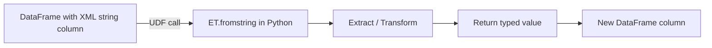

# Getting Started

Set up the project and run your first PySpark + ElementTree example in minutes.

## Prerequisites

!!! warning "Java required"
    PySpark 4 requires Java 17 or later on your `PATH`. Verify with:
    ```bash
    java -version
    ```

| Requirement | Version |
|-------------|---------|
| Python | ≥ 3.11 |
| Java | 11 or 17 |
| uv | latest |

## Installation

=== "uv (recommended)"

    ```bash
    # Clone and enter the project
    cd spark-xml-etree

    # Install all dependencies (runtime + dev)
    uv sync
    ```

=== "pip"

    ```bash
    cd spark-xml-etree
    pip install -e ".[dev]"
    ```

!!! note
    The only runtime dependency is `pyspark>=4.0.0`. The XML library
    `xml.etree.ElementTree` is part of the Python standard library.

## Verify the Installation

Run the simplest example to confirm everything works:

```bash
uv run python examples/xmls_data_processing.py
```

??? success "Expected output"

    ```
    +-----+-------------------+
    |index|title              |
    +-----+-------------------+
    |0    |Empire Burlesque   |
    |1    |Hide your heart    |
    |2    |Greatest Hits      |
    |3    |Still got the blues|
    |4    |Eros               |
    +-----+-------------------+
    ```

## Run the Test Suite

```bash
uv run pytest tests/ -v
```

??? success "Expected output"

    ```
    tests/test_data_processing.py          ... 11 passed
    tests/test_attributes_explode.py       ...  8 passed
    tests/test_namespace_handling.py        ...  9 passed
    tests/test_nested_flattening.py        ...  8 passed
    tests/test_error_handling.py           ... 11 passed
    tests/test_build_from_dataframe.py     ... 10 passed

    57 passed
    ```

## SparkSession Pattern

Every example creates a SparkSession with an environment variable fallback:

```python
import os
from pyspark.sql import SparkSession

spark = (
    SparkSession.builder
    .appName("xml-etree-single-field")                       # (1)!
    .master(os.environ.get("SPARK_MASTER", "local[*]"))      # (2)!
    .config("spark.sql.shuffle.partitions", "4")              # (3)!
    .config("spark.ui.enabled", "false")                      # (4)!
    .getOrCreate()
)
spark.sparkContext.setLogLevel("WARN")
```

1. Descriptive app name — visible in the Spark UI and logs.
2. `SPARK_MASTER` env var for cluster mode; defaults to local.
3. Default 200 is wasteful for small datasets.
4. Skip the Spark Web UI for faster startup.

## Environment Variables

| Variable | Default | Purpose |
|----------|---------|---------|
| `SPARK_MASTER` | `local[*]` | Spark master URL |
| `PYSPARK_PYTHON` | `python3` | Python binary for executors |
| `PYSPARK_DRIVER_PYTHON` | `python3` | Python binary for the driver |
| `SPARK_LOCAL_IP` | — | Set to `127.0.0.1` inside Docker |

## Core Concept

The fundamental pattern in every example is:



1. Store XML as a **string column** in a Spark DataFrame.
2. Write a **Python function** that calls `ET.fromstring()` to parse the XML.
3. Wrap it in a **PySpark UDF** with an explicit return type.
4. Apply the UDF with `withColumn` or `select` to produce new columns.

## Next Steps

- [User Guide](guide/index.md) — walk through each pattern with full examples
- [Utility Reference](api-reference.md) — function signatures and schemas
- [Testing](testing.md) — how the test suite is organized
