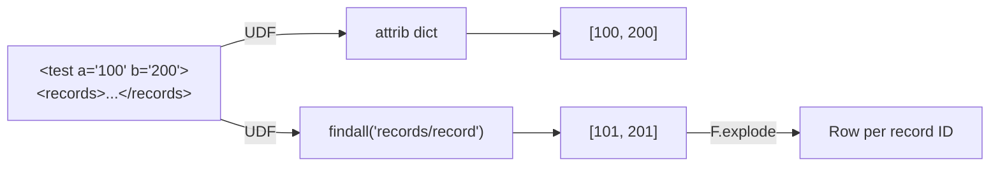

# Attributes & Explode

> :material-file-code: **Source:** `src/spark_etree/xmls_data_processing_multiple_column2.py`

Extract XML attributes from root elements and explode nested record arrays
into individual rows.

## Data Flow



## XML Input

```xml
<test a="100" b="200">
  <records>
    <record id="101" />
    <record id="201" />
  </records>
</test>
```

## Implementation

### Decorator UDF for attributes

```python linenums="1"
from pyspark.sql.functions import udf
from pyspark.sql.types import ArrayType, StringType

@udf(returnType=ArrayType(StringType()))                                # (1)!
def extract_attributes(xml: str) -> List[str]:
    """Return the 'a' and 'b' attributes from the root element."""
    doc = ET.fromstring(xml)
    return [doc.attrib["a"], doc.attrib["b"]]                           # (2)!
```

1. The `@udf` decorator registers the function directly — no separate
   `udf(fn, schema)` call needed.
2. `doc.attrib` is a dict of all attributes on the root element.

### Array UDF for nested records

```python linenums="1"
def extract_record_ids(xml: str) -> List[int]:
    """Return all record/@id values as integers."""
    doc = ET.fromstring(xml)
    return [int(r.attrib["id"])                                         # (1)!
            for r in doc.findall("records/record")]                     # (2)!

extract_record_ids_udf = udf(extract_record_ids, ArrayType(IntegerType()))
```

1. Cast the string attribute to `int` — Spark expects `IntegerType`.
2. XPath-like path navigates to nested `<record>` elements.

### Explode into rows

```python linenums="1"
df_exploded = (
    df
    .withColumn("record_ids", extract_record_ids_udf(F.col("data")))   # (1)!
    .withColumn("record_id", F.explode("record_ids"))                   # (2)!
    .select("id", "record_id")
)
```

1. Add an array column containing all record IDs.
2. `F.explode` creates one row per array element.

## Run

```bash
uv run python src/spark_etree/xmls_data_processing_multiple_column2.py
```

??? success "Expected output"

    ```
    +---+---------+
    |id |record_id|
    +---+---------+
    |1  |101      |
    |1  |201      |
    |2  |202      |
    |2  |402      |
    |3  |303      |
    |3  |603      |
    |3  |903      |
    +---+---------+
    ```

## Key Takeaways

| Concept | Detail |
|---------|--------|
| `@udf` decorator | Shorthand for simple UDFs — pass `returnType=` |
| XML attributes | `doc.attrib["name"]` reads attribute values |
| `ArrayType` | UDF returns a Python `list` → Spark array column |
| `F.explode` | Turns each array element into its own row |
