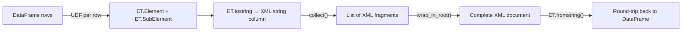

# Building XML from DataFrames

> :material-file-code: **Source:** `src/spark_etree/xmls_build_from_dataframe.py`

Convert DataFrame rows into XML element strings using a UDF, then assemble
them into a complete XML document on the driver.

## Data Flow



## Implementation

### Row-to-XML UDF

```python linenums="1"
import xml.etree.ElementTree as ET

def row_to_xml(emp_id: int, name: str, dept: str, salary: int) -> Optional[str]:
    """Serialize a single employee row into an XML element string."""
    if name is None:                                                   # (1)!
        return None

    emp = ET.Element("employee", id=str(emp_id))                       # (2)!
    ET.SubElement(emp, "name").text = name                             # (3)!
    ET.SubElement(emp, "department").text = dept
    ET.SubElement(emp, "salary").text = str(salary)
    return ET.tostring(emp, encoding="unicode")                        # (4)!
```

1. Return `None` for rows with missing required data.
2. Create the root element with an attribute.
3. Add child elements with text content.
4. Serialize to a Unicode string (no byte encoding).

### Apply the UDF

```python linenums="1"
row_to_xml_udf = udf(
    lambda eid, n, d, s: row_to_xml(eid, n, d, s),                    # (1)!
    StringType(),
)

xml_df = df.withColumn(
    "xml",
    row_to_xml_udf(F.col("emp_id"), F.col("name"),
                    F.col("dept"), F.col("salary")),
)
```

1. Multi-column UDFs need a lambda wrapper to pass multiple columns.

### Assemble a complete document

```python linenums="1"
def wrap_in_root(xml_fragments: list[str], root_tag: str = "employees") -> str:
    """Combine XML fragment strings under a single root element."""
    root = ET.Element(root_tag)
    for fragment in xml_fragments:
        root.append(ET.fromstring(fragment))                           # (1)!

    ET.indent(root, space="  ")                                        # (2)!
    return ET.tostring(root, encoding="unicode", xml_declaration=True) # (3)!

fragments = [row["xml"] for row in xml_df.select("xml").collect()]     # (4)!
full_xml = wrap_in_root(fragments)
```

1. Parse each fragment and append to the root tree.
2. Pretty-print with 2-space indentation (Python ≥ 3.9).
3. Include `<?xml version='1.0' ...?>` declaration.
4. `collect()` brings the data to the driver — do this only for the final
   assembled output, not for intermediate processing.

### Round-trip back to DataFrame

```python linenums="1"
root = ET.fromstring(full_xml)
round_trip_rows = []
for emp in root.findall("employee"):
    round_trip_rows.append({
        "emp_id": int(emp.attrib["id"]),
        "name": emp.findtext("name"),
        "department": emp.findtext("department"),
        "salary": int(emp.findtext("salary", default="0")),
    })

round_trip_df = spark.createDataFrame(round_trip_rows)
```

## Run

```bash
uv run python src/spark_etree/xmls_build_from_dataframe.py
```

??? success "Expected output — assembled XML"

    ```xml
    <?xml version='1.0' encoding='utf-8'?>
    <employees>
      <employee id="101">
        <name>Alice</name>
        <department>Engineering</department>
        <salary>95000</salary>
      </employee>
      <employee id="103">
        <name>Charlie</name>
        <department>Engineering</department>
        <salary>110000</salary>
      </employee>
      <employee id="105">
        <name>Eve</name>
        <department>Engineering</department>
        <salary>102000</salary>
      </employee>
    </employees>
    ```

??? success "Expected output — round-trip DataFrame"

    ```
    +-----------+------+-------+------+
    |department |emp_id|name   |salary|
    +-----------+------+-------+------+
    |Engineering|101   |Alice  |95000 |
    |Engineering|103   |Charlie|110000|
    |Engineering|105   |Eve    |102000|
    +-----------+------+-------+------+
    ```

## Key Takeaways

| Concept | Detail |
|---------|--------|
| `ET.Element` / `ET.SubElement` | Build XML elements programmatically |
| `ET.tostring(encoding="unicode")` | Serialize to string (not bytes) |
| `ET.indent` | Pretty-print (Python ≥ 3.9) |
| `xml_declaration=True` | Add `<?xml ...?>` header |
| Multi-column UDF | Lambda wrapper: `lambda a, b: fn(a, b)` |
| `collect()` caveat | Only collect the final result — not intermediate data |

!!! warning "Driver memory"
    `wrap_in_root` calls `collect()` to bring all fragments to the driver.
    This is fine for small result sets but will OOM for large DataFrames.
    For large outputs, write XML fragments as individual files using
    `df.select("xml").write.text(path)` instead.
