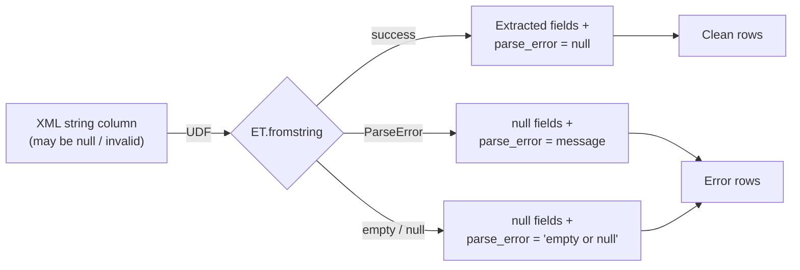

# Error Handling

> :material-file-code: **Source:** `src/spark_etree/xmls_error_handling.py`

Safely parse XML that may be malformed, incomplete, empty, or null —
capturing parse errors in a dedicated column instead of crashing the job.

## Data Flow



## Problem

Real-world XML data is messy. A Spark job should not fail because one row
has bad XML. Instead, capture the error and continue processing:

```python title="Sample dirty data"
SAMPLE_DATA = [
    {"id": 1, "xml": '<product sku="P100"><name>Widget</name><price>19.99</price></product>'},
    {"id": 3, "xml": "this is not xml at all"},     # malformed
    {"id": 5, "xml": None},                          # null
    {"id": 6, "xml": ""},                            # empty string
]
```

## Implementation

### Schema with error column

```python linenums="1"
PRODUCT_SCHEMA = StructType([
    StructField("sku", StringType(), True),
    StructField("name", StringType(), True),
    StructField("price", StringType(), True),
    StructField("category", StringType(), True),
    StructField("parse_error", StringType(), True),                    # (1)!
])
```

1. The `parse_error` field is `None` for valid rows and contains the error
   message for failed parses.

### Safe parse function

```python linenums="1"
def safe_parse_product(payload: Optional[str]) -> Dict[str, Optional[str]]:
    if not payload:                                                     # (1)!
        return {**empty, "parse_error": "empty or null input"}

    try:
        doc = ET.fromstring(payload)                                    # (2)!
    except ET.ParseError as e:
        return {**empty, "parse_error": str(e)}                         # (3)!

    return {
        "sku": doc.attrib.get("sku"),
        "name": doc.findtext("name"),
        "price": doc.findtext("price"),
        "category": doc.findtext("category"),
        "parse_error": None,                                            # (4)!
    }
```

1. Guard against `None` and empty strings before parsing.
2. Attempt to parse — may raise `ET.ParseError`.
3. Catch the error and return it as a string — the job continues.
4. `None` means the row parsed successfully.

### Separate clean from error rows

```python linenums="1"
safe_parse_udf = udf(safe_parse_product, PRODUCT_SCHEMA)

parsed = (
    df
    .withColumn("product", safe_parse_udf("xml"))
    .select("id", "product.*")
)

clean = parsed.filter(F.col("parse_error").isNull())                   # (1)!
errors = parsed.filter(F.col("parse_error").isNotNull())               # (2)!
```

1. Clean rows: `parse_error` is null → XML was valid.
2. Error rows: `parse_error` contains the failure reason.

## Run

```bash
uv run python src/spark_etree/xmls_error_handling.py
```

??? success "Expected output — all rows"

    ```
    +---+----+------------+-------+-----------+------------------------------+
    |id |sku |name        |price  |category   |parse_error                   |
    +---+----+------------+-------+-----------+------------------------------+
    |1  |P100|Widget      |19.99  |Tools      |NULL                          |
    |2  |P200|Gadget      |NULL   |Electronics|NULL                          |
    |3  |NULL|NULL        |NULL   |NULL       |syntax error: line 1, column 0|
    |4  |NULL|Mystery Item|5.00   |NULL       |NULL                          |
    |5  |NULL|NULL        |NULL   |NULL       |empty or null input           |
    |6  |NULL|NULL        |NULL   |NULL       |empty or null input           |
    |7  |P300|Gizmo       |invalid|Toys       |NULL                          |
    |8  |P400|NULL        |12.50  |Office     |NULL                          |
    +---+----+------------+-------+-----------+------------------------------+
    ```

??? info "Clean vs error split"

    ```
    Clean rows: 5
    Error rows: 3 (ids 3, 5, 6)
    ```

## Key Takeaways

| Concept | Detail |
|---------|--------|
| Error column | Add a `parse_error` field to the struct schema |
| Guard clauses | Check for `None` / empty before calling `ET.fromstring` |
| `try/except` | Catch `ET.ParseError` and return the message as a string |
| Filter | `isNull()` / `isNotNull()` to separate clean from error rows |

!!! tip "Production pattern"
    Write error rows to a separate table or file for investigation, and
    continue processing clean rows through the rest of the pipeline.
